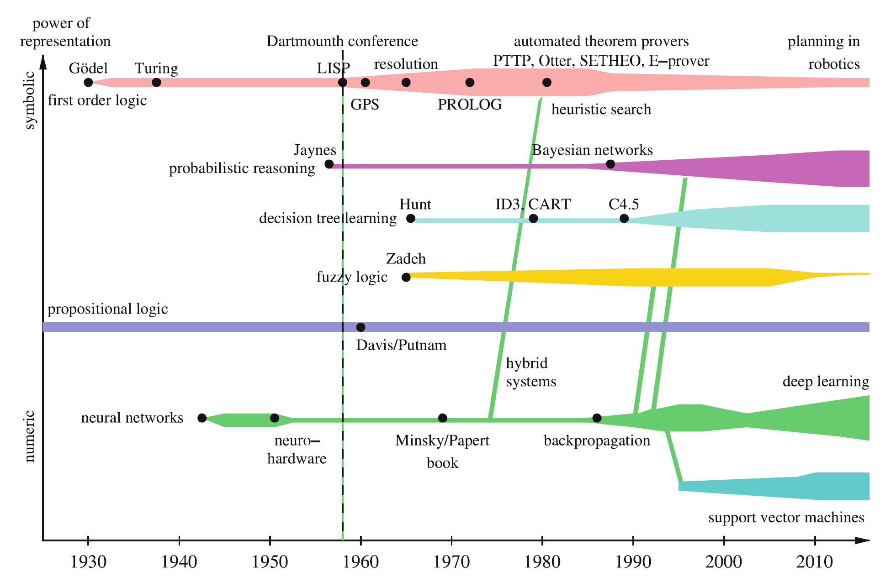
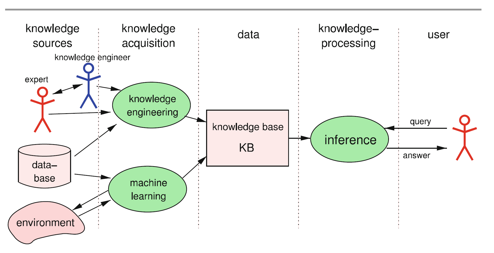
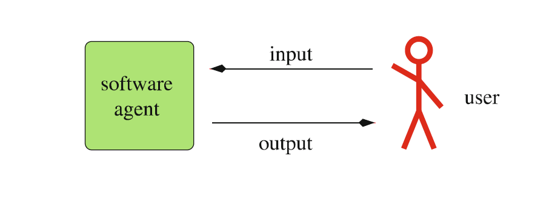
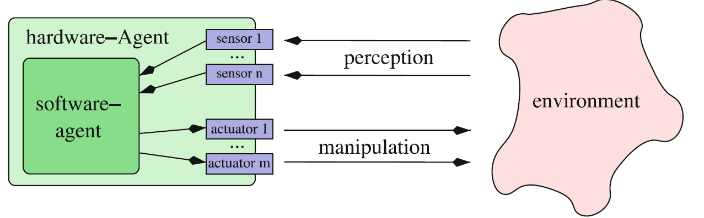
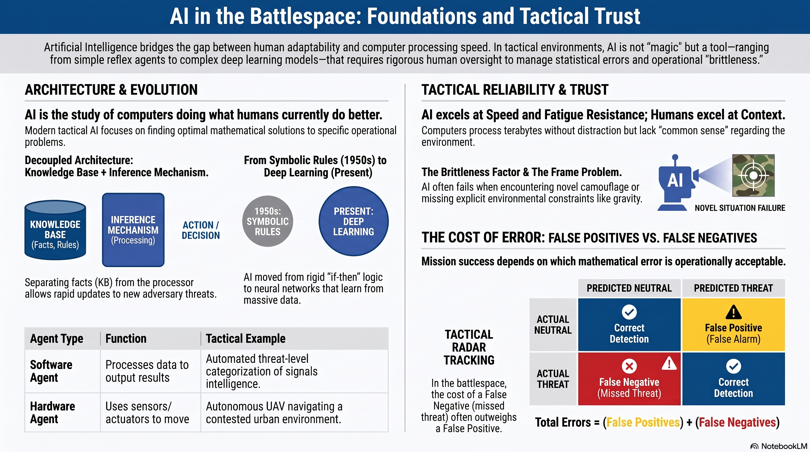

# L1: Intro to Artificial Intelligence

The term "Artificial Intelligence" (AI) often stirs emotions, bringing up science-fiction images of intelligent cyborgs or questions about the nature of human consciousness. However, the formal study of this field began with a very specific vision.

The term was first defined in 1955 by John McCarthy, one of the pioneers of the field, roughly as follows: "The goal of AI is to develop machines that behave as though they were intelligent." [{cite:t}`ertel2018introduction`]
While McCarthy's definition was groundbreaking, it left room for ambiguity. For example, the text describes "Braitenberg vehicles"—simple robotic cars with wheels driven directly by light sensors. If one vehicle is hardwired to drive toward a light source and another to drive away, it creates the illusion of complex, "intelligent" behavior (like aggression or fear) using nothing but basic electrical circuits.

Because AI aims to solve difficult practical problems rather than just mimic basic behaviors, a more robust and pragmatic definition was provided by Elaine Rich in 1983: "Artificial Intelligence is the study of how to make computers do things at which, at the moment, people are better."

In the battlespace, humans excel at adapting to chaotic, novel situations. Computers excel at processing massive amounts of data in fractions of a second. AI seeks to bridge this gap, creating systems capable of executing complex, high-speed cognitive tasks to support human commanders.

:::{admonition} Lesson Objectives
:class: note

* Describe what artificial intelligence systems do using concrete examples.

* Identify strengths and limitations of modern AI systems.

* Explain why AI outputs require evaluation and cannot be blindly trusted.
:::

## Approaches to AI: Brain Science vs. Problem Solving

There are two distinct philosophical and practical approaches to creating artificial intelligence [{cite:t}`ertel2018introduction`]:

The Brain Science Approach: This approach attempts to understand exactly how the human brain works and then models or simulates it on a computer. Many of the foundational principles in the field of Artificial Neural Networks (ANNs) stem directly from biological brain science and neuroscience.

The Problem-Solving Approach: This is a strictly goal-oriented approach. It starts with a specific tactical problem and attempts to find the most optimal mathematical solution. How humans solve the problem is treated as entirely unimportant. The method itself is secondary to achieving the optimal, intelligent result.

Modern tactical AI relies heavily on the problem-solving approach. Much like medicine offers different tools for different ailments, AI provides a broad palette of specific algorithmic solutions tailored to specific operational problems.

## The Evolution of AI Methods

 

The methods used to achieve artificial intelligence have evolved dramatically over the decades over several key phases:

Symbolic AI and Logic (1950s–1980s): Early AI focused heavily on logic and symbol processing. Engineers built {term}`Expert System` by hardcoding thousands of explicit "if-then" rules. While successful for small, controlled problems, these systems suffered from a "combinatorial explosion"—the real world (and the battlefield) is simply too complex to program every possible rule by hand.

The New Connectionism (1980s): Because rigid logic systems failed to adapt, researchers turned to {term}`Connectionism`—mathematically modeled neural networks. Instead of hardcoding rules, these networks learned by analyzing training data. They excelled at pattern recognition (like identifying vehicles in images) but often acted as "black boxes" whose logic could not be easily explained.

Reasoning Under Uncertainty (1990s): AI began blending the explicit knowledge of logic with statistical probabilities. Technologies like Bayesian networks and Decision Trees allowed systems to make highly accurate predictions even when faced with incomplete intelligence or the "fog of war."

The AI Revolution (2010s–Present): Fueled by massive increases in computing power and data availability, "Deep Learning" took over. This enabled AI to surpass human performance in image classification and complex strategy games, paving the way for autonomous robotics and advanced sensor fusion.

## Knowledge-Based Systems

 

When building complex AI, hardcoding every piece of information directly into the program quickly becomes unmanageable. To solve this, AI engineers separate the system into two distinct parts:

The {term}`Knowledge Base (KB)`: A declarative database that stores facts, rules, and doctrines explicitly.

The {term}`Inference Mechanism`: The processing engine that uses the information in the Knowledge Base to draw conclusions, answer queries, or formulate plans.

IBM's Watson (which [famously defeated](https://www.youtube.com/watch?v=P18EdAKuC1U)  human champions on the quiz show Jeopardy!) as a prime example of a knowledge-based system. It utilized an inference engine to rapidly search a Knowledge Base containing four terabytes of data.

Decoupling the knowledge from the processor is a massive operational advantage. If an adversary introduces a new type of radar jammer, engineers do not have to rewrite the entire AI targeting algorithm. They simply update the declarative facts in the Knowledge Base, and the existing Inference Mechanism automatically adapts its conclusions based on the new intelligence.

## What AI Systems Do (Agents in Action)

At its core, an AI system is an {term}`Agent`, a system that processes information from its environment and produces an output or action. There are two primary types of agents, both of which are critical in modern operations:

{term}`Software Agent`: A program that calculates a result from data inputs.

* An intelligence-parsing algorithm that ingests thousands of intercepted text messages and automatically categorizes them by threat level, outputting a summarized report to an analyst.

{term}`Hardware Agent (Autonomous Robot)`: An agent equipped with physical sensors (cameras, radar) to perceive the environment and actuators (motors, rotors) to manipulate the environment.

* An autonomous Unmanned Aerial Vehicle (UAV) that uses optical sensors to navigate through a contested urban environment without a human pilot holding a joystick.

These agents can range from simple {term}`Reflex Agent`, which react purely to their immediate sensor inputs (e.g., a drone immediately banking left if its proximity sensor detects a wall), to complex learning agents that adapt their behavior over time based on mission success.

## Strengths and Limitations of Modern AI

While AI systems are incredibly powerful, treating them as infallible "magic" is a dangerous operational oversight.

**Strengths**

* Data Throughput & Speed: Tasks such as rapid mathematical computation or searching a 4-terabyte database for a specific tactical clue are where digital computers vastly outperform humans.

* Fatigue Resistance: An AI radar-tracking algorithm does not get tired, distracted, or visually fatigued after a 12-hour shift, whereas human cognitive performance degrades significantly over time.

**Limitations**

* Lack of True Comprehension: A machine learning model doesn't "understand" what a tank is; it only recognizes the mathematical pixel patterns associated with the label "tank."

* Brittleness in Novel Environments: Human intelligence is highly adaptive. If an AI system encounters a situation vastly different from its training data (e.g., a new type of adversary camouflage), it will often fail unpredictably rather than adapt gracefully.

**The Frame Problem:** AI systems lack "common sense" context. An autonomous ground vehicle might successfully avoid a landmine (its programmed goal) but drive off a bridge to do so if "gravity" wasn't explicitly weighted in its environment model.

## Trust, Evaluation, and the Cost of Errors

Because modern AI systems (especially neural networks) are statistical engines, they will occasionally make mistakes. Therefore, their outputs cannot be blindly trusted; they require continuous human evaluation.

To understand why, consider the example regarding a spam email filter. Let's adapt that concept into a Tactical Threat Filter.

Imagine an AI agent tasked with classifying incoming radar tracks as either Neutral or Threat. Out of 1,000 tracks, consider two different AI models:

Model A makes 12 total errors.

Model B makes 38 total errors.

Is Model A automatically better? We must look at the types of errors in a "Confusion Matrix."

| Model A | Predicted Neutral | Predicted Threat |
| --- | --- | --- |
| **Actual Neutral** | 189 | 1 (False Positive)|
| **Actual Threat**  | 11 (False Negative) | 799 |

| Model B | Predicted Neutral | Predicted Threat |
| --- | --- | --- |
| **Actual Neutral** | 200 | 38 (False Positive) |
| **Actual Threat** | 0 (False Negative) | 762 |

While Model A made fewer errors overall, its 11 errors were False Negatives—meaning it ignored 11 actual incoming threats. Model B made more errors (38), but they were all False Positives (False Alarms), meaning no real threats slipped through. In a tactical environment, the cost of a missed threat is often catastrophic, while the cost of a false alarm is wasted time. Because there are different severities of errors, an AI's raw accuracy is not enough. Human operators must establish the rules of engagement, evaluate the AI's confidence levels, and decide which types of mathematical errors are operationally acceptable.

## Summary Infographic

 

**Knowledge Check & Practice Questions**

1. An intelligence squadron deploys a system that automatically translates intercepted foreign radio broadcasts into English text transcripts in real-time. Is this system functioning as a Hardware Agent or a Software Agent?

2. A commander wants to replace all human imagery analysts with a new AI system that was trained to identify enemy tanks in satellite photos. The AI can process 10,000 photos an hour. However, the adversary recently began hiding their tanks under a new type of optical-camouflage netting that the AI has never seen before. What AI limitation will the commander likely encounter?

3. Referencing the concept of the "Spam Filter", imagine an autonomous sentry gun is programmed to classify approaching figures. A False Positive means the gun classifies a friendly soldier as an enemy. A False Negative means the gun classifies an enemy infiltrator as a friendly soldier. Which error carries the highest ethical and tactical cost, and why does this necessitate human evaluation?