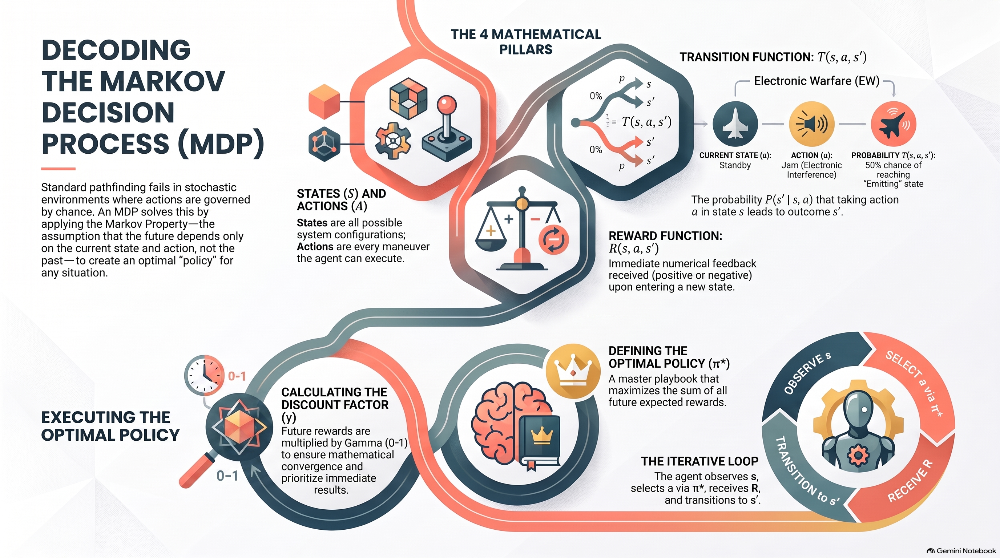

# L11: Markov Decision Processes

:::{admonition} Lesson Objectives
:class: note

* Contrast deterministic search from nondeterministic search problems.

* Mathematically describe the parameters for an MDP (Transition Function, Reward Function).

* Define the Markov property and properly construct state representations.

* Apply discounting to a search problem.
:::

## Deterministic vs. Nondeterministic Search

In previous lessons (DFS, BFS, A*), we modeled the battlefield as a deterministic environment. We assumed that if an autonomous Unmanned Surface Vehicle (USV) executed the command "Move North," it would successfully move into the Northern grid sector 100% of the time.

In real-world combat, the environment is nondeterministic (or a {term}`Stochastic Environment`). Actions do not always go as planned.

What if the USV hits a mud slick and slides East?

What if a cyber-defense agent tries to drop a connection, but the adversary uses a sophisticated evasion technique to bypass the firewall?

When the results of our actions are governed by chance, standard pathfinding algorithms fail because we cannot guarantee our plan will survive contact with the environment. Instead of finding a single, rigid path, we must formulate a {term}`Markov Decision Process (MDP)` to find a {term}`Policy (MDP)`—a master playbook that tells the agent what to do no matter what state it randomly ends up in.

## The Markov Property and State Representation

The entire mathematical foundation of an MDP rests on a critical assumption about how the environment operates, known as the {term}`Markov Property`:

"The future is independent of the past given the present."

Mathematically, this means the probability of reaching a new state $s'$ depends only on the current state $s$ and the current action $a$, completely ignoring the history of how the agent got there:

$$P(S_{t+1}=s' \mid S_t=s_t, A_t=a_t, S_{t-1}=s_{t-1}, \dots) = P(S_{t+1}=s' \mid S_t=s_t, A_t=a_t)$$

### Evaluating State Representations

To guarantee the Markov Property holds true, the AI Systems Integration Officer must design the state representation perfectly. The state must contain all the information necessary to predict the future.

Tactical Scenario (Cyber Defense): Imagine a network agent monitoring incoming traffic. If the agent's state representation only tracks the Source IP Address (e.g., State = "198.51.100.14"), does this satisfy the Markov Property?

No. The probability of this specific IP launching an aggressive DDoS attack in the next second depends heavily on whether that IP has sent 10,000 failed login attempts over the past five minutes (the past history). Because that vital historical context is missing from the current state, the future is dependent on the unrepresented past. To fix this and satisfy the Markov property, the history must be rolled into the current state (e.g., State = ("198.51.100.14", Failed_Logins=10000)).

## Defining an MDP

To build an MDP, we define the environment using four core components. Let's formulate a Cyber-Defense Agent tasked with managing incoming network connections under heavy load:

A Set of States ($S$): Every possible configuration the agent could find itself in.

Example: (Threat_Level, System_Load). Specific states might be (Suspicious, High_Load) or (Secure, Normal_Load).

A Set of Actions ($A$): Every possible maneuver the agent can execute.

Example: Block_Connection, Monitor_Traffic, Ignore.

The {term}`Transition Function` ($T(s,a,s')$ or $P(s' \mid s,a)$): The probability that taking action $a$ in state $s$ will lead to a specific outcome state $s'$.

Example: If the agent chooses to Block_Connection while in (Suspicious, High_Load), there is a 95% chance it successfully transitions to (Secure, Normal_Load), and a 5% chance the adversary bypasses the block, leading to (Compromised, High_Load).

The {term}`Reward Function` ($R(s,a,s')$): The immediate numerical feedback received upon entering state $s'$.

Positive Rewards: Successfully terminating a hostile connection ($+10$).

Negative Rewards: Suffering a system compromise ($-100$), or expending critical CPU resources to Monitor_Traffic ($-1$).

Our ultimate goal in an MDP is not to find a "path", but to find the Optimal Policy ($\pi^*$) that maximizes the sum of all future expected rewards.

---

## Visualizing the MDP: Transition Table and Markov Network

To better understand how these parameters interact, consider an **Electronic Warfare (EW) Aircraft** operating in contested airspace. 

**States ($S$):** The aircraft can be in `Standby`, `Emitting`, or `Targeted` (a terminal state where the aircraft is locked on by enemy air defenses).
**Actions ($A$):** The agent can choose to `Loiter` or `Jam`.

We can map the outcomes of these actions using a **Transition and Reward Table**:

| Current State ($s$) | Action ($a$) | Next State ($s'$) | Probability $T(s,a,s')$ | Reward $R(s,a,s')$ |
| :--- | :--- | :--- | :--- | :--- |
| **Standby** | Loiter | Standby | 1.0 (100%) | +1 |
| **Standby** | Jam | Standby | 0.5 (50%) | +3 |
| **Standby** | Jam | Emitting | 0.5 (50%) | +3 |
| **Emitting** | Loiter | Standby | 0.5 (50%) | +1 |
| **Emitting** | Loiter | Emitting | 0.5 (50%) | +1 |
| **Emitting** | Jam | Targeted | 1.0 (100%) | -15 |

We can also visualize this exact same mathematical structure as a **Markov Network Graph**. The nodes represent the states, and the arrows represent the transition probabilities and rewards associated with taking an action.

```{mermaid}
graph LR
    %% Nodes
    S((Standby))
    E((Emitting))
    T(((Targeted)))

    %% Combined self-loops on Standby to prevent overlapping lines
    S -- "Loiter (1.0), R=+1, Jam (0.5), R=+3" --> S
    
    %% Lengthened bidirectional arrows to give text breathing room
    S -- "Jam (0.5), R=+3" ---> E
    E -- "Loiter (0.5), R=+1" ---> S

    %% Self-loop on Emitting
    E -- "Loiter (0.5), R=+1" --> E
    
    %% Path to Terminal State
    E -- "Jam (1.0), R=-15" ---> T

    %% Styling
    style S fill:#3498db,stroke:#2980b9,stroke-width:2px,color:#fff
    style E fill:#f39c12,stroke:#d35400,stroke-width:2px,color:#fff
    style T fill:#e74c3c,stroke:#c0392b,stroke-width:4px,color:#fff
```

## Discounting the Future

If a cyber-agent is monitoring an endless stream of traffic, it could theoretically accumulate infinite small $+1$ rewards for surviving each minute. To prevent our mathematical models from outputting infinity (which makes comparing policies impossible), we use a {term}`Discount Factor` ($\gamma$, pronounced "Gamma").

We multiply future rewards by $\gamma$ (a decimal between 0 and 1) at each time step. The further in the future a reward is, the more heavily it is discounted:


$$U([r_0, r_1, r_2, \dots]) = r_0 + \gamma r_1 + \gamma^2 r_2 \dots$$

### Why do we discount?

Mathematics: It guarantees that infinite sequences eventually sum to a finite limit, allowing algorithms to converge.

Operational Reality: A guaranteed blocked threat today is inherently more valuable than the promise of a blocked threat three weeks from now, given the extreme volatility of cyberspace.


## Summary Infographic


<br>
<hr width="100%" size="4" color="black">


## Knowledge Check & Practice Questions

1. If an autonomous agent's state representation only includes its current GPS coordinates, but its fuel consumption (which determines its next physical state) heavily depends on how fast it was flying over the previous 10 minutes, what fundamental mathematical assumption is violated?<br>
A) The Completeness Guarantee<br>
B) Expected Value<br>
C) The Markov Property<br>
D) The Discount Factor<br>

2. In a Markov Decision Process, what is the specific term for the numerical feedback an agent receives immediately after transitioning to a new state $s'$?<br>
A) The Transition Function $P(s' \mid s,a)$<br>
B) The Expected Value (EV)<br>
C) The Discount Factor $\gamma$<br>
D) The Reward Function $R(s,a,s')$<br>

3. What is the operational and mathematical purpose of applying a Discount Factor ($\gamma$) to future rewards?<br>
A) To computationally force an infinite loop of rewards to eventually sum to a finite limit.<br>
B) To artificially lower the agent's confidence in its noisy sensors.<br>
C) To force the agent to explore all possible states uniformly before making a decision.<br>
D) To convert a stochastic environment into a perfectly deterministic one.<br>