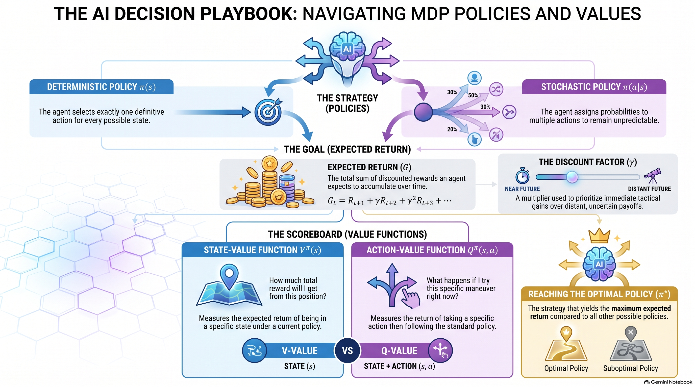

# Lesson 12: Markov Decision Processes II (Values & Policies)

:::{admonition} Lesson Objectives
:class: note
* Define value functions and policies.
* Interpret expected cumulative reward.
* Explain what makes a policy optimal.
:::

In the previous lesson, we modeled tactical environments using Markov Decision Processes (MDPs), establishing states, actions, transition probabilities, and rewards. In this lesson, we will mathematically formalize how an AI agent makes decisions within that environment by defining policies and calculating the total expected value of its choices.

## Defining Policies

A **Policy ($\pi$)** is the AI agent's "playbook." It dictates exactly what the agent should do in every possible state of the battlefield.

There are two primary types of policies:
* **{term}`Deterministic Policy` ($\pi(s)$):** A policy that selects exactly one definitive action per state. 
    * *Example:* If an autonomous sentry drone is in the state `(Low_Battery)`, the deterministic policy always outputs the action `Return_To_Base`.
    
* **{term}`Stochastic Policy` ($\pi(a\vert{}s)$):** A policy that assigns action probabilities for each state. 
    * *Example:* To prevent an adversary from easily predicting its patrol route, a sentry drone in state `(Intersection_Alpha)` has a 70% probability of choosing `Turn_Left` and a 30% probability of choosing `Go_Straight`.

## Expected Cumulative Reward (Return)

Agents do not just care about the immediate, short-term reward of their very next step; they care about winning the overall engagement. The **Expected Return ($G$)** is the total sum of discounted rewards the agent expects to accumulate over time.

Because environments are stochastic, the agent cannot guarantee exactly which path it will take. Therefore, it calculates the mathematical expected value of the return. To prioritize immediate tactical gains over distant, uncertain payoffs, we use a discount factor ($\gamma$):

$$G_t = R_{t} + \gamma R_{t+1} + \gamma^2 R_{t+2} + \dots$$

## Value Functions

How does an AI commander actually compare two different operational states to know which is better? We use **Value Functions**.

* **{term}`State-Value Function` ($V^\pi(s)$):** The expected return starting in a specific state $s$ and then strictly following policy $\pi$. It answers: *"If I am holding this current tactical position and follow my current SOP, how much total reward will I get?"*

* **{term}`Action-Value Function` ($Q^\pi(s, a)$):** The expected return after taking a specific action $a$ in state $s$, and *then* following policy $\pi$. It answers: *"What happens if I try this specific maneuver right now, and then revert to my standard SOP?"*

Action-Value functions (Q-values) are critical because they allow the agent to directly mathematically compare different actions available in the exact same state to see which is superior.

## What Makes a Policy Optimal?

The ultimate goal of reinforcement learning and MDPs is to find the **Optimal Policy ($\pi^*$)**. 

A policy is considered mathematically optimal if its expected return is greater than or equal to the expected return of *all other possible policies* for every single state in the environment. 

When an agent follows the optimal policy, it achieves the **{term}`Optimal State-Value Function` ($V^*(s)$)**. This value explicitly represents the maximum expected discounted return achievable from each state. 

If an autonomous missile defense system computes the optimal action-values ($Q^*(s,a)$) for its tracking algorithms, formulating the optimal policy is simple: in any given state, it just greedily selects the action that has the highest $Q^*$ value.

## Summary Infographic

 

## Knowledge Check & Practice Questions

1. An autonomous sentry drone at a contested intersection assigns a 70% probability to turning left and a 30% probability to going straight to prevent adversaries from predicting its patrol route. What type of policy is the drone using? 
A) A deterministic policy 
B) A stochastic policy 
C) An optimal state-value function 
D) A transition function 

2. An AI commander must decide whether to execute a localized cyber-attack or wait for more intelligence. Which mathematical function should it use to directly compare the expected returns of these two specific actions from its current state? 
A) The State-Value Function $V^\pi(s)$ 
B) The Expected Return $G$ 
C) The Action-Value Function $Q^\pi(s, a)$ 
D) The Discount Factor $\gamma$ 

3. A Space Force reconnaissance satellite receives an immediate reward of $+4$ now for capturing an image, and a reward of $+10$ one step later when the image is transmitted to a ground station. If the discount factor is $\gamma = 0.5$, what is the expected two-step return ($G$)? 
A) 14 
B) 7 
C) 9 
D) 5 

