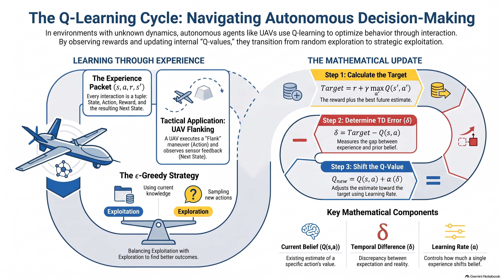

## L15 Reinforcement Learning - Q Learning


:::{admonition} Lesson Objectives
:class: note
* Explain Q-learning and Q-values
* Compare model-based and model-free learning
* Interpret learning from experience
:::


When deploying autonomous agents—such as unmanned aerial vehicles (UAVs) navigating contested airspace or cyber-defense algorithms securing tactical networks—the environment's exact dynamics are rarely known in advance. The agent must interact with the environment, observing the consequences of its actions to optimize its behavior over time. 

### Compare Model-Based and Model-Free Learning

When an agent plans its actions, it relies on either a known model or raw experience.

*   **{term}`Model-Based Planning`:** Algorithms like Value Iteration (VI) and Policy Iteration (PI) rely on a completely known model of the environment. The agent knows the exact transition probabilities ($P(s'\vert{}s,a)$) and the reward function ($R$) in advance. By calculating all possible futures, the agent reasons over the outcomes before acting. 
*   **{term}`Model-Free Learning`:** Q-learning occurs when the model is unknown. The transition probabilities fade into question marks. Instead of calculating probabilities, the agent acts, observes the results $(s,a,r,s')$, and updates its Q-values directly based on those actual outcomes. The agent interacts with the environment instead of requiring the full model in advance.

### Interpret Learning from Experience

In model-free learning, experience becomes the teacher. The learner does not see every possible result; it only sees what happened during a specific interaction. 

One interaction creates one experience packet, formatted as the tuple $(s, a, r, s')$:
*   **$s$**: The current state.
*   **$a$**: The chosen action.
*   **$r$**: The observed reward.
*   **$s'$**: The observed next state.

To gather these packets, the agent must balance two behaviors:
*   **{term}`Exploitation`**: Choosing the current highest-Q action (the greedy action) to maximize performance using what has been learned.
*   **{term}`Exploration`**: Deliberately sampling alternative actions to discover potentially better outcomes, recognizing that early estimates may be wrong. 

The $\epsilon$-greedy strategy manages this tradeoff by mostly exploiting (with probability $1 - \epsilon$), while sometimes exploring (with probability $\epsilon$).

### Explain Q-Learning, Target, and TD Error

A {term}`Q-Value` ($Q(s,a)$) estimates the long-term return associated with taking a specific action in a specific state. It is not a probability, nor is it just the immediate reward. 

When a new experience packet $(s, a, r, s')$ is received, the Q-learning algorithm executes a specific three-step mathematical update:

#### 1. Calculate the Target
The target represents what this new experience suggests the Q-value *should* move toward. It combines the immediate evidence (reward) with the estimated value of the best next action.
$$Target = r + \gamma \max_{a'} Q(s',a')$$
*(Where $\gamma$ is the discount factor, bounding the importance of future returns.)*

#### 2. Calculate the Temporal Difference (TD) Error
The {term}`Temporal Difference Error` ($\delta$) measures the discrepancy between the new target and the current prediction. 
$$\delta = Target - Q(s,a)$$
*   If $\delta > 0$: The experience was better than expected.
*   If $\delta < 0$: The experience was worse than expected.

#### 3. Update the Q-Value
The new estimate moves the old estimate toward the target, controlled by the learning rate ($\alpha$). A large $\alpha$ gives the new experience more influence, while a small $\alpha$ changes the estimate cautiously.
$Q_{new} = Q(s,a) + \alpha (\delta)$

```{mermaid}
graph LR
    S((State: s)) -- "Action: a - Observe r and s'" --> S1((State: s'))
    S1 -- "Calculate Target - maxQ(s', a')" --> 
    Q2 -- "Update Q(s,a) via α(δ)" --> NewQ
    NewQ -- "Do it again!" --> S
    
    classDef default fill:#f9f9f9,stroke:#888,stroke-width:2px,color:#000;
    classDef highlight fill:#d4edda,stroke:#28a745,stroke-width:2px,color:#000;
    linkStyle default stroke:#a0a0a0,stroke-width:2px;
```
### Controlling the Agent: Learning Rate and Exploration

When implementing Q-learning, the agent's behavior and adaptation speed are governed by specific bounded parameters. Two of the most critical are the learning rate ($\alpha$) and the exploration probability ($\epsilon$). 

#### The Learning Rate ($\alpha$)
The learning rate ($\alpha$) controls the update size, determining how far the agent's current estimate moves toward the newly calculated target. While it operates on a numeric range between 0 and 1, it is not a probability. 

*   **Large $\alpha$:** New experiences are given more influence, allowing the agent to adapt its Q-values rapidly.
*   **Small $\alpha$:** The agent's estimates change cautiously, meaning each individual experience matters less. This is not inherently wrong, but extremely small values mean that learning may require many more samples to effectively update the agent's beliefs.

#### The Exploration Probability ($\epsilon$)
The exploration parameter ($\epsilon$) is a probability that controls exactly how often the learner explores its environment rather than exploiting its known information. This is typically implemented via an **$\epsilon$-greedy** strategy, which operates on a simple intuition: mostly exploit, but sometimes explore.

When making a decision, the agent rolls a weighted die:
*   With a probability of **$1 - \epsilon$**, the agent chooses to **exploit**, relying on its current Q-table to choose the current best action.
*   With a probability of **$\epsilon$**, the agent chooses to **explore**, trying another action to gather new information.

Setting the correct $\epsilon$ value requires balancing a strict tradeoff:
*   **$\epsilon = 0$:** The agent never explores and risks getting stuck relying on early, potentially incorrect estimates.
*   **Moderate $\epsilon$:** The agent mostly exploits to maintain high performance but sometimes tries new actions to learn more.
*   **Very High $\epsilon$:** The agent explores constantly, which gathers a lot of data but results in lower overall performance because it ignores its optimized policy.

### Putting the Pieces Together: The Full Q-Learning Update

The full Q-learning update is a compact notation for a simple adjustment. The new estimate moves the old estimate toward the calculated target by combining all the individual components into a single equation:

$Q(s, a) \leftarrow Q(s, a) + \alpha [r + \gamma \max_{a'} Q(s', a') - Q(s, a)]$

This equation can be broken down into four distinct conceptual steps to understand how the agent revises its beliefs:

1.  **Current belief:** $Q(s,a)$
    *   *The agent's existing estimate of the long-term return for taking action $a$ in state $s$.*
2.  **Target:** $r + \gamma \max_{a'} Q(s',a')$
    *   *The immediate reward ($r$) plus the discounted expected value of the best next action.*
3.  **TD error:** $\text{Target} - Q(s,a)$
    *   *The discrepancy between what the agent expected and what it actually experienced.*
4.  **Adjustment:** $\alpha \times \text{error}$
    *   *The proportional shift applied to the old belief, dictated by the learning rate ($\alpha$).*

## Summary Infographic


## Knowledge Check & Practice Exercises

**Problem 1: Calculating the Full Q-Learning Update**
An autonomous loyal wingman UAV (State $s$) executes a "Flank" maneuver (Action $a$). The current belief for this action is $Q(s,a) = 5.0$. Upon execution, the UAV receives an immediate reward of $r = 2.0$ and transitions to a new state $s'$, where its sensors indicate the best next action has an estimated value of $\max_{a'} Q(s',a') = 8.0$. Assume a discount factor ($\gamma$) of $0.5$ and a learning rate ($\alpha$) of $0.5$. Calculate the Target, the Temporal Difference (TD) error, and the updated $Q(s,a)$.

<details>
  <summary>Show solution</summary>

  **Step 1:** Calculate the Target using the formula $r + \gamma \max_{a'} Q(s',a')$.
  $Target = 2.0 + 0.5(8.0) = 2.0 + 4.0 = 6.0$.

  **Step 2:** Calculate the TD error using the formula $Target - Q(s,a)$.
  $\delta = 6.0 - 5.0 = 1.0$.

  **Step 3:** Calculate the adjustment and update the Q-value using $Q(s,a) + \alpha \times error$.
  $Q_{new} = 5.0 + 0.5(1.0) = 5.5$.

  **Answer:**
  The Target is 6.0, the TD error is 1.0, and the updated Q-value is 5.5.

</details>
<br>
---

**Problem 2: Interpreting the TD Error**
A cyber-defense agent monitors network traffic and calculates a Temporal Difference (TD) error of $-15$ after taking an action to reroute packets. Does this negative error indicate the outcome was better or worse than the agent's current belief? If the agent's learning rate ($\alpha$) is set to a very small value like $0.01$, how will this impact the subsequent Q-value update?

<details>
  <summary>Show solution</summary>

  **Step 1:** Evaluate the sign of the TD error. A negative TD error ($\delta < 0$) means the target is below the current estimate.

  **Step 2:** Evaluate the impact of the learning rate ($\alpha$) on the adjustment step ($\alpha \times error$).

  **Answer:**
  The negative TD error indicates the outcome was worse than the agent expected. Because the learning rate is very small ($\alpha = 0.01$), the estimates will change very cautiously, meaning this specific negative experience will only slightly reduce the current Q-value.

</details>
<br>
---

**Problem 3: The Exploration Probability ($\epsilon$)**
An Electronic Warfare (EW) system uses Q-learning to select jamming frequencies against adversary communications. The system commander wants to maximize immediate performance and suggests setting the exploration probability ($\epsilon$) to $0$. Explain the tactical risk of this greedy strategy.

<details>
  <summary>Show solution</summary>

  **Step 1:** Define what setting $\epsilon = 0$ means for the agent's behavior. An $\epsilon$ of 0 means the agent will never explore and will only exploit its current best estimates.

  **Step 2:** Identify the risk of pure exploitation. Early estimates may be wrong, and without exploration, the agent cannot gather new information.

  **Answer:**
  Setting $\epsilon = 0$ means the EW system will only exploit what it currently believes is best and will never explore. The tactical risk is that the system can get stuck using suboptimal frequencies because its early estimates might be wrong, failing to discover newer, highly effective jamming alternatives.

</details>
<br>
---