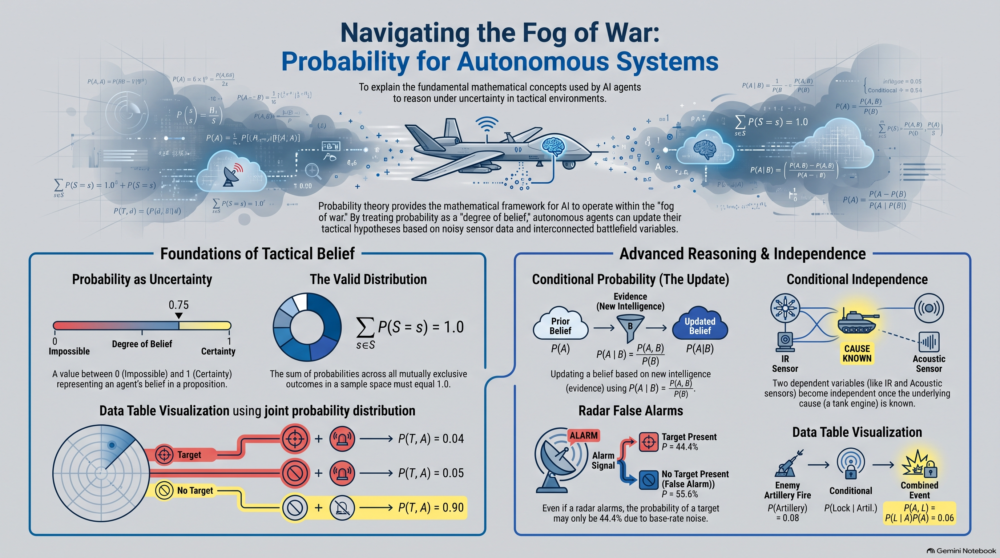

# Lesson 18: Probability (Uncertainty, Conditioning, and Independence)

:::{admonition} Lesson Objectives
:class: note
* Interpret probability as uncertainty.
* Compute joint and conditional probabilities.
* Identify independence and dependence.
:::

In previous lessons on deterministic search and game trees, an AI agent operates with complete knowledge of the state space. On the real-world battlefield, however, sensors are noisy, weather deteriorates, adversaries actively conceal their positions, and communications are jammed. We use **probability theory** as the mathematical framework to represent and reason under uncertainty—the "fog of war."

## Probability as Uncertainty

In artificial intelligence, probability represents an agent's **degree of belief** in a proposition given incomplete or noisy observations. Rather than stating definitively whether a hostile submarine is present in a sector, an autonomous maritime patrol aircraft maintains a mathematical probability distribution over all possible tactical hypotheses.

All probabilities are real numbers bounded between $0$ (impossible) and $1$ (certainty), and the sum of probabilities across all mutually exclusive outcomes in an entire sample space must equal $1$:

$$\sum_{s \in S} P(S = s) = 1.0$$

For example, an autonomous Unmanned Surface Vessel (USV) classifies an unidentified radar contact into three mutually exclusive categories: Hostile ($0.15$), Friendly ($0.75$), or Neutral ($0.10$). The sum $0.15 + 0.75 + 0.10 = 1.0$ forms a valid {term}`Probability Distribution`.

## Joint Probability Distributions

A **{term}`Joint Probability`** measures the likelihood that two or more random variables take on specific values simultaneously, denoted as $P(A = a, B = b)$ or simply $P(A, B)$.

A Full Joint Probability Table completely characterizes an uncertain domain by assigning a probability to every possible combination of atomic states.

Consider an Autonomous Early Warning Radar tracking an airspace sector. Let $T \in \{\text{Target}, \text{NoTarget}\}$ represent target presence, and let $A \in \{\text{Alarm}, \text{NoAlarm}\}$ represent whether the radar signal threshold is exceeded:

| $T$ | $A$ | $P(T, A)$ |
| :--- | :--- | :--- |
| $\text{Target}$ | $\text{Alarm}$ | $0.04$ |
| $\text{Target}$ | $\text{NoAlarm}$ | $0.01$ |
| $\text{NoTarget}$ | $\text{Alarm}$ | $0.05$ |
| $\text{NoTarget}$ | $\text{NoAlarm}$ | $0.90$ |

The sum of all four joint entries is $0.04 + 0.01 + 0.05 + 0.90 = 1.0$.

## Marginalization (Summing Out)

To calculate the unconditional probability of a single variable from a joint distribution, we apply **{term}`Marginal Probability (Marginalization)`**. We sum the joint probabilities across all possible values of the extraneous variables:

$$P(A) = \sum_{b} P(A, B = b)$$

Using the radar table above, calculate the marginal probability that an alarm triggers ($A = \text{Alarm}$), regardless of whether an actual target is present:

$$P(A = \text{Alarm}) = P(T = \text{Target}, A = \text{Alarm}) + P(T = \text{NoTarget}, A = \text{Alarm})$$
$$P(A = \text{Alarm}) = 0.04 + 0.05 = 0.09$$

The radar system generates an alarm in $9\%$ of all scans.

## Conditional Probability and the Product Rule

When an agent receives new intelligence or sensor telemetry (evidence $B$), it must update its belief about hypothesis $A$. The **{term}`Conditional Probability`** $P(A \mid B)$ represents the probability of $A$ occurring given that $B$ is known to be true:

$$P(A \mid B) = \frac{P(A, B)}{P(B)} \quad \text{where } P(B) > 0$$

If the radar alarms ($A = \text{Alarm}$), what is the updated probability that an actual enemy target is present ($T = \text{Target}$)?

$$P(T = \text{Target} \mid A = \text{Alarm}) = \frac{P(T = \text{Target}, A = \text{Alarm})}{P(A = \text{Alarm})} = \frac{0.04}{0.09} \approx 0.444 \text{ (or } 44.4\%)$$

Even though the alarm sounded, there is only a $44.4\%$ chance an actual target is present due to the base-rate of false alarms.

Rearranging the definition of conditional probability yields the **{term}`Product Rule (Probability)`**:

$$P(A, B) = P(A \mid B)P(B) = P(B \mid A)P(A)$$

A forward operating base knows that the historical probability of enemy artillery firing in a 24-hour cycle is $P(\text{Artillery}) = 0.08$. Intelligence indicates that if artillery fires, the probability of an adversary counter-battery radar locking on is $P(\text{RadarLock} \mid \text{Artillery}) = 0.75$. The joint probability of both events occurring simultaneously is:

$$P(\text{Artillery}, \text{RadarLock}) = P(\text{RadarLock} \mid \text{Artillery})P(\text{Artillery}) = 0.75 \times 0.08 = 0.06$$

## Independence and Dependence

Two random variables $A$ and $B$ are **{term}`Independence (Statistical Independence)`** ($A \perp B$) if observing the outcome of $B$ provides absolutely no new information about the distribution of $A$:

$$P(A \mid B) = P(A) \iff P(A, B) = P(A)P(B)$$

If two variables are not independent, they are **dependent**.

An autonomous UAV operates two redundant satellite communications receivers: Primary ($C_1$) and Backup ($C_2$). The hardware failure of $C_1$ ($P(C_1 = \text{Fail}) = 0.02$) is caused by internal component wear, which is independent of the failure of $C_2$ ($P(C_2 = \text{Fail}) = 0.02$). The joint probability of both independent links failing simultaneously is:

$$P(C_1 = \text{Fail}, C_2 = \text{Fail}) = P(C_1 = \text{Fail}) \times P(C_2 = \text{Fail}) = 0.02 \times 0.02 = 0.0004 \text{ (or } 0.04\%)$$

### Conditional Independence

Absolute independence is rare on the battlefield because most tactical variables are interconnected. However, two variables that are dependent can become independent once a third underlying variable is observed. This is **{term}`Conditional Independence`** ($A \perp B \mid C$):

$$P(A, B \mid C) = P(A \mid C)P(B \mid C) \iff P(A \mid B, C) = P(A \mid C)$$

An Autonomous Reconnaissance Drone has two onboard sensors: an Infrared (IR) Optical Camera ($S_{\text{IR}}$) and an Acoustic Signature Detector ($S_{\text{Acoustic}}$). If an enemy tank starts its engine ($T = \text{TankEngineOn}$), both sensors are much more likely to trigger alerts simultaneously. Therefore, $S_{\text{IR}}$ and $S_{\text{Acoustic}}$ are dependent. 

However, given that we *already know* the tank engine is running ($T = \text{TankEngineOn}$), any electrical noise or random sensor error in the optical camera ($S_{\text{IR}}$) gives us no information about the acoustic sensor's microphone noise. The two sensor alerts are **conditionally independent** given the true ground target state $T$.

## Summary Infographic

 

## Knowledge Check & Practice Questions

**1. An autonomous cyber-defense agent monitors incoming packet streams. If the probability of a Distributed Denial of Service (DDoS) attack occurring is $P(\text{DDoS}) = 0.05$, and the probability of a network switch crashing given an active DDoS attack is $P(\text{SwitchCrash} \mid \text{DDoS}) = 0.80$, what is the joint probability $P(\text{DDoS}, \text{SwitchCrash})$?**

- A) 0.85
- B) 0.04
- C) 0.16
- D) 0.004

**2. An Electronic Warfare (EW) surveillance system notes that jamming on Radar A and jamming on Radar B are dependent. However, once the AI confirms that an adversary EW Aircraft is active in the sector, knowing the state of Radar A provides no additional information about Radar B. What mathematical property describes this relationship?**

- A) Marginalization
- B) Statistical Absolute Independence
- C) Conditional Independence
- D) Deterministic Search Equivalence

**3. An intelligence database contains the following joint distribution for terrain trafficability ($T \in \{\text{Passable}, \text{Impassable}\}$) and adversary minefield presence ($M \in \{\text{Mined}, \text{Clear}\}$): $P(\text{Passable}, \text{Mined}) = 0.08$, $P(\text{Passable}, \text{Clear}) = 0.72$, $P(\text{Impassable}, \text{Mined}) = 0.12$, and $P(\text{Impassable}, \text{Clear}) = 0.08$. What is the marginal probability that the terrain is Passable ($P(\text{Passable})$)?**

- A) 0.80
- B) 0.72
- C) 0.20
- D) 0.08