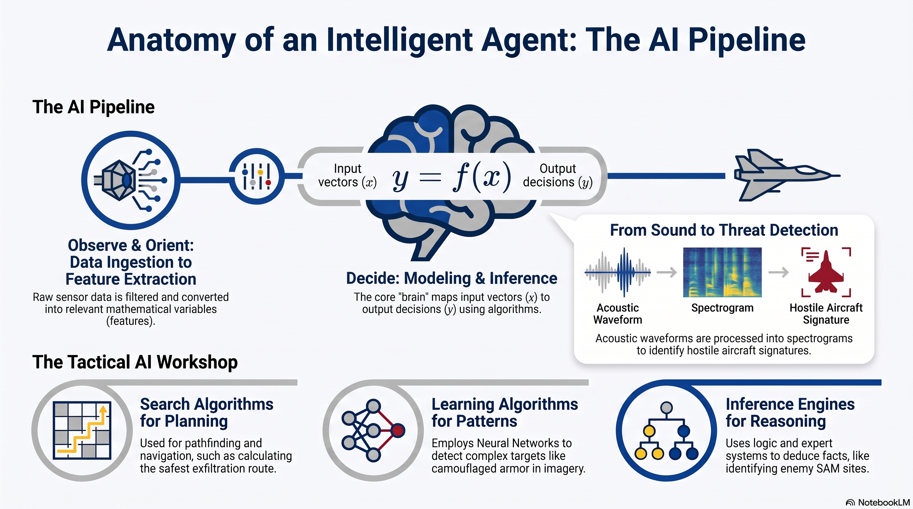

# L2: Anatomy of AI Systems

:::{admonition} Lesson Objectives
:class: note

* Identify the major components of an AI system pipeline.

* Explain how inputs are transformed into outputs.

* Relate different AI techniques (search, learning, inference) to system components.
:::

## The AI Pipeline: The Intelligent Agent

To an AI Systems Integration Officer, an {term}`Artificial Intelligence (AI)` system is not a magic black box; it operates as an "intelligent agent." According to {cite:t}`russell2020artificial`, an {term}`Agent` is anything that can perceive its environment through sensors and act upon that environment through actuators. We map this to a highly structured {term}`Pipeline`, similar to the military OODA loop (Observe, Orient, Decide, Act).

The major components of this pipeline include:

* Data Ingestion (Sensors) gathers raw intelligence from the environment (e.g., radar signatures, satellite imagery, intercepted text).

* {term}`Preprocessing` & {term}`Feature Extraction` are used to cleaning the raw data and isolating the mathematical variables most relevant to the mission.

* Modeling & {term}`Inference` are the core "brain" of the system where algorithms map perceptions to actions. As {cite:t}`ertel2018introduction` notes, this {term}`Inference Mechanism` is often separated from the {term}`Knowledge Base (KB)` to allow for flexible, declarative reasoning.

* Post-processing & Output (Actuators) translates the model's mathematical output back into a physical machine action or human-readable format.

## Transforming Inputs to Outputs

Mathematically, an AI system is an agent program that implements a function mapping percepts to actions. This approximates a function $y = f(x)$, where the input vector $x$ (sensor data) is transformed into the output vector $y$ (the decision).

This transformation happens in stages. For example, if an acoustic sensor picks up a sound profile:

**Raw Input:** An audio waveform file (noise).

**Transformation 1** ({term}`Preprocessing`): The system filters out background wind noise.

**Transformation 2** ({term}`Feature Extraction`): The system converts the audio into a spectrogram, mapping frequency over time.

**Transformation 3** ({term}`Inference`): A model analyzes the spectrogram and calculates an 85% probability that the profile matches a hostile rotary-wing aircraft.

**Final Output:** A red threat indicator lights up on the Tactical Operations Center (TOC) screen.

## Matching Techniques to Components

According to {cite:t}`ertel2018introduction`, AI is not a single universal method, but a workshop with various tools for different tasks. 

Different tactical problems require different methodologies within the modeling component:

{term}`Search` Algorithms (Pathfinding & Planning): Used when the system needs to navigate a known environment to find an optimal sequence of actions (e.g., A* search). Example: A routing algorithm calculating the safest exfiltration path.

{term}`Learning` Algorithms (Pattern Recognition): Used when the rules are too complex to program manually, so the system must adapt by changing its behavior based on training examples. Example: Training a Convolutional Neural Network (CNN) on thermal images to detect camouflaged armor.

{term}`Inference` Engines (Knowledge-Based Reasoning): Used when the system leverages explicit rules (like first-order logic) to deduce facts from current evidence. Example: An {term}Expert System that cross-references a detected radar frequency to infer the model of an enemy SAM site.

 

## 5. Knowledge Check & Practice Questions

1. In the AI pipeline, which component is directly responsible for converting raw sensor data (like a video feed) into isolated, mathematically relevant variables?

2. An AI system is tasked with finding the safest exfiltration route for a ground team by analyzing a known map of threat areas. Which AI technique is most appropriate for this task?

3. What is the primary mathematical purpose of an AI system's "Inference" phase?
