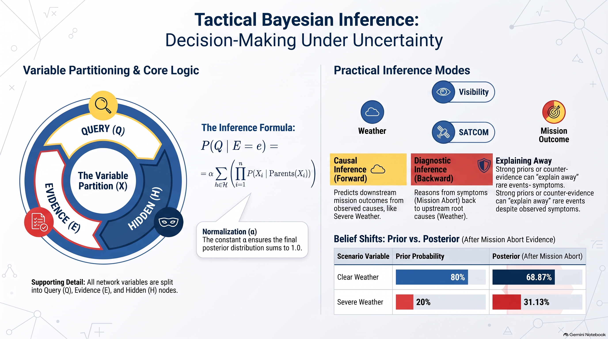

# L21: Bayesian Inference

:::{admonition} Lesson Objectives
:class: note

* Compute probabilities using factorization.

* Perform simple probabilistic inference.

* Interpret inference results.
:::

In Lesson 20, we learned that a {term}`Bayesian Network` decomposes an intractable joint distribution into local {term}`Conditional Probability Table (CPT)`s using a {term}`Directed Acyclic Graph (DAG)`.

However, building the graph is only the first step. On the battlefield, commanders and autonomous combat systems do not just store probabilities—they must answer mission-critical tactical queries:

"Given that our forward ground radar detected an explosion, what is the probability an enemy missile battery launched?"

"Given severe sector weather and radio silence, what is the probability our strike package aborted?"

The process of computing the answer to such queries from observed evidence is called {term}`Probabilistic Inference`.

## Variable Categorization in Probabilistic Inference

When performing inference on a Bayesian network, all random variables in the domain $\mathbf{X}$ are partitioned into three mutually exclusive subsets:
```{mermaid}
graph TD
    X["ALL VARIABLES IN THE NETWORK (X)"]

    Q["Query Nodes (Q)<br>What we want to calculate"]
    E["Evidence Nodes (E)<br>What sensors have measured: E = e"]
    H["Hidden Nodes (H)<br>Unobserved, must be summed out"]

    X --> Q
    X --> E
    X --> H

    style X fill:transparent,stroke:#3498db,stroke-width:2px
    style Q fill:transparent,stroke:#2ecc71,stroke-width:2px
    style E fill:transparent,stroke:#e67e22,stroke-width:2px
    style H fill:transparent,stroke:#95a5a6,stroke-width:2px
```


{term}`Query Variable`: The unknown variable of interest whose probability distribution we want to determine.

{term}`Evidence Variable`: The variables whose exact states have been observed by sensors, intelligence feeds, or pilot reports (e.g., $E = e$).

{term}`Hidden Variable`: Variables that are neither queried nor directly observed. Because their values remain unknown, they must be mathematically summed out ({term}`Marginal Probability (Marginalization)`).

$$\mathbf{X} = \{Q\} \cup \mathbf{E} \cup \mathbf{H}$$

The objective of probabilistic inference is to compute the posterior distribution:

$$\mathbf{P}(Q \mid \mathbf{E} = \mathbf{e})$$

## Computing Probabilities Using Factorization

Recall the Bayesian network chain rule from Lesson 20:

$$P(X_1, X_2, \dots, X_n) = \prod_{i=1}^n P(X_i \mid Parents(X_i))$$

We evaluate any single atomic configuration of the operational environment by multiplying the corresponding values from the local CPTs.

### Tactical Air-Strike Planning Topology

Consider the theater strike planning network:

$$W \to V, \quad W \to C, \quad V \to M, \quad C \to M$$

Where:

$W \in \{\text{Clear}, \text{Severe}\}$: Sector Weather

$V \in \{\text{Good}, \text{Poor}\}$: Visual Target Acquisition

$C \in \{\text{Reliable}, \text{Disrupted}\}$: SATCOM Link

$M \in \{\text{Success}, \text{Abort}\}$: Strike Mission Outcome

             ┌─────────────┐
             │ Weather (W) │
             └──────┬──────┘
                    │
            ┌───────┴───────┐
            ▼               ▼
     ┌──────────────┐┌──────────────┐
     │Visibility (V)││  SATCOM (C)  │
     └──────┬───────┘└──────┬───────┘
            │               │
            └───────┬───────┘
                    ▼
             ┌─────────────┐
             │ Mission (M) │
             └─────────────┘


### Numerical CPT Parameters

**Prior Weather**: $P(W = \text{Clear}) = 0.80, \quad P(W = \text{Severe}) = 0.20$

*Sensor Visibility*:

$P(V = \text{Good} \mid W = \text{Clear}) = 0.90, \quad P(V = \text{Poor} \mid W = \text{Clear}) = 0.10$

$P(V = \text{Good} \mid W = \text{Severe}) = 0.30, \quad P(V = \text{Poor} \mid W = \text{Severe}) = 0.70$

*SATCOM Communications*:

$P(C = \text{Reliable} \mid W = \text{Clear}) = 0.85, \quad P(C = \text{Disrupted} \mid W = \text{Clear}) = 0.15$

$P(C = \text{Reliable} \mid W = \text{Severe}) = 0.40, \quad P(C = \text{Disrupted} \mid W = \text{Severe}) = 0.60$

*Mission Execution*:

$P(M = \text{Success} \mid \text{Good}, \text{Reliable}) = 0.95, \quad P(M = \text{Abort} \mid \text{Good}, \text{Reliable}) = 0.05$

$P(M = \text{Success} \mid \text{Good}, \text{Disrupted}) = 0.60, \quad P(M = \text{Abort} \mid \text{Good}, \text{Disrupted}) = 0.40$

$P(M = \text{Success} \mid \text{Poor}, \text{Reliable}) = 0.50, \quad P(M = \text{Abort} \mid \text{Poor}, \text{Reliable}) = 0.50$

$P(M = \text{Success} \mid \text{Poor}, \text{Disrupted}) = 0.10, \quad P(M = \text{Abort} \mid \text{Poor}, \text{Disrupted}) = 0.90$

To compute the probability of any full joint state, factor along the graph:

$$P(W=w, V=v, C=c, M=m) = P(w) \cdot P(v \mid w) \cdot P(c \mid w) \cdot P(m \mid v, c)$$

## Performing Probabilistic Inference: Inference by Enumeration

When querying an incomplete state where some variables are unobserved, we apply {term}`Inference by Enumeration`.

By the definition of conditional probability:

$$P(Q \mid \mathbf{E} = \mathbf{e}) = \frac{P(Q, \mathbf{E} = \mathbf{e})}{P(\mathbf{E} = \mathbf{e})} = \alpha P(Q, \mathbf{E} = \mathbf{e})$$

Where $\alpha = \frac{1}{P(\mathbf{E} = \mathbf{e})}$ is the {term}`Normalization Constant`.

To compute the joint probability $P(Q, \mathbf{E} = \mathbf{e})$, we sum over all possible combinations of the {term}`Hidden Variable` ($H$):

$$P(Q = q \mid \mathbf{E} = \mathbf{e}) = \alpha \sum_{h \in H} P(Q = q, \mathbf{E} = \mathbf{e}, H = h)$$

Substituting the Bayesian network factorization:

$$P(Q = q \mid \mathbf{E} = \mathbf{e}) = \alpha \sum_{h \in H} \left( \prod_{i=1}^n P(X_i \mid Parents(X_i)) \right)$$

4. Step-by-Step Tactical Inference Walkthroughs


### Causal Inference (Forward Prediction)

In {term}`Causal Inference`, we reason from observed upstream causes to downstream mission outcomes.

For example, reconnaissance confirms that the target sector weather is Severe ($W = \text{Severe}$). What is the probability that the strike mission succeeds ($M = \text{Success}$)?

Query Variable ($Q$): Mission Outcome $M \in \{\text{Success}, \text{Abort}\}$

Evidence Variable ($E$): Weather $W = \text{Severe}$

Hidden Variables ($H$): Visibility ($V$) and Communications ($C$)

* Step 1: Write the marginalization formula over hidden variables $V$ and $C$

$$P(M = \text{Success} \mid W = \text{Severe}) = \sum_{v \in \{G, P\}} \sum_{c \in \{R, D\}} P(V=v, C=c, M=\text{Success} \mid W = \text{Severe})$$

Because $V$ and $C$ are conditionally independent given $W$, the joint conditional factors cleanly:

$$P(M = \text{Success} \mid W = \text{Severe}) = \sum_{v \in \{G, P\}} \sum_{c \in \{R, D\}} P(v \mid \text{Severe}) \cdot P(c \mid \text{Severe}) \cdot P(\text{Success} \mid v, c)$$

* Step 2: Enumerate and sum all 4 possible configurations of $(V, C)$

$V = \text{Good}, C = \text{Reliable}$:


$$P(G \mid \text{Sev}) \cdot P(R \mid \text{Sev}) \cdot P(\text{Succ} \mid G, R) = 0.30 \times 0.40 \times 0.95 = 0.1140$$

$V = \text{Good}, C = \text{Disrupted}$:


$$P(G \mid \text{Sev}) \cdot P(D \mid \text{Sev}) \cdot P(\text{Succ} \mid G, D) = 0.30 \times 0.60 \times 0.60 = 0.1080$$

$V = \text{Poor}, C = \text{Reliable}$:


$$P(P \mid \text{Sev}) \cdot P(R \mid \text{Sev}) \cdot P(\text{Succ} \mid P, R) = 0.70 \times 0.40 \times 0.50 = 0.1400$$

$V = \text{Poor}, C = \text{Disrupted}$:


$$P(P \mid \text{Sev}) \cdot P(D \mid \text{Sev}) \cdot P(\text{Succ} \mid P, D) = 0.70 \times 0.60 \times 0.10 = 0.0420$$

* Step 3: Sum the terms

$$P(M = \text{Success} \mid W = \text{Severe}) = 0.1140 + 0.1080 + 0.1400 + 0.0420 = 0.4040 \text{ (or } 40.40\%)$$

Tactical Takeaway: When severe weather strikes the operational sector, the compounded sensor and radio degradation collapses the autonomous strike package's probability of success from $85.3\%$ down to $40.4\%$.


### Diagnostic Inference (Backward Diagnosis)

In {term}`Diagnostic Inference`, an agent reasons backward from observed downstream symptoms to infer upstream root causes.

Tactical Scenario: Telemetry confirms that an air strike resulted in an Abort ($M = \text{Abort}$), while satellite communications remained operational ($C = \text{Reliable}$). Did the failure originate from Severe Weather ($W = \text{Severe}$)?

Query Variable ($Q$): Weather $W \in \{\text{Clear}, \text{Severe}\}$

Evidence Variables ($E$): $M = \text{Abort}, C = \text{Reliable}$

Hidden Variable ($H$): Visibility $V \in \{\text{Good}, \text{Poor}\}$

* Step 1: Formulate the unnormalized distribution over $W$ using $\alpha$

$$\mathbf{P}(W \mid M = \text{Abort}, C = \text{Reliable}) = \alpha \sum_{v \in \{G, P\}} \mathbf{P}(W, V=v, C=\text{Reliable}, M=\text{Abort})$$

Factor the joint probability:


$$P(w, v, \text{Reliable}, \text{Abort}) = P(w) \cdot P(v \mid w) \cdot P(\text{Reliable} \mid w) \cdot P(\text{Abort} \mid v, \text{Reliable})$$

* Step 2: Compute unnormalized probability for $W = \text{Clear}$

For $V = \text{Good}$:


$$P(\text{Clr}) \cdot P(G \mid \text{Clr}) \cdot P(R \mid \text{Clr}) \cdot P(\text{Ab} \mid G, R) = 0.80 \times 0.90 \times 0.85 \times 0.05 = 0.0306$$

For $V = \text{Poor}$:


$$P(\text{Clr}) \cdot P(P \mid \text{Clr}) \cdot P(R \mid \text{Clr}) \cdot P(\text{Ab} \mid P, R) = 0.80 \times 0.10 \times 0.85 \times 0.50 = 0.0340$$

Sum for Clear:


$$P(W = \text{Clear}, R, \text{Ab}) = 0.0306 + 0.0340 = 0.0646$$

* Step 3: Compute unnormalized probability for $W = \text{Severe}$

For $V = \text{Good}$:


$$P(\text{Sev}) \cdot P(G \mid \text{Sev}) \cdot P(R \mid \text{Sev}) \cdot P(\text{Ab} \mid G, R) = 0.20 \times 0.30 \times 0.40 \times 0.05 = 0.0012$$

For $V = \text{Poor}$:


$$P(\text{Sev}) \cdot P(P \mid \text{Sev}) \cdot P(R \mid \text{Sev}) \cdot P(\text{Ab} \mid P, R) = 0.20 \times 0.70 \times 0.40 \times 0.50 = 0.0280$$

Sum for Severe:


$$P(W = \text{Severe}, R, \text{Ab}) = 0.0012 + 0.0280 = 0.0292$$

* Step 4: Normalize using $\alpha$

Compute the normalization constant $\alpha$:


$$\alpha = \frac{1}{P(W = \text{Clear}, R, \text{Ab}) + P(W = \text{Severe}, R, \text{Ab})} = \frac{1}{0.0646 + 0.0292} = \frac{1}{0.0938} \approx 10.6610$$

Compute the normalized posterior probabilities:


$$P(W = \text{Clear} \mid R, \text{Ab}) = 0.0646 \times 10.6610 = \frac{0.0646}{0.0938} \approx 0.6887 \text{ (or } 68.87\%)$$

$$P(W = \text{Severe} \mid R, \text{Ab}) = 0.0292 \times 10.6610 = \frac{0.0292}{0.0938} \approx 0.3113 \text{ (or } 31.13\%)$$


## Interpreting Inference Results

Interpreting probabilistic inference requires looking beyond the raw decimals to understand how operational friction propagates:

###  Prior vs. Posterior Belief Shift:

Prior probability of Severe Weather: $P(W = \text{Severe}) = 0.20$ ($20.0\%$).

Posterior probability after observing an Abort under Reliable SATCOM: $P(W = \text{Severe} \mid R, \text{Ab}) = 0.3113$ ($31.13\%$).

Interpretation: Observing a mission abort increased our belief that severe weather occurred by over $55\%$ relative to the prior baseline.

### Explaining Away:

Notice that even though a mission abort occurred, the weather is still more likely to have been Clear ($68.87\%$) than Severe ($31.13\%$).

Why? The prior probability of Clear weather is high ($80\%$). Furthermore, observing that SATCOM was Reliable acts as counter-evidence against severe weather (since severe weather disrupts radios 60% of the time). The model balances the rare symptom against the strong base rate.

---

## Summary Infographic


<br>
<hr width="100%" size="4" color="black">

## Knowledge Check & Practice Questions

1. In a Bayesian network where random variables are partitioned into Query variables ($Q$), Evidence variables ($E$), and Hidden variables ($H$), what mathematical operation must be performed on the Hidden variables to calculate the posterior distribution $\mathbf{P}(Q \mid E)$?

A) Maximization using gradient ascent

B) Marginalization by summing joint probabilities over all states of $H$

C) Conditioning on $H$ by instantiating it to a random variable

D) Inversion using Laplace smoothing

2. A tactical network features variables $A \to B \to C$. An intelligence analyst knows the exact value of $A$ and wishes to calculate the probability distribution of $C$. Which role does variable $B$ play in this inference calculation?

A) It is the Query Variable

B) It is an Evidence Variable

C) It is a Hidden Variable that must be summed out

D) It is an Ancestor of $A$

3. When executing inference by enumeration, an unnormalized probability vector for a binary query variable $Q \in \{\text{True}, \text{False}\}$ evaluates to $\langle 0.045, 0.105 \rangle$. What is the value of the normalization constant $\alpha$, and what is the final posterior probability $P(Q = \text{True} \mid E)$?

A) $\alpha = 0.150, \quad P(Q = \text{True} \mid E) = 0.045$

B) $\alpha = 6.667, \quad P(Q = \text{True} \mid E) = 0.300$

C) $\alpha = 1.000, \quad P(Q = \text{True} \mid E) = 0.450$

D) $\alpha = 0.850, \quad P(Q = \text{True} \mid E) = 0.700$

4. An automated sensor array evaluates an Electronic Warfare jamming attack ($J \in \{0, 1\}$) from downstream receiver errors ($E \in \{0, 1\}$). Reasoning from the observed receiver errors back to the probability of an active jamming attack ($P(J=1 \mid E=1)$) is classified as which mode of inference?

A) Causal Inference

B) Diagnostic Inference

C) Uniform Search Inference

D) Intercausal Explaining-Away