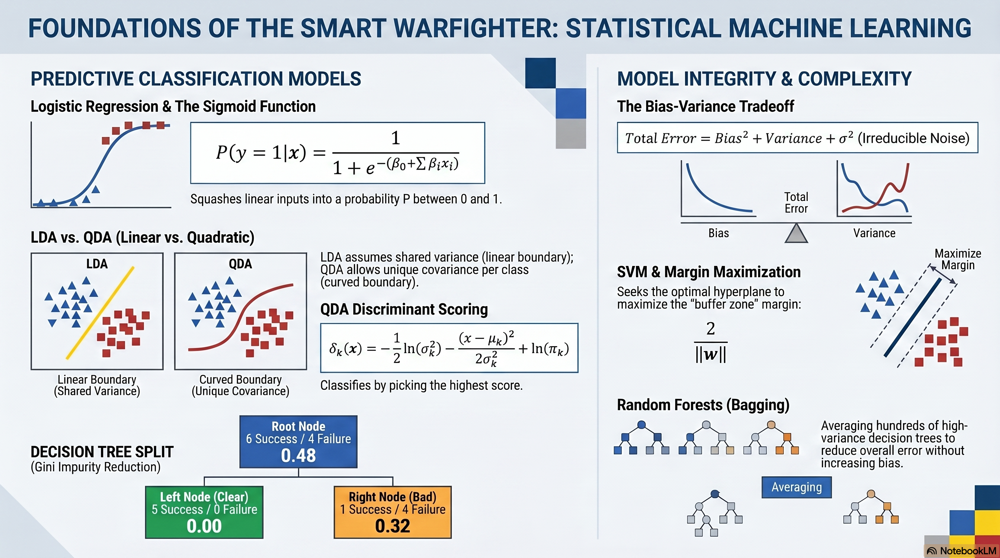

# L26: ML Foundations

Welcome to the foundation of the Machine Learning. Before we can deploy advanced neural networks or autonomous drone wingmen, we must master the statistical algorithms that form the bedrock of artificial intelligence. In this lesson, we will explore how mathematical models learn from data to predict outcomes, classify threats, and optimize missions.

:::{admonition} Lesson Objectives
:class: note

* Distinguish supervised and unsupervised learning
* Explain the bias-variance tradeoff
* Evaluate generalization using train/test splits and performance metrics
* Apply statistical ML models (Regression, LDA, QDA, SVM, Random Forest)
:::

## Supervised vs. Unsupervised Learning

At the highest level, machine learning is split into two primary paradigms based on the data available to the algorithm:

* **Supervised Learning:** The algorithm is trained on a labeled dataset. It learns a mapping from inputs (features, like radar cross-section) to known outputs (labels, like "F-35" or "Civilian Airliner"). It acts as a student with an answer key.
* **Unsupervised Learning:** The algorithm is given unlabeled data and must find hidden structures or patterns on its own. It acts as an analyst grouping unidentified radar anomalies based on similarities in speed and altitude, without knowing what those anomalies are. [Pg. 25, {cite:t}`James2023`]

In this lesson, we focus entirely on **Supervised Learning** to build reliable classification models.

## Bias-Variance Tradeoff

###  The Sweet Spot of Learning

Imagine training a pilot to fly in a simulator. If the simulator only ever shows them clear blue skies and no wind, they will learn a very rigid, simplistic way to fly. When they hit actual combat weather, they will fail because their training was too rigid (**High Bias / Underfitting**).

Conversely, imagine a simulator that randomly injects bird strikes, lightning, and engine fires every 10 seconds. The pilot might memorize exactly how to survive that specific, chaotic simulation, but they will be so jumpy and hypersensitive that they can't fly a normal mission (**High Variance / Overfitting**).

The goal of machine learning is to find the tactical sweet spot: a model flexible enough to handle complex reality, but disciplined enough not to memorize random noise.

###  The Error Equation

This is the fundamental tension in machine learning. The expected error of any model can be broken down into three parts:

$$E[(y - \hat{f}(x))^2] = \text{Bias}(\hat{f}(x))^2 + \text{Var}(\hat{f}(x)) + \sigma^2$$

* **Bias:** Error from erroneous assumptions (e.g., assuming a relationship is linear when it is complex). High bias leads to **underfitting**.
* **Variance:** Error from sensitivity to small fluctuations in the training set. High variance leads to **overfitting** (memorizing the noise).
* **$\sigma^2$ (Irreducible Error):** The inherent noise in the data itself. [Pg. 31, {cite:t}`James2023`]

> **Example - Bias vs. Variance**
> Let's say the inherent, unpreventable "fog of war" noise ($\sigma^2$) in our mission data causes a baseline error of $2\%$. Our overall model error is $10\%$.
> 1. **Underfitting (High Bias):** A simple linear model might miss the complex reality of warfare. Its bias squared is $7\%$, and its variance is $1\%$. Total error $= 7\% + 1\% + 2\% = 10\%$.
> 2. **Overfitting (High Variance):** We switch to a single massive Decision Tree. It perfectly fits the training data, dropping bias to $1\%$. However, it memorizes random historical anomalies, spiking its variance to $7\%$. Total error $= 1\% + 7\% + 2\% = 10\%$.
> 
> 
> **Result:** Lowering bias almost always raises variance. The goal of ensemble methods is to find the "sweet spot" in the middle.

Check out the **[Statistical ML Simulators](https://thecodeheadmt.github.io/CS471/StatisticalML/index.html)** to better understand how Random Forests works.

:::{admonition} Applications
:class: tip

* **Radar Signature Database.** You have a database of 10,000 known enemy and friendly radar signatures. You want to train an AI to classify them.
* **Surface-to-Air Missile (SAM) Detection.** You deploy an AI to scan satellite imagery for hidden SAM sites.
* **Predictive Maintenance.** You are tasked with analyzing historical telemetry from aircraft components to predict engine failures before they happen.
:::

## The Training Pipeline: Train How You Fight

If you let the algorithm "study" all 10,000 signatures and then test it on those exact same 10,000 signatures, it will score 100%. However, this is tactically useless. The model hasn't learned to identify threats; it has simply memorized the answers. In the Air Force, we train how we fight. To ensure our models are combat-ready, we must simulate the unknown.

### Training, Testing, and Generalization

Before training begins, we strictly partition our data:

* **The Training Set (Usually 80%):** The data the algorithm studies. It uses this to adjust its internal weights and math to find patterns.
* **The Testing Set (Usually 20%):** The "combat simulation." This data is locked away in a vault during training. The model *never* sees it until the final evaluation.

The ultimate goal of machine learning is **Generalization**—the ability of a model to perform accurately on entirely new, unseen data. If a model scores 99% on the Training Set but 50% on the Testing Set, it has failed to generalize. It has memorized the training data (a catastrophic failure known as *Overfitting*).

---

## Operational Metrics: Interpreting Performance

You run the model, and it reports **99% Accuracy**. The commander is thrilled, but as a Data Scientist, you know that flat accuracy is often a dangerous lie. Why? Because 99% of the desert is empty sand. If the AI simply draws a box over the entire map and blindly predicts "No SAM Sites Here," it will be mathematically 99% accurate, but you will lose aircraft.

###  Beyond Flat Accuracy

To truly interpret a model's operational performance, we break its predictions down into a **Confusion Matrix** [{cite:t}`powers2011evaluation`]:

* **True Positive (TP):** Model predicted a SAM site. There *is* a SAM site. (Target Acquired).
* **True Negative (TN):** Model predicted empty sand. It *is* empty sand. (All clear).
* **False Positive (FP):** Model predicted a SAM site. It was actually a civilian school. (Wasted munition / Collateral damage).
* **False Negative (FN):** Model predicted empty sand. It was actually a SAM site. (Aircraft shot down).

From these four quadrants, we calculate tactical metrics:

**1. Precision (Quality of the Strike):** When the model pulls the trigger, how often is it right? Highly critical when the cost of a False Positive (collateral damage) is unacceptable.

$$\text{Precision} = \frac{TP}{TP + FP}$$

**2. Recall (Completeness of the Scan):** Out of all the actual threats in the battlespace, how many did the model successfully find? Highly critical when the cost of a False Negative (missed threat) is fatal.

$$\text{Recall} = \frac{TP}{TP + FN}$$

**3. F1-Score:** The harmonic mean of Precision and Recall. Used when you need a balanced, single-number summary of the model's combat effectiveness.

$$F1 = 2 \times \frac{\text{Precision} \times \text{Recall}}{\text{Precision} + \text{Recall}}$$

To truly understand how a "lazy" model can manipulate flat accuracy to look good while entirely failing its mission, adjust the raw matrix values in the interactive simulator below. Notice how Precision and Recall react dynamically when you alter the False Negatives.

## Logistic Regression, LDA, & QDA

###  Logistic Regression

Imagine a mechanic evaluating an aircraft engine. They don't just want a "Yes" or "No" on whether it will fail; they want a confidence score. Logistic Regression takes a linear combination of sensor data (like vibration and heat) and squeezes it through a mathematical S-curve (the Sigmoid function). Instead of outputting a raw, unbounded number, it translates the sensor data into a strict probability between 0% and 100%. If that probability crosses a set threshold, the model predicts a failure.

Despite its name, Logistic Regression [Pg. 138 {cite:t}`James2023`] is a classification algorithm. It uses a linear equation but passes the result through a **sigmoid function** to squash the output into a probability between 0.0 and 1.0.

The probability of engine failure given feature vector $x$ is:

$$P(y=1 \mid x) = \frac{1}{1 + e^{-(\beta_0 + \beta_1 x_1 + \dots + \beta_n x_n)}}$$

If $P > 0.5$, the model predicts a failure.

> **Example 27.1 - Logistic Regression**
> Let's predict engine failure based on a single feature: Vibration ($x_1$).
> Suppose our trained model has an intercept $\beta_0 = -5$ and a vibration weight $\beta_1 = 0.5$.
> We receive a new sensor reading of $12\text{ Hz}$ vibration ($x_1 = 12$).
> 1. Calculate the linear sum: $z = -5 + (0.5 \times 12) = -5 + 6 = 1$
> 2. Apply the sigmoid function: $P = \frac{1}{1 + e^{-1}}$
> 3. Since $e^{-1} \approx 0.367$, the probability is $P = \frac{1}{1 + 0.367} = \frac{1}{1.367} \approx 0.73$
> 
> 
> **Result:** The model predicts a 73% probability of engine failure. Since $0.73 > 0.5$, the mechanic is alerted.

---

###  Linear Discriminant Analysis (LDA)

Instead of drawing a line to separate classes, LDA tries to figure out what a "normal" example of each class looks like. It builds a statistical profile (a bell curve) representing the average friendly aircraft and the average enemy aircraft. When a new, unknown radar blip appears, LDA looks at both profiles and calculates: "Given how this blip is behaving, which profile is it most likely to belong to?" Crucially, LDA assumes that both friendlies and enemies have the exact same amount of deviation (variance) from their average profiles.

Instead of modeling the probability directly, LDA models the distribution of the features for each class (Failed vs. Operational). It assumes the data for both classes share the same variance but have different means. [Pg. 150-156, {cite:t}`James2023`] It uses Bayes' Theorem to calculate the probability:

$$P(Y=k \mid X=x) = \frac{f_k(x) \pi_k}{\sum_{l=1}^{K} f_l(x) \pi_l}$$

Where $\pi_k$ is the prior probability of class $k$, and $f_k(x)$ is the Gaussian density function.

> **Example 27.2 - LDA**
> Suppose 15% of engines fail historically ($\pi_{fail} = 0.15$), and 85% are operational ($\pi_{op} = 0.85$).
> We read a high temperature of $100^\circ\text{C}$ ($x = 100$). Based on historical distributions, the probability density of seeing $100^\circ\text{C}$ in a failing engine is $f_{fail}(100) = 0.04$, and in an operational engine is $f_{op}(100) = 0.01$.
> 1. Numerator (Failure score): $0.04 \times 0.15 = 0.006$
> 2. Numerator (Operational score): $0.01 \times 0.85 = 0.0085$
> 3. Total sum (Denominator): $0.006 + 0.0085 = 0.0145$
> 4. Final Probability of Failure: $\frac{0.006}{0.0145} \approx 0.413$
> 
> 
> **Result:** Despite the high temperature, the overwhelming prior probability that engines are usually fine drags the failure probability down to 41.3%. The engine is flagged for monitoring, but not immediately grounded.

Check out the **[Statistical ML Simulators](https://thecodeheadmt.github.io/CS471/StatisticalML/index.html)** to better understand how Linear Discriminant Analysis works.

---

###  Quadratic Discriminant Analysis (QDA)

In the real battlespace, the assumption that all classes behave with the same variance is flawed. A heavy C-17 cargo plane flies a very tight, predictable route (low variance). A swarm of small drones flies erratically (high variance). QDA upgrades LDA by allowing every single class to possess its own unique variance shape. Because these shapes are no longer identical, the mathematical boundary between them bends into a curve, allowing QDA to capture much more complex, non-linear flight envelopes.

LDA assumes all classes share the exact same variance. However, in the real battlespace, a drone swarm's flight envelope looks completely different from a cargo plane's. **QDA** solves this by giving every single class $k$ its own covariance matrix ($\Sigma_k$). [Pg. 156, {cite:t}`James2023`]

Because the variances no longer mathematically cancel out between classes, the resulting decision boundary is a curve (quadratic) rather than a straight line. The model classifies an observation $x$ by calculating a discriminant score $\delta_k(x)$ for each class and picking the highest one:

$$\delta_k(x) = -\frac{1}{2} \log \lvert \Sigma_k \rvert - \frac{1}{2} (x - \mu_k)^T \Sigma_k^{-1} (x - \mu_k) + \log \pi_k$$

For a single feature (1D data), the formula simplifies to:

$$\delta_k(x) = -\frac{1}{2} \ln(\sigma_k^2) - \frac{(x - \mu_k)^2}{2\sigma_k^2} + \ln(\pi_k)$$

> **Example 27.3 - QDA**
> Assume both Cargo Planes and Drone Swarms average 300 knots ($\mu = 300$), and they are equally common ($\pi = 0.5$). However, Cargo speed variance is tight ($\sigma^2_{Cargo} = 100$), while Drone speed variance is chaotic ($\sigma^2_{Drone} = 2500$).
> Radar picks up a target flying at $x = 320$ knots. Let's calculate the QDA scores (Note: $\ln(0.5) \approx -0.69$):
> 1. **Cargo Score:** $\delta_C(320) = -0.5 \ln(100) - \frac{(320 - 300)^2}{2 \times 100} - 0.69$
> $\delta_C(320) = -2.30 - \frac{400}{200} - 0.69 = -2.30 - 2.00 - 0.69 = \mathbf{-4.99}$
> 2. **Drone Score:** $\delta_D(320) = -0.5 \ln(2500) - \frac{(320 - 300)^2}{2 \times 2500} - 0.69$
> $\delta_D(320) = -3.91 - \frac{400}{5000} - 0.69 = -3.91 - 0.08 - 0.69 = \mathbf{-4.68}$
> 
> 
> **Result:** Since $-4.68 > -4.99$, the model classifies the target as a **Drone Swarm**. Even though 320 knots is close to the Cargo average, QDA mathematically realizes that a 20-knot deviation is highly suspicious for a stable cargo flight, but completely normal for an erratic drone.

Check out the **[Statistical ML Simulators](https://thecodeheadmt.github.io/CS471/StatisticalML/index.html)** to better understand how Quadratic Discriminant Analysis works.

## Support Vector Machines (SVM)

**Scenario:** Radar Cross-Section Classification. You need to classify incoming aircraft as friendly or adversarial based on non-linear radar cross-section profiles and speed.

###  The Buffer Zone

Imagine plotting friendly and adversarial radar returns on a map. An SVM doesn't just want to draw a thin line between the two groups; it wants to establish a "no-man's land" or buffer zone that is as wide as possible. The data points sitting right on the edge of this buffer zone act as the "support vectors"—they physically hold the boundary in place.

If a threat profile is highly complex and cannot be separated by a straight line, the SVM employs a mathematical maneuver called the **Kernel Trick**. It projects the 2D map into a 3D space, twisting and folding the data until a flat sheet of paper (a hyperplane) can be slid cleanly between the friendlies and the adversaries.

###  Support Vector Machine

An SVM seeks the optimal hyperplane that separates the classes with the maximum possible margin. The "support vectors" are the data points closest to the boundary. [Pg. 367, {cite:t}`James2023`]

The goal is to maximize the margin $\frac{2}{\lVert w \rVert}$ by solving the optimization problem:

$$\min_{w,b} \frac{1}{2} \lVert w \rVert^2$$

Subject to the constraint that all points are classified correctly. To handle non-linear data, SVM uses the **Kernel Trick** to project data into higher dimensions where a linear cut becomes possible.

> **Example 27.3 - SVM Margin**
> Imagine we mapped friendly and adversarial radar returns onto a 2D grid. The SVM found the optimal dividing line with a weight vector $w = [3, 4]$.
> 1. Calculate the magnitude of the weight vector ($\lVert w \rVert$): $\sqrt{3^2 + 4^2} = \sqrt{9 + 16} = \sqrt{25} = 5$
> 2. Calculate the margin width: $\frac{2}{\lVert w \rVert} = \frac{2}{5} = 0.4$
> 
> 
> **Result:** The mathematical margin of $0.4$ represents the physical "buffer zone" in our feature space. A wider margin means the model is more confident and less likely to misclassify a slightly anomalous friendly radar blip as an adversary.
> **Insight:** Quadratic Discriminant Analysis (QDA) allows each class to have its own variance. This allows QDA to draw curved, non-linear boundaries naturally, making it highly effective for complex radar profiles where flight envelopes overlap in curves, not straight lines.

Check out the **[Statistical ML Simulators](https://thecodeheadmt.github.io/CS471/StatisticalML/index.html)** to better understand how a Support Vector Machine works.

## Decision Trees & Random Forests

**Scenario:** Mission Success Prediction. You must predict the probability of mission success based on a massive matrix of weather, logistics, and intelligence data.

###  The Tactical Flowchart

A Decision Tree mimics human decision-making by creating a flowchart. It looks at the mission data and asks a series of Yes/No questions. "Is the cloud cover below 10,000 feet? Yes. Is the target heavily defended? No."

At each fork in the road (a node), the algorithm searches for the specific question that best separates the remaining data into pure, distinct groups of "Success" and "Failure." It measures this purity using a metric called Gini Impurity. The lower the impurity, the better the question.

###  Decision Trees & Gini Impurity

A Decision Tree learns by recursively splitting data based on the feature that best separates the target classes (e.g., Success vs. Failure). To find the "best" split, the algorithm calculates the **Gini Impurity** of a node. A Gini score of $0$ means the node is perfectly pure (contains only one class). [Pg. 331, {cite:t}`James2023`]

For a node containing classes $C$, with the probability $p_i$ of an item belonging to class $i$, the Gini Impurity is:

$$Gini = 1 - \sum_{i=1}^{C} p_i^2$$

> **Example 27.4 - Decision Tree Splitting**
> A planning node contains 10 past missions: 6 Successes and 4 Failures.
> 1. Calculate the Root Node Impurity:
> $Gini_{root} = 1 - ( (0.6)^2 + (0.4)^2 ) = 1 - (0.36 + 0.16) = 1 - 0.52 = 0.48$
> 2. We split the data using a rule: "Was the Weather Clear?"
> 
> 
> * **Left Node (Clear Weather):** 5 missions (all 5 are Successes).
> $Gini_{left} = 1 - ( (1.0)^2 + (0.0)^2 ) = 1 - 1 = 0.0$ (Perfectly pure!)
> * **Right Node (Bad Weather):** 5 missions (1 Success, 4 Failures).
> $Gini_{right} = 1 - ( (0.2)^2 + (0.8)^2 ) = 1 - (0.04 + 0.64) = 1 - 0.68 = 0.32$
> 
> 
> **Result:** The weighted average impurity of the two child nodes is $\frac{5}{10}(0) + \frac{5}{10}(0.32) = 0.16$. Since $0.16 < 0.48$, splitting by "Weather" significantly reduced impurity. The algorithm keeps this split!

### The Concept & Math: Random Forests

A single Decision Tree is incredibly prone to high variance. If left unchecked, it will grow deep enough to achieve a Gini Impurity of $0$ on every leaf, meaning it has memorized the training data completely (Overfitting).

A **Random Forest** fixes this through a mathematical technique called *bagging* (Bootstrap Aggregating). Rather than relying on one massive, over-complicated flowchart, it builds hundreds of shallow, simple decision trees. Crucially, each tree is only allowed to look at a random subset of the training data and a random subset of the features.

When it's time to make a prediction, the Random Forest passes the mission data through all 500 trees and tallies their votes. By averaging the predictions of many high-variance, independent models, the overall variance drops significantly while maintaining low bias, resulting in a highly robust tactical model.
 

## Summary Infographic

 

## Knowledge Check

1. If an Intelligence Surveillance Reconnaissance (ISR) model achieves 99% accuracy on historical training data but only 60% accuracy on new incoming data, what specific problem from the {term}`Bias-Variance Tradeoff` is occurring?

2. Why would a Data Scientist choose an SVM with an RBF kernel over Logistic Regression for classifying radar cross-sections?

3. In the context of the Random Forest algorithm, explain how {term}`Bagging (Bootstrap Aggregating)` reduces the overall variance of the model compared to a single decision tree.