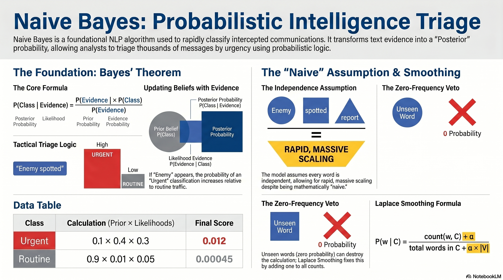

# L27: Naive Bayes Classification

In the previous lesson, we used physical sensor data (numbers) to predict outcomes. But what happens when the intelligence we gather isn't numbers, but unstructured text?

:::{admonition} Lesson Objectives
:class: note
* Apply Naive Bayes classification
* Interpret independence assumptions
* Compute class probabilities
* Implement smoothing techniques to handle zero-frequency events
:::

Whether it's an intercepted enemy radio transmission, a secure network email, or a translated intelligence brief, the Air Force processes millions of words a day. To classify this text rapidly, we rely on **Bayes' Theorem**. The **Naive Bayes** classifier is incredibly fast, highly scalable, and forms the historical foundation for all modern natural language processing (NLP). [Pg. 158, {cite:t}`James2023`]

 

## The Core Concept: Bayes' Theorem

:::{admonition} Applications
:class: tip
- **Tactical Communications Triage:** You are receiving thousands of short, intercepted radio transmissions. You need to automatically flag messages as "Routine" or "Urgent" so human analysts know what to read first.

- **Secure Network Phishing:** You are filtering incoming emails on a secure Air Force network to detect malicious phishing attempts designed to steal credentials.

- **Adversary Communications:** You are classifying intercepted text. What happens if the adversary uses a brand new code word (like "thunderbird") that has *never* appeared in your historical training data?
:::

###  Updating Beliefs with Evidence

Humans use Bayes' Theorem instinctively every day. It is the mathematical process of updating our beliefs based on new evidence.

Imagine you are stationed at an airbase and you hear the roar of a jet engine. Because you are on a friendly base, your baseline assumption (your *prior* belief) is that it is a friendly aircraft. The probability of it being a threat is very low. However, a few seconds later, the base air raid sirens start wailing. This is *new evidence*. You instantly update your belief: the probability of the aircraft being a threat just skyrocketed.

Bayes' Theorem formalizes this intuition. It takes our historical baseline probability (the Prior) and multiplies it by the weight of the new evidence (the Likelihood) to calculate our final, updated conclusion (the Posterior).

###  Bayes' Theorem

In classification, we want to find the probability of a specific class (like "Urgent") given the text evidence we just observed.

$$P(\text{Class} \mid \text{Evidence}) = \frac{P(\text{Evidence} \mid \text{Class}) \times P(\text{Class})}{P(\text{Evidence})}$$

* **$P(\text{Class})$ [The Prior]:** What is the baseline probability of this class before seeing any evidence? (e.g., 90% of all transmissions are Routine).
* **$P(\text{Evidence} \mid \text{Class})$ [The Likelihood]:** If the transmission *is* Urgent, how likely is it to contain the word "contact"?
* **$P(\text{Class} \mid \text{Evidence})$ [The Posterior]:** The final probability that the transmission is Urgent, given that we saw the word "contact".

Check out the **[Bayes Simulator](https://thecodeheadmt.github.io/CS471/BayesSim/index.html)** to better understand how a Bayes classification works.

 

## Text Classification

###  The Bag of Words

When applying Bayes' Theorem to an entire sentence, we use a technique called the "Bag of Words." We completely ignore grammar, punctuation, and the order of the words. Instead, we treat the sentence as a literal bag of isolated evidence. We pull each word out of the bag one by one, look up how often that specific word appears in "Urgent" vs. "Routine" messages historically, and multiply those probabilities together to build a final score.

###  Naive Bayes for Text

To classify a full sentence, we look at the words $w_1, w_2, \dots, w_n$. The formula becomes:

$$P(\text{Class} \mid w_1, w_2, \dots, w_n) \propto P(\text{Class}) \prod_{i=1}^{n} P(w_i \mid \text{Class})$$

The $\propto$ symbol means "proportional to." Because calculating the exact denominator ($P(\text{Evidence})$) across thousands of words is computationally expensive, we skip it. We calculate this proportional score for both "Urgent" and "Routine" and simply pick the class with the higher score.

> **Example 28.1 - Calculating the Posterior**
> Historically, 10% of transmissions are Urgent ($P(\text{U}) = 0.1$) and 90% are Routine ($P(\text{R}) = 0.9$).
> We intercept a new transmission: **"Enemy spotted"**.
> Let's look at our historical dictionary (Likelihoods):
> * $P(\text{``enemy''} \mid \text{U}) = 0.4$ (40% of Urgent messages use this word)
> * $P(\text{``spotted''} \mid \text{U}) = 0.3$
> * $P(\text{``enemy''} \mid \text{R}) = 0.01$ (1% of Routine messages use this word)
> * $P(\text{``spotted''} \mid \text{R}) = 0.05$
> 
> 
> **Calculate Urgent Score:** $0.1 \times 0.4 \times 0.3 = 0.012$
> **Calculate Routine Score:** $0.9 \times 0.01 \times 0.05 = 0.00045$
> **Result:** Since $0.012 > 0.00045$, the model confidently classifies the message as **Urgent**. Even though Routine messages are 9 times more common, the specific words provided overwhelming evidence to the contrary.

 

## Cyber Threats & The Independence Assumption

###  Double-Counting Evidence

Why is it called *Naive* Bayes? Because the algorithm makes a massive, mathematically "naive" assumption: it assumes every single piece of evidence is completely independent of everything else.

In the real world, things are correlated. If an intelligence satellite detects a tank hull, there is a very high probability it will also detect a tank turret right next to it. They are connected. But Naive Bayes ignores this reality. It treats the hull and the turret as two entirely separate, coincidental pieces of evidence. This leads to the algorithm "double-counting" correlated features, which makes its final predictions mathematically overconfident.

###  The "Naive" Assumption

The math physically breaks the probability of a phrase into the multiplied probabilities of isolated words:

$$P(\text{"password"}, \text{"reset"} \mid \text{Malicious}) = P(\text{"password"} \mid \text{Malicious}) \times P(\text{"reset"} \mid \text{Malicious})$$

> **Example 28.2 - The Independence Failure**
> Let's look at the words "password" and "reset". In reality, if a phishing email contains the word "password", there is a massive probability the next word is "reset". They are highly correlated.
>
> However, Naive Bayes ignores this. It calculates the threat level of "password" (say, 80% malicious) and the threat level of "reset" (say, 70% malicious), and multiplies them together as if they were two entirely separate pieces of evidence.
>
> **Result:** This causes Naive Bayes to "double-count" the evidence, making its final probability scores overly confident (e.g., predicting a 99.99% probability of an attack). Yet, despite being mathematically overconfident, the *decision boundary* rarely changes—an email marked 99.99% malicious and an email marked 85% malicious are both correctly sent to the spam folder!

 

## Zero-Frequency Events & Laplace Smoothing

###  The Absolute Veto

Imagine a commander who says, "I will only launch this strike if intelligence confirms A, B, and C." If intelligence confirms A and B perfectly, but C is unverified, the strike doesn't happen.

Because Naive Bayes relies on multiplication, it suffers from this exact same weakness. If you feed the algorithm a sentence containing ten words, and nine of those words are massive red flags for a cyber attack, but the tenth word is a brand new term the algorithm has never seen before, its historical probability is zero. In math, anything multiplied by zero is zero. That single unknown word acts as an absolute veto, instantly dragging the entire threat score down to zero and allowing the phishing email to slip through.

To prevent this catastrophic failure, we use a trick called **Smoothing**. We essentially lie to the algorithm, mathematically pretending that we have seen every possible word at least once.

###  The Zero Probability Problem

If a word has never been seen in a class, its historical probability is $0$. A single $0$ destroys the entire calculation:

$$P(\text{Urgent} \mid w_1, w_2, w_{new}) \propto 0.5 \times 0.3 \times \mathbf{0} = \mathbf{0}$$

We fix this with **Laplace Smoothing** (also called Add-One smoothing).

$$P(w \mid C) = \frac{\text{count}(w, C) + \alpha}{\text{total words in } C + \alpha \times \lvert V \rvert}$$

* **$\alpha$ (Alpha):** The smoothing parameter (usually 1).
* **$\lvert V \rvert$:** The total size of our vocabulary (number of unique words the model knows).

> **Example 28.3 - Laplace Smoothing**
> Assume class "Urgent" has 100 total words. Our vocabulary $\lvert V \rvert$ contains 500 unique words.
> We encounter the unseen word "thunderbird".
> * **Without smoothing ($\alpha = 0$):** $P(\text{"thunderbird"} \mid U) = \frac{0}{100} = 0$
> * **With smoothing ($\alpha = 1$):** $P(\text{"thunderbird"} \mid U) = \frac{0 + 1}{100 + (1 \times 500)} = \frac{1}{600} \approx 0.0016$
> 
> 
> **Result:** The probability is tiny ($0.16\%$), representing that it is rare, but crucially, it is *not zero*. The math survives, and the rest of the sentence can still drive the classification.
 

 

## Knowledge Check

<!-- :::{note} Click here to reveal!
:class: dropdown
This is hidden until the user clicks the box.
::: -->

1. Why is the Naive Bayes algorithm considered "Naive"? Give an example of how this assumption might be violated in an intelligence report.

2. If an intercepted message contains the word "encryption", and this word has never appeared in your training dataset, what mathematical error will occur if you do not use smoothing?

3. Explain how Laplace (Add-One) smoothing prevents the mathematical failure identified in question 2.