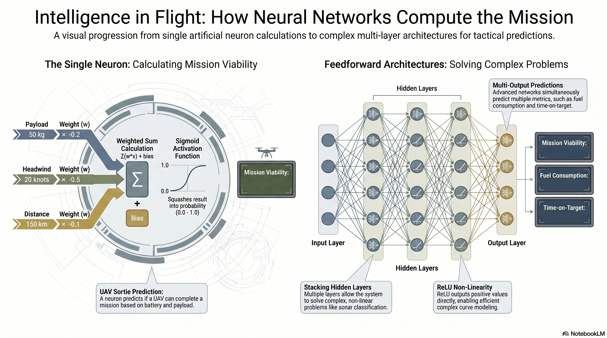

# L28: Neural Networks I

While statistical models like Logistic Regression and Support Vector Machines are powerful, they often require humans to manually engineer features. Artificial Neural Networks (ANNs) take inspiration from the human brain, allowing systems to automatically learn complex, non-linear representations of raw data. In this lesson, we will explore the fundamental building block of deep learning: the artificial neuron, and how connecting them creates feedforward architectures capable of solving highly complex tactical problems.

:::{admonition} Lesson Objectives
:class: note

* Describe artificial neuron structure and feedforward architectures
* Execute forward propagation
* Compute weighted sums
* Explain how non-linear activation functions enable complex decision boundaries
:::

 

## The Artificial Neuron (The Perceptron)

:::{admonition} Applications
:class: tip
- **UAV Sortie Viability** Predict whether an autonomous UAV has enough battery to complete a sortie based on three telemetry features: Payload Weight, Headwind Speed, and Mission Distance.

-  **Sonar Classification** Classify raw sonar returns as either Subsurface Mines or Rocks.
:::

###  Biological Inspiration & The Voting System

The fundamental building block of a neural network is the **Artificial Neuron** (historically called a {term}`Perceptron`). It is designed to mimic a biological brain cell. In biology, a neuron receives electrical signals through its dendrites. If the incoming signals are strong enough, the neuron "fires" an electrical pulse down its axon to the next cell.

In machine learning, we translate this biology into a mathematical "voting system." Imagine the flight computer of a UAV trying to decide if it should launch. It receives multiple pieces of intelligence (inputs), but it doesn't trust all of them equally. It assigns a **weight** to each input to represent its importance. A massive headwind might get a heavy negative weight, while the distance might be weighted less severely. Finally, the neuron has a **bias**—an inherent baseline threshold. You can think of the bias as the UAV's base battery capacity before any negative factors are applied. The neuron tallies up the votes (the inputs multiplied by their weights) and combines them with the bias. If the final score crosses a specific threshold, the neuron "fires" and approves the launch.

###  The Weighted Sum

An artificial neuron receives multiple inputs, applies a specific weight to each (representing the importance of that input), and adds a bias term (a baseline threshold).

The weighted sum $z$ of a single neuron is calculated as:

$$z = \sum_{i=1}^{n} w_i x_i + b$$

Once the weighted sum is calculated, it is passed through an {term}`Activation Function` to determine the neuron's final output. For binary classification (like Success or Failure), we often use the {term}`Sigmoid Function` to squash the output into a probability between **0.0** and **1.0**.

> **Example 29.1 - The Single Neuron**
> Let's predict UAV battery viability. Our trained artificial neuron has the following weights:
> * Payload ($x_1$): $w_1 = -0.2$
> * Headwind ($x_2$): $w_2 = -0.5$
> * Distance ($x_3$): $w_3 = -0.1$
> * Bias: $b = 40$
> 
> 
> We receive a mission profile: **50 kg** payload, **20 knots** headwind, **150 km** distance.
> 1. Calculate the weighted sum: $z = (-0.2 \times 50) + (-0.5 \times 20) + (-0.1 \times 150) + 40$
> 2. $z = -10 - 10 - 15 + 40 = 5$
> 3. Apply the Sigmoid function: $P = \frac{1}{1 + e^{-5}}$
> 4. Since $e^{-5} \approx 0.0067$, the probability is $P = \frac{1}{1.0067} \approx 0.993$
> 
> 
> **Result:** The neuron predicts a **99.3%** probability that the UAV will successfully complete the sortie. The mission is cleared.

 

## Feedforward Architectures & Non-Linearity

###  The Chain of Command & Bending Reality

A single artificial neuron is effectively just Logistic Regression; it can only draw a single, straight line through data. If a threat profile is highly complex—like the chaotic acoustic returns of a submarine hiding among jagged rocks—a straight line will fail to separate the targets from the clutter.

To solve complex problems, we must stack neurons together into a {term}`Feedforward Architecture`. Data flows in a single direction down a "chain of command": from the Input Layer, through intermediate {term}`Hidden Layer`s, to the Output Layer.

What does a Hidden Layer actually *do*? It acts as an abstraction engine. The first layer might look at raw soundwaves and output basic echo patterns. The second layer takes those echoes and combines them into shape profiles. By the time the data reaches the output layer, the network isn't looking at raw audio anymore; it is looking at highly processed tactical features.

However, stacking layers only works if we introduce **Non-Linearity**. If every neuron operates using strict linear math, stacking them is like placing transparent colored lenses over each other—the result is just one blended color (a single linear equation). By using non-linear activation functions, we allow the network to "fold" and "bend" its decision boundary, wrapping it perfectly around irregular threat profiles.

###  Activation Functions

If we only use linear combinations, stacking layers is mathematically useless (a linear function of a linear function is still linear). We must introduce non-linearity using activation functions in the hidden layers:

* **ReLU (Rectified Linear Unit):** $f(x) = \max(0, x)$. It outputs the input directly if positive, otherwise, it outputs zero. This simple function allows networks to model highly complex curves and is computationally efficient.
* **Sigmoid:** $\sigma(x) = \frac{1}{1 + e^{-x}}$. Typically reserved for the final output node to yield a probability.

> **Example 29.2 - Two-Layer Forward Propagation**
> Imagine a simplified sonar system with 2 input features, a hidden layer of 2 neurons using ReLU, and 1 output neuron using Sigmoid.
> Input vector $X = [2, -1]$.
> **Hidden Layer (ReLU):**
> * Neuron 1 Weights: $w = [1, 1]$, Bias = $0$.
> * $z_1 = (2 \times 1) + (-1 \times 1) + 0 = 1$.
> * Activation: $\max(0, 1) = 1$.
> * Neuron 2 Weights: $w = [-1, 2]$, Bias = $1$.
> * $z_2 = (2 \times -1) + (-1 \times 2) + 1 = -3$.
> * Activation: $\max(0, -3) = 0$.
> 
> 
> **Output Layer (Sigmoid):**
> * Output Weights: $w = [2, -2]$, Bias = $-1$.
> * Inputs to this layer are the activations from the hidden layer: $[1, 0]$.
> * $z_{out} = (1 \times 2) + (0 \times -2) - 1 = 1$.
> * Activation: $\frac{1}{1 + e^{-1}} \approx 0.73$.
> 
> 
> **Result:** The network predicts a **73%** probability that the sonar return is a Subsurface Mine.

 

## Complex Architectures: Multiple Outputs

###  Shared Understanding

In traditional machine learning, if you have two questions, you build two separate models. You would build a statistical model to predict fuel, and a completely separate model to predict time.

The danger of this approach in the battlespace is that the models don't talk to each other. Because aerodynamics and fuel consumption are physically linked by drag and throttle, evaluating them in isolation ignores reality.

Deep learning solves this elegantly. A single neural network can be designed to output multiple predictions at once. The raw telemetry passes through a shared set of hidden layers. These shared layers act as a generalized "internal physics engine," developing a deep mathematical understanding of how the aircraft behaves in the current weather. At the very end of the network, the architecture splits. One output neuron uses that shared understanding to calculate fuel, while the other uses it to calculate time. This ensures that both predictions are grounded in the exact same physical reality.

###  Vector Outputs

Statistical models typically output a single number. Neural Networks can output an entire vector simply by adding more neurons to the final layer. If the final layer has two neurons with linear activations (no Sigmoid, because we are predicting raw continuous numbers, not probabilities), the network produces two distinct predictions from the exact same shared hidden layers.

$$Y = [y_{\text{fuel}}, y_{\text{time}}]$$

We will explore how to create these models using multiple outputs in the following sections.

 

## Summary Infographic

 

## Knowledge Check

1. If a Data Scientist builds a deep neural network with 5 hidden layers but uses strictly *linear* activation functions for every single neuron, how will its final decision boundary compare to a single artificial neuron (perceptron)?

2. In the calculation of a neuron's weighted sum, what is the conceptual difference between a "weight" and a "bias"?

3. Why might an engineering team design a single neural network to simultaneously predict both "estimated fuel consumption" and "time-on-target" for a strike package, rather than building two completely separate statistical models?

4. During a forward propagation pass analyzing acoustic signatures, a hidden layer neuron calculates a pre-activation weighted sum of **-4.2**. If this neuron uses a Rectified Linear Unit (ReLU) activation function, what signal does it pass to the next layer, and why is this mathematically important?
