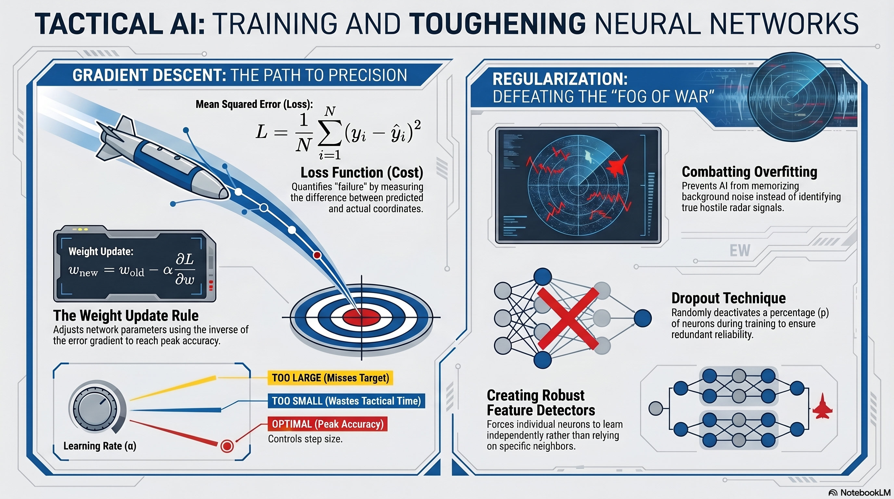

# L29: Neural Networks II

In the previous lesson, we built the architecture of a neural network and executed {term}`Forward Propagation`—pushing data through the layers to get a prediction. But a freshly initialized network is like an untrained cadet; its initial weights are completely random, meaning its first predictions will likely be entirely wrong.

:::{admonition} Lesson Objectives
:class: note

* Explain loss functions, gradient descent, and backpropagation
* Interpret training curves
* Diagnose and mitigate overfitting using regularization techniques (L2, Dropout)
:::

In this lesson, we will explore how a neural network actually *learns* from its mistakes using a process called {term}`Backpropagation` and {term}`Gradient Descent`. We will then tackle the greatest enemy of deep learning: the tendency of complex networks to memorize the "fog of war" (overfitting) rather than learning true tactical generalizations, and how to defeat it using {term}`Regularization`.

## The Learning Process: Gradient Descent

:::{admonition} Applications
:class: tip
- **Precision Guided Munitions (PGM)** You are training an AI to adjust the control fins of a smart bomb to hit a specific GPS coordinate.

-  **Electronic Warfare (EW) Signal Classification** You are training an AI to differentiate between hostile radar locks and friendly background noise.

:::

### Artillery Calibration and The Chain of Command

How does a machine actually learn? Think of it like calling in artillery.

1. **Fire for Effect ({term}`Forward Propagation`):** You fire the first round using completely random dial settings. It lands 500 meters wide.

2. **Measure the Error ({term}`Loss Function (Cost Function)`):** The forward observer calls back and says, "You missed by 500 meters." This distance from the bullseye is your **Loss**. The entire goal of training is to drive this number to zero.

3. **Calculate the Blame ({term}`Backpropagation`):** You have dozens of dials (weights) controlling elevation, windage, and charge. Which dial caused the miss? The network works backward from the impact point, using calculus to assign "blame" to every single weight in the network based on how much it contributed to the error.

4. **Adjust the Dials ({term}`Gradient Descent`):** Now that you know which dials are wrong, you turn them slightly in the opposite direction of the error to improve the next shot.

###  Gradient Descent and Learning Rate

For regression tasks (predicting a continuous number, like coordinates), the most common loss function is {term}`Mean Squared Error (MSE)`. We square the errors so that negative misses (hitting short) and positive misses (hitting long) don't accidentally cancel each other out:

$$L = \frac{1}{N} \sum_{i=1}^{N} (y_i - \hat{y}_i)^2$$

Once the loss is calculated, the network works backward from the output layer to the input layer ({term}`Backpropagation`). Using calculus, it computes the {term}`Gradient` ($\nabla L$)—the derivative of the loss with respect to every single weight in the network. The gradient mathematically points in the direction of the steepest *increase* in error.

Imagine walking down a steep mountain at night wearing a blindfold. You feel the ground with your foot to figure out which way points *up* (the gradient). To get to basecamp (zero error), you take a step in the exact *opposite* direction.

This is {term}`Gradient Descent`, and the weight update rule is:

$$w_{new} = w_{old} - \alpha \frac{\partial L}{\partial w}$$

* **$\alpha$ (Alpha):** The {term}`Learning Rate`. This determines how large of a step the network takes. If $\alpha$ is too large (taking giant leaps down the mountain), the network wildly overcorrects, jumps over the valley, and misses the target entirely. If $\alpha$ is too small (taking millimeter steps), the network learns so slowly that the training time becomes tactically unviable.

> **Example 30.1 - The Weight Update**
> A network controlling a PGM fin has a weight $w = 2.5$.
> The current Learning Rate is $\alpha = 0.01$.
> During a training drop, the bomb misses the target. Backpropagation calculates the derivative of the loss with respect to this specific weight: $\frac{\partial L}{\partial w} = 15.0$ (a positive gradient, meaning increasing the weight caused more error).
>
> Let's update the weight:
>
> 1. Calculate the step: $\alpha \times \text{Gradient} = 0.01 \times 15.0 = 0.15$
>
> 2. Subtract from the old weight: $w_{new} = 2.5 - 0.15 = 2.35$
> 
> 
> **Result:** The new weight is **2.35**. In the next training epoch, the fin will adjust slightly less aggressively, resulting in a lower loss and a more accurate strike.

To see the operational dangers of an improperly calibrated Learning Rate, adjust the Alpha slider in the interactive simulator below.

## Defeating the Fog of War: Regularization

### The Concept: Memorizing the Practice Test & Unit Cross-Training

Neural Networks are mathematically greedy. If you give a deep network enough layers, it has so much processing power that it won't bother learning the general shape of the hostile radar. Instead, it will literally memorize the specific static, weather noise, and background clutter of every single training example.

This is {term}`Overfitting`. It is the equivalent of a cadet memorizing the exact answers to a practice exam without learning the underlying physics. They score 100% on the practice test, but fail the moment they face a real-world problem with slightly different variables.

To combat this, we use {term}`Regularization`. One of the most effective methods is **Dropout**. Think of Dropout like unit cross-training. If a 10-person squad relies entirely on one star radio operator to call in airstrikes, the whole squad fails if that operator goes down. To prevent this, the commander randomly pulls different people out of training exercises. This forces every single member of the squad to learn how to operate the radio.

###  Dropout

{term}`Dropout` is a brilliantly counter-intuitive technique. During training, at every single {term}`Epoch`, we randomly turn off (drop out) a certain percentage of the neurons in a layer.

* **$p$ (Dropout Rate):** The probability that a given neuron is disabled during a training step (usually between 0.2 and 0.5).

> **Example 30.2 - The Power of Dropout**
> Imagine an EW classification network with 10 hidden neurons. Without dropout, Neuron #3 might become mathematically "lazy," relying entirely on Neuron #7 to identify the radar frequency, while Neuron #3 just memorizes the background static.
>
> If we apply a Dropout rate of $p = 0.5$, Neuron #7 is randomly turned off 50% of the time! Neuron #3 is suddenly forced to learn how to identify the radar frequency itself because it can no longer rely on its neighbor.
>
> **Result:** Dropout forces the network to create redundant, robust, and independent feature detectors. It prevents the network from memorizing the noise, forcing it to focus on the signal.

## Summary Infographic

 

## Knowledge Check & Practice Questions

1. In the context of {term}`Gradient Descent`, what happens to the weight updates if the Learning Rate ($\alpha$) is set significantly too high?
2. A Data Scientist notices that their neural network has a Training Loss of 0.01 and a Validation Loss of 4.50. What phenomenon is occurring, and what specific architectural layer could they add to fix it?
3. Explain the conceptual mechanism of a {term}`Dropout` layer. How does randomly turning off artificial neurons actually make the network *more* robust in real-world combat scenarios?

<!-- # L30: Neural Networks II 

In the previous lesson, we built the architecture of a neural network and executed {term}`Forward Propagation`—pushing data through the layers to get a prediction. But a freshly initialized network is like an untrained cadet; its initial weights are completely random, meaning its first predictions will likely be entirely wrong.

:::{admonition} Lesson Objectives
:class: note
* Explain loss functions, gradient descent, and backpropagation
* Interpret training curves
* Diagnose and mitigate overfitting using regularization techniques (L2, Dropout)
:::

In this lesson, we will explore how a neural network actually *learns* from its mistakes using a process called {term}`Backpropagation` and {term}`Gradient Descent`. We will then tackle the greatest enemy of deep learning: the tendency of complex networks to memorize the "fog of war" (overfitting) rather than learning true tactical generalizations, and how to defeat it using {term}`Regularization`.

 

## The Learning Process: Gradient Descent

**Scenario:** Precision Guided Munitions (PGM). You are training an AI to adjust the control fins of a smart bomb to hit a specific GPS coordinate.

To train the network, we must define what "failure" looks like. We do this using a {term}`Loss Function (Cost Function)`. The network calculates a prediction, compares it to the actual target, and computes the error (Loss). The goal of the network is to minimize this Loss.

###  Gradient Descent and Learning Rate

For regression tasks (predicting a continuous number, like coordinates), the most common loss function is {term}`Mean Squared Error (MSE)`:

$$L = \frac{1}{N} \sum_{i=1}^{N} (y_i - \hat{y}_i)^2$$

Once the loss is calculated, the network works backward from the output layer to the input layer ({term}`Backpropagation`). Using calculus, it computes the {term}`Gradient` ($\nabla L$)—the derivative of the loss with respect to every single weight in the network. The gradient points in the direction of the steepest *increase* in error. To learn, the network takes a step in the *opposite* direction.

This is {term}`Gradient Descent`, and the weight update rule is:

$$w_{new} = w_{old} - \alpha \frac{\partial L}{\partial w}$$

* **$\alpha$ (Alpha):** The {term}`Learning Rate`. This determines how large of a step the network takes. If $\alpha$ is too large, the network wildly overcorrects and misses the target entirely. If $\alpha$ is too small, the network learns so slowly that the training time becomes tactically unviable.

> **Example 30.1 - The Weight Update**
> A network controlling a PGM fin has a weight $w = 2.5$.
> The current Learning Rate is $\alpha = 0.01$.
> During a training drop, the bomb misses the target. Backpropagation calculates the derivative of the loss with respect to this specific weight: $\frac{\partial L}{\partial w} = 15.0$ (a positive gradient, meaning increasing the weight caused more error).
> Let's update the weight:
> 1. Calculate the step: $\alpha \times \text{Gradient} = 0.01 \times 15.0 = 0.15$
> 2. Subtract from the old weight: $w_{new} = 2.5 - 0.15 = 2.35$
> 
> 
> **Result:** The new weight is **2.35**. In the next training epoch, the fin will adjust slightly less aggressively, resulting in a lower loss and a more accurate strike.

 

## Defeating the Fog of War: Regularization

**Scenario:** Electronic Warfare (EW) Signal Classification. You are training an AI to differentiate between hostile radar locks and friendly background noise.

Neural Networks are mathematically greedy. If you give a deep network enough layers, it won't just learn the general shape of the hostile radar—it will memorize the specific static and background noise of every single training example. This is {term}`Overfitting`, and it is deadly in combat because the network will fail the moment it encounters a hostile signal in a slightly different weather condition.

We combat this using {term}`Regularization` techniques.

###  Dropout

{term}`Dropout` is a brilliantly counter-intuitive technique. During training, at every single {term}`Epoch`, we randomly turn off (drop out) a certain percentage of the neurons in a layer.

* **$p$ (Dropout Rate):** The probability that a given neuron is disabled during a training step (usually between 0.2 and 0.5).

> **Example 30.2 - The Power of Dropout**
> Imagine an EW classification network with 10 hidden neurons. Without dropout, Neuron #3 might become mathematically "lazy," relying entirely on Neuron #7 to identify the radar frequency, while Neuron #3 just memorizes the background static.
> If we apply a Dropout rate of $p = 0.5$, Neuron #7 is randomly turned off 50% of the time! Neuron #3 is suddenly forced to learn how to identify the radar frequency itself because it can no longer rely on its neighbor.
>
> **Result:** Dropout forces the network to create redundant, robust, and independent feature detectors. It prevents the network from memorizing the noise, forcing it to focus on the signal.

 

## Summary Infographic

 

## Knowledge Check & Practice Questions

1. In the context of {term}`Gradient Descent`, what happens to the weight updates if the Learning Rate ($\alpha$) is set significantly too high?

2. A Data Scientist notices that their neural network has a Training Loss of 0.01 and a Validation Loss of 4.50. What phenomenon is occurring, and what specific architectural layer could they add to fix it?

3. Explain the conceptual mechanism of a {term}`Dropout` layer. How does randomly turning off artificial neurons actually make the network *more* robust in real-world combat scenarios?
 -->
