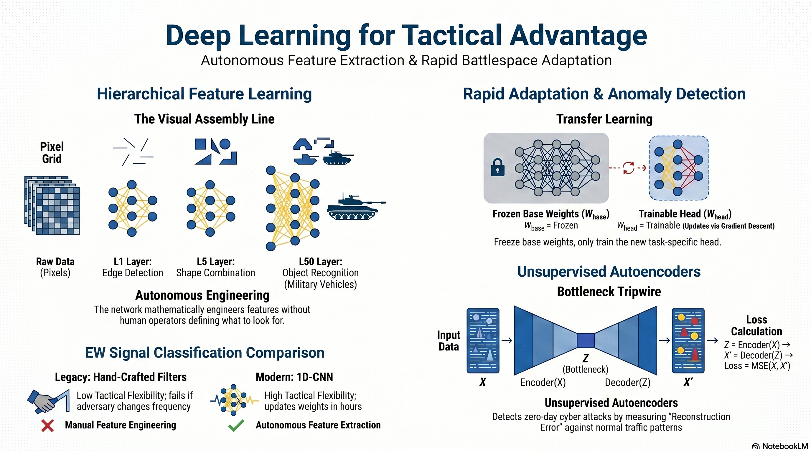

# L30: Deep Learning

In the previous lessons, we built shallow neural networks (1-2 hidden layers) and trained them to solve specific, highly structured problems. However, the modern battlespace does not always provide neatly organized tabular data. We must process raw, high-dimensional data: live video feeds from drones, gigabytes of raw network traffic, and chaotic electromagnetic radio frequencies.

:::{admonition} Lesson Objectives
:class: note

* Explain hierarchical feature learning
* Describe modern deep architectures
* Apply transfer learning to adapt pre-trained models to domain-specific tasks
:::

Enter **Deep Learning**. By stacking dozens (or hundreds) of hidden layers, a neural network ceases to be a simple mathematical calculator and becomes a **hierarchical feature extractor**. In this lesson, we will explore how deep architectures autonomously learn the underlying structure of reality, and how we can rapidly adapt these massive models for tactical advantage.

:::{admonition} Applications
:class: tip
- **Cargo Logistics Classification** You need to deploy an AI on a surveillance drone to classify vehicles at a logistics hub as either "Military Transport" or "Civilian Cargo."

- **Cyber Intrusion Detection** You are defending a secure Air Force network. Hackers do not use the same tactics twice, meaning you cannot train a Supervised classifier on "known" attacks, because tomorrow's attack will look entirely different. We must use an Unsupervised deep learning architecture.
:::

 

## Hierarchical Feature Learning

### The Visual Assembly Line

If you ask a human to identify a T-72 tank in a satellite image, they don't look at individual pixels; they look for a turret, treads, and a chassis. But a computer only sees a massive grid of numbers representing color values. How does it bridge the gap?

Deep Neural Networks (DNNs) act like an automated assembly line, breaking the problem down into a hierarchy of increasing complexity. In a shallow network, the model tries to jump straight from "pixels" to "tank"—which often fails. In a deep network, each sequential layer builds upon the discoveries of the layer before it. The network mathematically engineers its own features without a human operator ever telling it *what* to look for.

### Layered Extraction

If we feed raw pixels of a satellite image into a deep network:

* **Layer 1 (Low-Level):** Learns to detect basic, generic structures like vertical edges, horizontal lines, and color gradients.
* **Layer 5 (Mid-Level):** Takes those raw edges and combines them to detect geometric shapes, wheels, and metallic textures.
* **Layer 50 (High-Level):** Takes those shapes and combines them to recognize complete tactical objects: "T-72 Tank" or "Supply Truck."

 

## Transfer Learning

Training a deep image classification network from scratch requires millions of labeled images, hundreds of GPUs, and weeks of training time—resources you do not have in a forward operating base.

### Basic Training vs. Specialized Schools

Think about how the Air Force trains personnel. When someone joins to become a Special Tactics officer, the pipeline doesn't start by teaching them how to tie their boots or march in formation; they already learned those universal foundations in Basic Training. The specialized school *transfers* that foundational knowledge and only teaches the specific mission parameters.

We do the exact same thing with neural networks. We take a massive, open-source network that has already spent weeks training on supercomputers to recognize millions of everyday objects. This network's lower layers have already mastered "Basic Training"—they possess perfect edge and shape detectors. We preserve that knowledge, and only re-train the very top layer of the network to identify our specific military cargo.

### The Transfer Protocol

Instead of starting with randomized weights, we use {term}`Transfer Learning`. We mathematically "freeze" the weights of the foundational layers so their hard-earned knowledge cannot be accidentally destroyed by {term}`Gradient Descent` during our local training.

We then slice off the original output layer (the "head") and attach a brand new, randomized output layer designed specifically for our 2 classes.

$$W_{base} = \text{Frozen (No Gradient Updates)}$$

$$W_{head} = \text{Trainable (Updates via Gradient Descent)}$$

We only train the final layer. The network learns to map its pre-existing knowledge of "shapes and wheels" directly to our specific tactical categories. This reduces computational load by over 95%, allowing models to be updated and deployed in minutes.

 

## Unsupervised Autoencoders

### The Sketch Artist Tripwire

Imagine an incredible sketch artist who has only ever drawn fighter jets. They have memorized the aerodynamics so perfectly that if you show them a photo of an F-22 for three seconds, they can redraw it from memory flawlessly. But, if you show them a picture of a submarine, their brain doesn't know how to process it. When they try to draw it from memory, the result is a distorted, unrecognizable mess.

An **Autoencoder** is the mathematical equivalent of this artist. We force it to compress normal network traffic into a tiny mathematical bottleneck, and then force it to redraw (reconstruct) the traffic perfectly. Because it trains *exclusively* on normal, benign traffic, it becomes an expert at drawing "fighter jets."

When a Zero-Day malware attack hits the network, it looks like a submarine. The Autoencoder tries to compress and redraw it, but fails catastrophically. By measuring how "bad" the drawing is (the Reconstruction Error), we can detect brand-new cyber attacks without ever needing to know their signature beforehand.

### The Autoencoder

An {term}`Autoencoder` consists of an {term}`Encoder` that compresses the data down into a tiny bottleneck (the {term}`Latent Space (Bottleneck)`, $Z$), and a {term}`Decoder` that attempts to reconstruct the original data ($X'$) from that bottleneck.

$$Z = \text{Encoder}(X)$$

$$X' = \text{Decoder}(Z)$$

$$\text{Loss} = \text{MSE}(X, X')$$

When anomalous traffic is fed into the network, it fails to compress it properly, resulting in a massive, mathematically measurable {term}`Reconstruction Error`. If the error spikes above an automated threshold, we isolate the network node.

To physically see how this mathematical tripwire functions during a Zero-Day attack, interact with the Autoencoder simulation below.

 

## Electronic Warfare (Case Study)

**The Historical Paradigm:** For decades, classifying radar and radio frequency (RF) signals in Electronic Warfare relied on hand-crafted statistical filters. Signal Intelligence (SIGINT) operators would capture a signal, run a Fast Fourier Transform (FFT) to convert it from the time domain to the frequency domain, and manually engineer features (pulse width, frequency modulation, amplitude). These manual features were then fed into a basic classifier (like a Support Vector Machine). If the adversary updated their radar modulation by just a few hertz, the rigid, hard-coded manual filters failed, and human engineers had to manually rewrite the software.

**The Deep Learning Paradigm:**
Modern EW systems have abandoned manual feature engineering entirely. Today, operators feed raw In-Phase and Quadrature (IQ) radio samples directly into massive deep networks—specifically 1-Dimensional Convolutional Neural Networks ({term}`1D-Convolutional Neural Network (1D-CNN)`).

Because these networks are *deep*, they learn the hierarchical features of the RF spectrum autonomously, just like they learn the edges of an image. The lower layers learn to filter basic static noise, the middle layers learn pulse structures, and the final layers classify the specific adversary emitter.

If the adversary changes their tactics, the Air Force simply collects a new batch of raw IQ data, runs a transfer learning update on the top layer, and pushes the updated weights back to the electronic attack pods on the aircraft in a matter of hours. Deep Learning has effectively shifted EW from rigid, hardware-defined combat to agile, software-defined warfare.

## Summary Infographic

 

## Knowledge Check & Practice Questions

1. During a rapid deployment, you use {term}`Transfer Learning` to adapt a massive visual model to classify local adversary vehicles. Why do you mathematically "freeze" the first 40 layers of the network, and what specific types of features are those early layers actually detecting?

2. When building an {term}`Autoencoder` to defend an Air Force network, a junior engineer suggests training the model on a dataset containing *both* normal traffic and historical malware signatures. Explain why this approach defeats the entire purpose of the Autoencoder's "tripwire" design for detecting Zero-Day attacks.

3. In the historical Electronic Warfare paradigm, Signal Intelligence operators had to manually engineer features (like pulse width and amplitude) using Fast Fourier Transforms before classifying a radar signal. How does upgrading to a deep {term}`1D-Convolutional Neural Network (1D-CNN)` fundamentally change this workflow, and why does it make the electronic attack pod more agile?

<!-- # L31: Deep Learning

In the previous lessons, we built shallow neural networks (1-2 hidden layers) and trained them to solve specific, highly structured problems. However, the modern battlespace does not always provide neatly organized tabular data. We must process raw, high-dimensional data: live video feeds from drones, gigabytes of raw network traffic, and chaotic electromagnetic radio frequencies.

:::{admonition} Lesson Objectives
:class: note
* Explain hierarchical feature learning
* Describe modern deep architectures
* Apply transfer learning to adapt pre-trained models to domain-specific tasks
:::

Enter **Deep Learning**. By stacking dozens (or hundreds) of hidden layers, a neural network ceases to be a simple mathematical calculator and becomes a **hierarchical feature extractor**. In this lesson, we will explore how deep architectures autonomously learn the underlying structure of reality, and how we can rapidly adapt these massive models for tactical advantage.

 

## Hierarchical Feature Learning

In a standard shallow network, the hidden layer tries to map the raw inputs directly to the final prediction. In a Deep Neural Network (DNN), each layer learns increasingly complex, abstract representations of the data.

If we feed raw pixels of a satellite image into a deep network:

* **Layer 1 (Low-Level):** Learns to detect basic edges, lines, and color gradients.

* **Layer 5 (Mid-Level):** Combines edges to detect shapes, wheels, and metallic textures.

* **Layer 50 (High-Level):** Combines shapes to recognize complete tactical objects: "T-72 Tank" or "Supply Truck."

The network mathematically engineers its own features. The human operator no longer has to tell the algorithm *what* to look for; the algorithm figures it out autonomously.

 

## Transfer Learning

**Scenario:** Cargo Logistics Classification. You need to deploy an AI on a surveillance drone to classify vehicles at a logistics hub as either "Military Transport" or "Civilian Cargo."

Training a deep image classification network from scratch requires millions of labeled images, hundreds of GPUs, and weeks of training time—resources you do not have in a forward operating base.

### The Math: The Transfer Protocol

Instead of starting with randomized weights, we use {term}`Transfer Learning`. We take a massive, pre-trained network (like MobileNet or ResNet) that has already spent weeks learning how to recognize millions of everyday objects (cats, dogs, cars, planes). This network already possesses perfect low-level and mid-level feature detectors.

We mathematically "freeze" the weights of these lower layers so they cannot be altered by {term}`Gradient Descent`. We then slice off the original output layer (the "head") and attach a brand new, randomized output layer designed specifically for our 2 classes.

$$W_{base} = \text{Frozen (No Gradient Updates)}$$

$$W_{head} = \text{Trainable (Updates via Gradient Descent)}$$

We only train the final layer. The network learns to map its pre-existing knowledge of "shapes and wheels" directly to our specific tactical categories in minutes rather than weeks.

 

## Unsupervised Autoencoders

**Scenario:** Cyber Intrusion Detection. You are defending a secure Air Force network. Hackers do not use the same tactics twice, meaning you cannot train a Supervised classifier on "known" attacks, because tomorrow's attack will look entirely different. We must use an Unsupervised deep learning architecture.

### The Math: The Autoencoder

An {term}`Autoencoder` is a neural network trained to recreate its own input. It consists of an {term}`Encoder` that compresses the data down into a tiny bottleneck (the Latent Space, $Z$), and a {term}`Decoder` that attempts to reconstruct the original data ($X'$) from that bottleneck.

$$Z = \text{Encoder}(X)$$

$$X' = \text{Decoder}(Z)$$

$$\text{Loss} = \text{MSE}(X, X')$$

**The Tactical Application:** We train the Autoencoder *exclusively* on benign, normal network traffic. The network learns to perfectly compress and decompress normal behavior.
 
  
 

## Electronic Warfare (Case Study)

**The Historical Paradigm:** For decades, classifying radar and radio frequency (RF) signals in Electronic Warfare relied on hand-crafted statistical filters. Signal Intelligence (SIGINT) operators would capture a signal, run a Fast Fourier Transform (FFT) to convert it from the time domain to the frequency domain, and manually engineer features (pulse width, frequency modulation, amplitude). These manual features were then fed into a basic classifier (like a Support Vector Machine). If the adversary updated their radar modulation by just a few hertz, the manual filters failed, and human engineers had to rewrite the software.

**The Deep Learning Paradigm:**
Modern EW systems have abandoned manual feature engineering. Today, operators feed raw In-Phase and Quadrature (IQ) radio samples directly into massive deep networks—specifically 1-Dimensional Convolutional Neural Networks (1D-CNNs).

Because these networks are *deep*, they learn the hierarchical features of the RF spectrum autonomously. The lower layers learn to filter basic noise, the middle layers learn pulse structures, and the final layers classify the specific adversary emitter. If the adversary changes their tactics, the Air Force simply collects a new batch of raw IQ data, runs a transfer learning update (like we did in the cargo lab), and pushes the updated weights back to the electronic attack pods on the aircraft in a matter of hours. Deep Learning has shifted EW from hardware-defined combat to software-defined, highly agile warfare.

 -->
