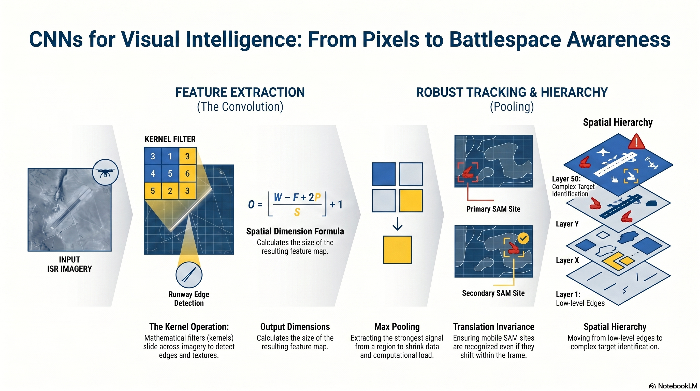

# L31: Convolutional Neural Networks

In the previous lessons, our neural networks analyzed data by looking at individual features (like airspeed or altitude). If we fed an image into a standard dense network, we would have to flatten the 2D image into a single 1D line of pixels. This mathematically destroys all spatial relationships—the network would forget which pixels were next to each other.

:::{admonition} Lesson Objectives
:class: note

* Explain convolution, stride, padding, and pooling
* Describe how CNNs achieve spatial hierarchy and translation invariance
* Interpret learned visual feature maps
:::

To process visual Intelligence, Surveillance, and Reconnaissance (ISR) feeds, we need an architecture that understands spatial geometry. **Convolutional Neural Networks (CNNs)** solve this by sliding small, mathematical filters across an image, allowing the AI to "see" shapes, edges, and textures exactly how they appear in the battlespace.

:::{admonition} Applications
:class: tip

- **Runway Edge Detection:** You are analyzing overhead satellite imagery to locate an adversary's hidden airstrip. Before an AI can classify the airstrip, it must first be able to see the edges of the concrete.

 - **Mobile Target Tracking:** An adversary's mobile SAM site is moving across a vast operational sector. If the CNN only learns what the SAM site looks like when it is perfectly centered in the frame, the model will fail when the vehicle moves to the top-left corner.

- **Target Verification:** Your commander asks, "How do we know the AI is actually identifying the T-72 tank, and not just memorizing the trees in the background?"
:::

 

## The Convolution Operation

###  The Flashlight on the Map

If you are looking for a specific hidden airstrip on a massive satellite map, you don't stare at the entire map at once. You take a magnifying glass (or a flashlight) and scan it systematically from the top-left to the bottom-right.

A Convolutional Neural Network does exactly this. Instead of a magnifying glass, it uses a small grid of numbers called a {term}`Filter (Kernel)`. Let's say a specific filter is mathematically designed to detect horizontal lines. The CNN slides this filter across the image. When the filter passes over an empty desert, it outputs a low number. But the moment the filter slides over the horizontal edge of an airstrip, the math aligns perfectly, and the filter "lights up," outputting a massive positive number.

By sliding dozens of different filters across the image simultaneously, the CNN creates a new "map" highlighting exactly where all the edges, corners, and colors are located.

###  Convolution, Stride, and Padding

A {term}`Convolution` is a mathematical operation that slides a small grid of numbers—called a {term}`Filter (Kernel)`($K$)—over the input image ($I$). At every step, it multiplies the filter's numbers by the image's pixel values and sums them up.

$$S(i, j) = (I * K)(i, j) = \sum_{m} \sum_{n} I(i-m, j-n) K(m, n)$$

To control how this filter moves, we adjust two hyperparameters:

* **Stride ($S$):** How many pixels the filter shifts at a time. A stride of 1 moves pixel-by-pixel. A stride of 2 skips pixels, shrinking the output size.
* **Padding ($P$):** Sliding a 3x3 filter over an image means the filter cannot perfectly center on the very edge pixels. This causes the output image to shrink. To prevent this, we add a border of zero-value pixels (Zero-Padding) around the original image.

You can calculate the exact width of the resulting output map ($O$) using the spatial dimension formula:

$$O = \lfloor \frac{W - F + 2P}{S} \rfloor + 1$$

*(Where $W$ is input width, $F$ is filter width, $P$ is padding, and $S$ is stride).*

To visualize how different sensor feeds and filter settings change the spatial dimensions of your data, use the CNN architecture calculator below.

 

## Pooling & Translation Invariance

###  The Sector Commander

A 4K drone camera captures over 8 million pixels per frame. If we run hundreds of convolutions over that image, the amount of data quickly exceeds the processing power of the aircraft. We need a way to summarize the intelligence.

Think of a **Pooling Layer** like a sector commander. The commander oversees a 2x2 grid containing four individual scout outposts. Instead of passing all four detailed scout reports up the chain of command, the commander only passes up the *most severe* threat level they received. This reduces the data by 75%.

Furthermore, if an enemy tank moves from the top-left outpost to the bottom-right outpost, the sector commander's report ("There is a tank in my sector") remains exactly the same. The exact pixel coordinates are lost, but the *presence* of the target is preserved. This gives the CNN **Translation Invariance**—it can recognize a SAM site regardless of whether it is in the dead center of the image or off in the corner.

###  Max Pooling

To solve the processing load, CNNs use **Pooling Layers**. The most common is {term}`Max Pooling`. Similar to a convolution, a pooling window slides across the image, but instead of multiplying, it simply takes the maximum pixel value in that window and discards the rest.

This achieves two critical tactical goals:

1. **Dimensionality Reduction:** It aggressively shrinks the size of the data, reducing the computational load on the aircraft's processors.

2. **Translation Invariance:** Because it takes the "maximum" signal (the strongest feature) within a region, it doesn't matter if the target shifted slightly left or right—the strongest signal survives the pooling operation.

 

## Feature Maps & What the Network "Looks" At

###  Peeling Back the Black Box

When your commander asks, "How do we know the AI is actually identifying the T-72 tank, and not just memorizing the trees in the background?", you must be able to prove it. Neural networks are often called "black boxes," but in a CNN, we can actually pull the visual data out of the hidden layers.

We answer this by visualizing the intermediate hidden layers (Feature Maps). By peeling back the layers of a CNN, we can see the literal image representations the network is engineering:

* **Early Layers** look like raw static and neon outlines. They are activating exclusively on the edges of the tank treads and the barrel.
*
* **Middle Layers** look like blurry blobs. They are activating on the holistic shape of the turret.
*
* By proving that the highest activations (the brightest pixels in the feature map) are physically located on the tank and *not* on the surrounding forest, we can mathematically verify that the model is tracking the right target.

 

## Dimensionality: 1D vs. 2D Convolutions

While we most commonly associate CNNs with images, the convolution operation is incredibly versatile. The "dimension" of a convolution simply refers to how many directions the filter is allowed to slide. In the Air Force, we deploy both 1D and 2D convolutions daily to process entirely different types of intelligence.

### 1D Convolutions: The Sequence Scanner
:::{admonition} Application
:class: tip
- **Electronic Warfare (EW)** You are analyzing an intercepted radio frequency (RF) signal to detect the specific pulse repetition of an adversary's tracking radar.
:::

A 1D Convolution processes *sequential* or time-series data. Imagine reading a ticker tape of raw audio frequencies. The mathematical filter is a short line of numbers, and it only slides in one direction: forward through time.

**Why it is Useful:** In EW, it doesn't matter *when* the radar lock occurs in a 5-minute audio recording; the pattern of the radar pulse is always the same. By sliding a 1D filter across the entire recording, the network can detect the specific "shape" of the radar frequency regardless of exactly when the signal spiked. 1D-CNNs are the gold standard for analyzing sonar pings, RF spectrums, and predictive maintenance telemetry (like engine vibrations over time).

> **Example 32.1 - 1D Convolution**
> An incoming radio signal over 5 seconds is represented as a 1D array: `[0, 1, 5, 5, 1, 0]`.
>
> Our network has learned a 1D "Square Wave Filter": `[1, 1, 1]`.
>
> The filter slides across the array left-to-right. When it centers over the `[5, 5, 1]` portion of the signal, the multiplication produces a massive spike in the output, alerting the EW officer that a synthetic pulse was just detected.

### 2D Convolutions: The Spatial Scanner
:::{admonition} Application
:class: tip
- **Satellite Imagery Analysis** You are analyzing overhead optical intelligence to locate hidden surface-to-air missile (SAM) launchers.
:::

A 2D Convolution processes *spatial* grid data. This is the "flashlight on a map" metaphor. The mathematical filter is a 2D square (like a 3x3 grid), and it slides in two directions: left-to-right across the width of the image, and top-to-bottom across the height.

**Why it is Useful:** In visual ISR, a SAM launcher looks like a SAM launcher whether it is parked in the top-left corner of the photograph or the bottom-right. By sliding a 2D filter across the entire grid, the network learns to detect geometric structures—like the sharp metallic corners of a missile tube or the circular treads of a vehicle—regardless of where they are physically located on the map.

> **Example 32.2 - 2D Convolution**
> A drone captures a 1024x1024 pixel image of a target sector.
>
> The network has learned a 3x3 "Vertical Edge Filter":
> `[-1, 0, 1]`
> `[-1, 0, 1]`
> `[-1, 0, 1]`
>
> As this 2D square slides across the desert, it outputs zeroes. But when it slides over the stark shadow of a concrete runway, the left side of the filter hits dark pixels (-1) and the right side hits bright pixels (+1). The math multiplies out to a high number, successfully mapping the left edge of the airstrip.

 

## Summary Infographic

 

## Knowledge Check

1. **The Padding Problem:** If a Data Scientist applies a 5x5 convolution filter to a 1024x1024 pixel satellite image with a stride of 1 and *no* padding, the resulting feature map will shrink. Why does this happen, and what specific technique is used to prevent it?

2. **Translation Invariance:** An autonomous drone is tracking an adversary's mobile missile launcher. The launcher is constantly shifting its position within the drone's camera frame. Explain how a `MaxPooling` layer mathematically ensures the CNN can still recognize the target despite these shifts.

3. **Spatial Hierarchy:** A deep CNN has been trained to classify visual intelligence from an MQ-9 Reaper. If you extract and visualize the Feature Maps from Layer 1, how will they visually differ from the Feature Maps extracted from Layer 50?

