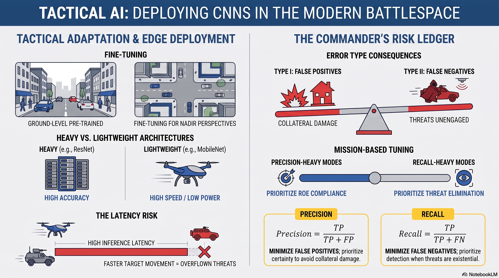

# L32: CNN Applications

In the previous lesson, we learned the mechanics of how Convolutional Neural Networks (CNNs) use sliding filters and pooling layers to understand spatial relationships. Now, we will explore how to operationalize these networks in the modern battlespace. We will look at how to fine-tune pre-trained vision models for satellite intelligence, evaluate their mistakes through the lens of mission risk, and balance the critical trade-offs between mathematical accuracy and processing speed on tactical edge hardware.

:::{admonition} Lesson Objectives
:class: note

* Fine-tune a pre-trained CNN on spatial data
* Evaluate model outputs using confusion matrices to quantify operational risks
* Analyze architectural trade-offs between speed and accuracy for edge deployment
:::

## Fine-Tuning for Spatial Data

###  Specializing the Satellite Scout

In Lesson 31, we explored basic **Transfer Learning**, where we froze a massive network's base layers and only trained a brand new classification head. This works perfectly when your new tactical images look similar to the images the network originally trained on.

However, standard pre-trained models (like ResNet or MobileNet) were trained on datasets like ImageNet, which consists of ground-level photos taken by humans standing on the earth (looking horizontally at cars, buildings, or trees). Satellite or drone imagery—such as the EuroSAT or xView datasets—presents a completely different reality: a **top-down, nadir perspective**.

To bridge this gap, we use **Fine-Tuning**. Instead of keeping the entire base network frozen, we "unfreeze" the last few convolutional layers.

Think of this like taking an expert reconnaissance scout who spent years tracking targets on foot in the jungle, and moving them to a high-altitude surveillance aircraft. Their fundamental eyes and pattern-recognition skills are excellent, but they need to slightly adjust their mental model to understand how those same targets look from 30,000 feet in the air. By allowing the upper convolutional layers to update their weights slightly, the network adapts its learned geometric features to the unique angles, scales, and shadows of overhead intelligence.

## Confusion Matrices & Operational Risk

###  The Commander's Risk Ledger

In a computer science lab, an error is just a statistical point deducted from an accuracy score. In combat operations, different types of errors have radically different consequences. We map these errors using a **Confusion Matrix**.

Imagine an autonomous target recognition system scanning a sector for hostile surface-to-air missile (SAM) launchers. The system can fail in two distinct ways:

1. **The False Positive (Type I Error):** The AI mistakenly classifies a civilian delivery truck as a hostile SAM site. If the system automatically launches a munition, this error results in a tragic violation of the Rules of Engagement (ROE), a waste of high-value munitions, and severe strategic fallout.
2. **The False Negative (Type II Error):** The AI mistakenly classifies an actual, active hostile SAM site as a civilian delivery truck. It ignores the threat. This error results in an unengaged adversary, leading to the potential downing of friendly aircraft.

By examining a Confusion Matrix, a commander can see exactly which way the AI is failing. If the model has a high False Positive rate, the commander might tighten the fire-control constraints. If it has a high False Negative rate, the commander might deploy additional human analysts to double-check the feed.

###  Precision vs. Recall in Mission Context

To tune our models to match the commander's risk tolerance, we rely on two opposing mathematical metrics derived from the confusion matrix:

$$\text{Precision} = \frac{\text{True Positives}}{\text{True Positives} + \text{False Positives}}$$

$$\text{Recall} = \frac{\text{True Positives}}{\text{True Positives} + \text{False Negatives}}$$

* **High Precision Mode:** Minimize False Positives. Use this when the political or tactical cost of collateral damage is unacceptable. The AI will only flag a target when it is absolutely certain.
* **High Recall Mode:** Minimize False Negatives. Use this when the threat is existential and you cannot afford to miss a single adversary asset. The AI will flag anything that even remotely resembles a threat, accepting the risk of false alarms.

## Edge Deployment & Architectural Trade-offs

###  The Drone's Brain Capacity

The final pillar of applying CNNs is choosing *where* the math takes place. Running a massive, 50-layer deep network like ResNet-50 requires an immense amount of electricity and cooling, typical of a cloud server or a ground command center.

However, an autonomous drone flying deep in contested, electronic-warfare environments cannot rely on a satellite link to send high-definition video back to a base for processing. It must process the pixels locally using an **Edge Device**—a lightweight, low-power hardware payload embedded directly on the aircraft.

This introduces a severe engineering trade-off: **Speed vs. Accuracy**.

* **Heavy Architectures (e.g., ResNet-50):** These models feature complex residual connections that catch subtle features, yielding exceptional target accuracy. However, they demand high computational power, resulting in a high **Inference Latency** (the time it takes to process a single frame). If a model takes 2 seconds to analyze an image, a drone traveling at 60 knots will fly right past its target before the AI finishes thinking.
* **Lightweight Architectures (e.g., MobileNet):** These models use streamlined mathematical tricks (like depthwise separable convolutions) to drastically reduce parameter size. They process video frames blindingly fast, but sacrifice a margin of accuracy on small or heavily camouflaged targets.

To explore how these hardware limitations, resolution demands, and architectural choices interact during an active flight window, adjust the mission parameters in the drone payload simulator below.

## Summary Infographic

 

## Knowledge Check & Practice Questions

1. You are deploying a vehicle target-recognition CNN to an autonomous drone payload. The drone has strict battery life limitations (low available wattage). If the current model has an inference latency of 450 milliseconds per frame, explain why this poses an operational risk, and name an architectural change you could implement to fix it.

2. A CNN trained exclusively on ground-level photos of tanks fails completely when deployed on a high-altitude reconnaissance satellite, even though the tanks are clearly visible in the footage. What is the root cause of this failure, and how does the concept of **Fine-Tuning** solve it?

3. A sensor station uses a CNN to identify incoming hostile fighter jets. The commander states: *"I would rather deal with 20 false alarms that turn out to be flocks of birds, than miss a single actual adversary aircraft."* Through the lens of a Confusion Matrix, does the commander want you to optimize the model for high **Precision** or high **Recall**? Explain your reasoning.