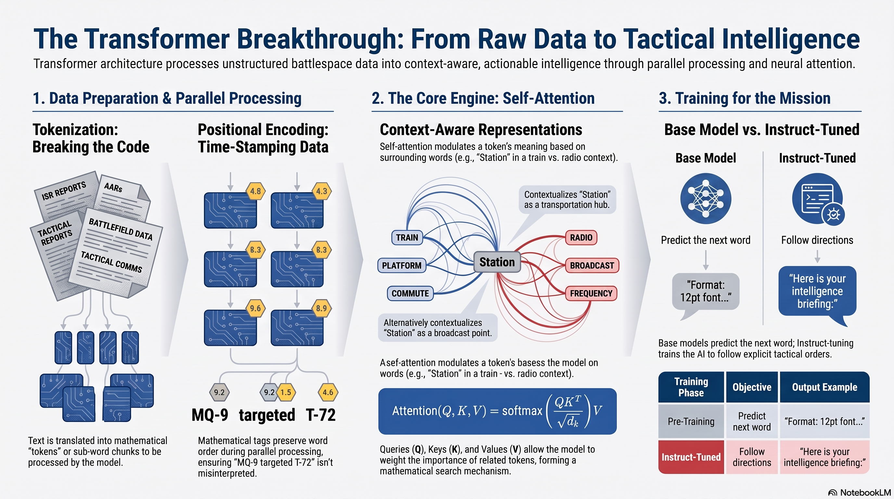

# L33: Transformers and LLMs

The modern battlespace generates an overwhelming amount of unstructured text: Intelligence, Surveillance, and Reconnaissance (ISR) reports, After Action Reports (AARs), intercepted communications, and geopolitical news feeds. In the past, algorithms struggled to understand the nuance, context, and complex grammar of human language.

Starting in 2017, a new model architecture overtook the field of natural language processing: the {term}`Transformer`. Introduced in the seminal paper *“Attention is all you need,”* this architecture proved that a simple mechanism called "neural attention" could build powerful sequence models without relying on the slow, sequential processing of older recurrent neural networks. This breakthrough gave birth to **Large Language Models (LLMs)**. The content for this less is derived from Deep Learning with Python {cite}`chollet2021deep`.

:::{admonition} Lesson Objectives
:class: note

* Explain tokenization, positional encoding, and self-attention
* Describe the pre-training and instruct-tuning paradigms
* Interact with LLMs using APIs
:::

## Tokens and Positions

### Breaking the Code (Tokenization)

Computers cannot do math on letters; they can only process numbers. Before an LLM can read an ISR report, the text must be translated into a mathematical format through {term}`Tokenization`.

A tokenizer does not always break text word-by-word. It breaks text into "chunks" or sub-words. Common words (like "The" or "UAV") might be a single token. But complex or newly invented military jargon might be broken down into pieces. For example, the word "multirotor" might be split into the tokens "multi", "ro", and "tor". Each unique token is assigned a specific ID number from the model's vast dictionary.

### Time-Stamping the Data (Positional Encoding)

Older language models read text sequentially, one word at a time, like a human reading a book. This was incredibly slow. The {term}`Transformer` architecture solves this by reading the *entire document at once* in parallel.

However, if you throw all the words into the network at the exact same time, the network loses the word order. "The MQ-9 targeted the T-72" and "The T-72 targeted the MQ-9" use the exact same words but have completely opposite tactical meanings.

To fix this, Transformers use {term}`Positional Encoding`. Before the tokens are fed into the neural network, a mathematical "time-stamp" is added to each one, permanently tagging its exact position in the sentence. This allows the model to process everything blazingly fast in parallel, while still perfectly understanding the sequence of coordinate data and subject-verb relationships.

## Self-Attention

### Context-Aware Tokens

You've already learned how neural networks use forms of attention. Max pooling in a CNN looks at a region and selects just one feature to keep (an "all or nothing" form of attention).

In language, attention is more complex because the meaning of a word is usually context-specific. When an ISR report mentions a "station," are we talking about a train station, a radio station, or the International Space Station? In a basic embedding space, "station" has a fixed vector representation. But that's not how language works.

A smart model provides a different vector representation for a word depending on the other words surrounding it. That’s where {term}`Self-Attention` comes in. The purpose of self-attention is to modulate the representation of a token by using the representations of related tokens in the sequence. This produces *context-aware* token representations.

### Calculating Attention Scores

As the model processes the AAR, it algorithmically figures out context through a two-step process:

**Step 1:** It computes relevancy scores between the current word (the pivot) and every other word in the sentence. We use the dot product between two word vectors as a measure of the strength of their relationship. Words closely related to the pivot word get a high score; irrelevant words get a score near zero. These scores go through a scaling function and a softmax.

**Step 2:** It computes the sum of all word vectors in the sentence, weighted by our relevancy scores. Irrelevant words contribute almost nothing. The resulting sum becomes our *new* representation for the pivot word—a representation that now incorporates the surrounding context.

If the sentence was "The train left the station," the new vector for "station" now includes part of the "train" vector, clarifying that it is a train station.

### Queries, Keys, and Values

This terminology comes from search engines and recommender systems. Imagine you’re typing a query to retrieve a photo from your collection—“dogs on the beach.” Internally, each of your pictures is described by a set of keywords—“cat,” “dog,” “party” (the keys). The search engine compares your query to the keys, and returns the pictures (the values) associated with the top matches.

Conceptually, this is what Transformer-style attention is doing:

1. **Query (Q):** A reference sequence that describes something you’re looking for (the current token being analyzed).

2. **Key (K):** A format that describes the body of knowledge and can be readily compared to a query.

3. **Value (V):** The body of knowledge you’re trying to extract information from.

The operation becomes: *For each element in the query, compute how much the element is related to every key, and use these scores to weight a sum of values.*

$$\text{Attention}(Q, K, V) = \text{softmax}\left(\frac{QK^T}{\sqrt{d_k}}\right)V$$

In sequence classification or standard LLM text generation, the query, keys, and values are all the same sequence—you’re comparing a sequence to itself to enrich each token with context from the whole document.

## Training Paradigms: Base vs. Instruct

### Learning the Language vs. Following Orders

If you deploy a raw, freshly trained {term}`Base Model`, it will likely fail this task. Why? Because of how it was trained.

**Phase 1: Pre-Training (The Base Model)**
In this phase, the model is fed a massive chunk of the internet (Wikipedia, books, articles). Its only goal is to play a game: *Predict the next word*. Through trillions of repetitions, it learns grammar, facts, and reasoning. However, a Base Model doesn't know it's an AI assistant. If you prompt a Base Model with: *"Write an intelligence briefing:"*, it might simply predict the next logical words and output: *"Format requirements: 12pt font, double spaced, due by Friday."* It is just completing a document.

**Phase 2: Instruct-Tuning (The Assistant)**
To make the AI useful for operations, we put the Base Model through {term}`Instruct-Tuning`. Human operators give the model thousands of examples of prompts and the *correct, desired responses*. The model is heavily penalized if it just "continues the text," and heavily rewarded if it follows the explicit instructions. This transforms the underlying Base Model into a highly obedient tactical assistant that knows how to write your briefing exactly as ordered.

## Summary Infographic

 

## Knowledge Check & Practice Questions

1. **The Order of Operations:** If a Transformer processes an entire sentence simultaneously in parallel, how does the model mathematically know which word came first and which came last?

2. **Self-Attention in Action:** In the sentence, *"The pilot landed the damaged aircraft safely because she was highly trained,"* which previous word in the sequence will the self-attention mechanism mathematically link the word *"she"* to with the highest attention weight?

3. **Base vs. Instruct:** You are deployed to a forward operating base and given a locally hosted LLM. When you type *"Translate this intercepted message into English:"*, the model replies by outputting *"Translate this intercepted message into Spanish:"*. What training phase has this model likely missed, and why is it behaving this way?

<!-- 
# L33: Transformers and LLMs

The modern battlespace generates an overwhelming amount of unstructured text: Intelligence, Surveillance, and Reconnaissance (ISR) reports, After Action Reports (AARs), intercepted communications, and geopolitical news feeds. In the past, algorithms struggled to understand the nuance, context, and complex grammar of human language.

The invention of the Transformer architecture revolutionized artificial intelligence, giving birth to Large Language Models (LLMs) capable of reading, summarizing, and reasoning over vast amounts of text with near-human comprehension.

:::{admonition} Lesson Objectives
:class: note

Explain tokenization, positional encoding, and self-attention

Describe the pre-training and instruct-tuning paradigms

Interact with LLMs using APIs
:::

## Tokens and Positions

### Breaking the Code (Tokenization)
Computers cannot do math on letters; they can only process numbers. Before an LLM can read an ISR report, the text must be translated into a mathematical format through {term}Tokenization.

A tokenizer does not always break text word-by-word. It breaks text into "chunks" or sub-words. Common words (like "The" or "UAV") might be a single token. But complex or newly invented military jargon might be broken down into pieces. For example, the word "multirotor" might be split into the tokens "multi", "ro", and "tor". Each unique token is assigned a specific ID number from the model's vast dictionary.

### Time-Stamping the Data (Positional Encoding)

Older language models read text sequentially, one word at a time, like a human reading a book. This was incredibly slow. The {term}Transformer architecture solves this by reading the entire document at once in parallel.

However, if you throw all the words into the network at the exact same time, the network loses the word order. "The MQ-9 targeted the T-72" and "The T-72 targeted the MQ-9" use the exact same words but have completely opposite tactical meanings.

To fix this, Transformers use {term}Positional Encoding. Before the tokens are fed into the neural network, a mathematical "time-stamp" is added to each one, permanently tagging its exact position in the sentence. This allows the model to process everything blazingly fast in parallel, while still perfectly understanding the sequence of coordinate data and subject-verb relationships.

## Self-Attention

Imagine you need an AI to summarize a 50-page After Action Report. The report mentions "Bravo Company" on page 1, and on page 12 it says, "They advanced on the ridge." How does the AI know who "They" refers to?

### The Context Engine

The true superpower of the Transformer is {term}Self-Attention. As the model processes the AAR, the self-attention mechanism looks at every single word and asks, "How strongly does this word relate to every other word in this document?"

When the model reads the word "They" on page 12, the self-attention mechanism mathematically calculates high "attention weights" linking it back to "Bravo Company" on page 1, and linking "ridge" back to the "Grid Coordinate 45A" mentioned on page 11. It dynamically builds a web of context, successfully linking entities, unit names, and locations across massive documents.

### Queries, Keys, and Values

The self-attention mechanism works like a highly advanced database search:

Query (Q): The current word the model is looking at (e.g., "They").

Key (K): The labels of all the other words in the text.

Value (V): The actual meaning of those other words.

The attention score is calculated by taking the dot product of the Queries and Keys. If the Query ("They") mathematically aligns with the Key for "Bravo Company", the resulting attention score will be massive, and the network will pull that context into its current understanding.

$$\text{Attention}(Q, K, V) = \text{softmax}\left(\frac{QK^T}{\sqrt{d_k}}\right)V$$

### Base vs. Instruct

Imagine if you input a raw feed of disparate global events into an LLM and ask it to write a daily intelligence briefing.

### Learning the Language vs. Following Orders

If you deploy a raw, freshly trained {term}Base Model, it will likely fail this task. Why? Because of how it was trained.

#### Phase 1: Pre-Training (The Base Model)
In this phase, the model is fed a massive chunk of the internet (Wikipedia, books, articles). Its only goal is to play a game: Predict the next word. Through trillions of repetitions, it learns grammar, facts, and reasoning. However, a Base Model doesn't know it's an AI assistant. If you prompt a Base Model with: "Write an intelligence briefing:", it might simply predict the next logical words and output: "Format requirements: 12pt font, double spaced, due by Friday." It is just completing a document.

#### Phase 2: Instruct-Tuning (The Assistant)
To make the AI useful for operations, we put the Base Model through {term}Instruct-Tuning. Human operators give the model thousands of examples of prompts and the correct, desired responses. The model is heavily penalized if it just "continues the text," and heavily rewarded if it follows the explicit instructions. This transforms the underlying Base Model into a highly obedient tactical assistant that knows how to write your briefing exactly as ordered.

Knowledge Check & Practice Questions

The Order of Operations: If a Transformer processes an entire sentence simultaneously in parallel, how does the model mathematically know which word came first and which came last?

Self-Attention in Action: In the sentence, "The pilot landed the damaged aircraft safely because she was highly trained," which previous word in the sequence will the self-attention mechanism mathematically link the word "she" to with the highest attention weight?

Base vs. Instruct: You are deployed to a forward operating base and given a locally hosted LLM. When you type "Translate this intercepted message into English:", the model replies by outputting "Translate this intercepted message into Spanish:". What training phase has this model likely missed, and why is it behaving this way? -->