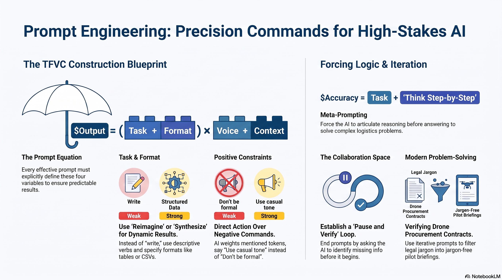

# L34: Prompt Engineering

Two common complaints about AI responses are that they are either wrong (hallucinations) or incredibly boring. Both are almost always the result of poor prompting.

An LLM is only as effective as the instructions it receives. Prompt Engineering is the discipline of structuring text inputs to reliably extract highly accurate, specific, and useful outputs from an AI model. You must provide instructions as you would to an especially literal-minded intern on their first day working with you.

:::{admonition} Lesson Objectives
:class: note

* Construct prompts using the Task, Format, Voice, and Context framework.

* Apply iterative prompting to refine and filter AI outputs.

* Implement meta-prompts to force LLMs to plan and articulate their reasoning step-by-step.
:::

## The Anatomy of a Prompt

To get useful and interesting responses, a clear prompt should explicitly define four features: Task, Format, Voice, and Context [{cite:t}`bowen2024teaching`].

### **TASK:** What exactly do you want the AI to do?

Bland or generic verbs produce bland content. "Condense this" works better than "make this shorter." "Explore diet plans" produces more interesting results than "write a paper about diet plans."

Use direct, descriptive, or creative verbs to stimulate divergent results: Create, Summarize, Analyze, Elaborate, Reimagine, Explain, Identify, Translate, Transform, Synthesize, Abridge, Invent.

* Weak: "Write a classroom exercise about radar."

* Strong: "Take the ideas above and reimagine them as a classroom exercise about radar." (This forces the AI to distance itself from the original text rather than just copying it).

---

### **FORMAT:** What is the specific output?

You must explicitly define what the final product should look like, how long it should be, and how it should be structured.

Examples: Essay, Blog Post, Email, Jargon-Free Summary, Dialogue, Lesson Plan, Product Description, Python Code, CSV file, Table.

* Weak: "List regional conflicts."

* Strong: "Create a table of regional conflicts. In column one, list the country. In column two, list the displaced population count. Provide exactly 10 bullet points."

---

### **VOICE:** What style of language is desired?

AI is highly sensitive to role, purpose, and intent. It can respond in the voice of a character, a specific profession, or an established tone.

Examples: Academic, jargon-free, like a copywriter, like a millennial, in the style of my professor.

Tone Modifiers: Serious & empathetic, casual & funny, positive & enthusiastic.

Example Prompt: "Write the opening paragraph... Hook the reader with something unexpected. Write in a formal academic style as if you are a college professor."

---

### **CONTEXT:** What further information can you provide?

A lot of human communication relies on unspoken context. LLMs are contextual processors and usually need more explicit context than another human.

Examples: Suitable as a reading assignment for an undergraduate course. I want a range of solutions that are inexpensive. Wait until I respond.

## Forcing the AI to Think

As with humans, an AI's fastest or first thought is often not its best. Asking your AI to slow down can drastically improve the logic and creativity of its results.

### Meta-Prompts and Step-by-Step Logic

You can force an LLM to articulate its reasoning before providing a final answer. Research shows that adding simple "meta-prompts" to your instructions leads to higher accuracy on complex tasks:

"Take a deep breath and work on this problem step-by-step."

"Break this down."

"Let's think carefully about the problem and solve it together."

### Creating Human-AI Collaboration Space

You can also ask the AI to work in stages, creating space for collaboration. Try ending your prompt with:

"Before you begin, ask me what other information you might need to fulfill this task."

"Don't do anything yet. First ask me if any part of what I am asking you to do is confusing."

### Iteration and Filtering

Few complicated tasks are accomplished with a single prompt. Because LLMs remember the context of the conversation, you can use iterative prompting to filter and refine the results, almost like programming with natural language.

### If/Then Constraints

You can create literal if/then statements to force the AI to verify its own work:

"Make sure each reference actually exists by verifying that a web search returns a citation with a DOI. Eliminate any suggestions that do not comply with this."

"Find five words used in the South that have a similar meaning to death. Continue checking until you have at least one phrase that has not appeared in a work of literature."

### Positive Instructions over Negative

Avoid negative commands ("don't do X"). AI associates strongly with the words you provide; if you say "don't think about cookies," the model will heavily weigh the token "cookies."

Weak: "Avoid formal language."

Strong: "Use a casual and informal tone."

## Summary Infographic

 

## Knowledge Check & Practice Questions

1. Analyzing Prompt Anatomy: You need an LLM to review a dense, 20-page legal contract regarding drone procurement and explain it to a new pilot. You draft the following prompt: "Summarize this legal document for a drone pilot. Make sure it isn't too long or confusing." Identify which of the four core prompt features (Task, Format, Voice, Context) are missing or poorly defined, and rewrite the prompt using the framework to improve the output.

2. Positive vs. Negative Instructions: You are trying to get an AI to write a press release about a new radar system, but it keeps using overly aggressive military terminology. You write the prompt: "Write a press release. Do not use scary military words like 'kill', 'destroy', or 'lethal'." Why will this prompt likely fail to achieve your desired result, and how should you rephrase it?

3. Meta-Prompting for Accuracy: You give an LLM a complex logistics problem: "Base A has 50 gallons of fuel. Base B needs 20 gallons. A transport truck burns 1 gallon per mile. The distance is 15 miles. Can the truck deliver the fuel and return to Base A?" The LLM immediately outputs "Yes, the truck can make the delivery," which is mathematically incorrect. How can you alter your prompt to fix this hallucination without changing the math problem itself?