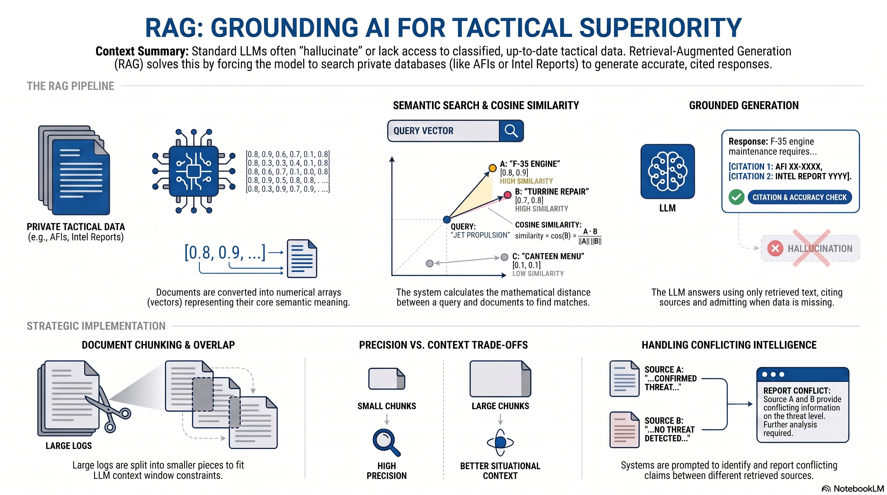

# L35: Retrieval-Augmented Generation (RAG)

Large Language Models (LLMs) are incredibly powerful, but they suffer from two critical limitations in tactical environments: they only know what they were trained on (which means they lack up-to-date or classified proprietary data), and they are prone to {term}`Hallucinations` (making up facts with high confidence).

To solve this, we use {term}`Retrieval-Augmented Generation (RAG)`. RAG is an architecture that allows an LLM to search an external database of your own private documents, retrieve the exact paragraphs relevant to a user's question, and use that retrieved text to generate a highly accurate, cited, and grounded response.

:::{admonition} Lesson Objectives
:class: note

* Explain vector embeddings and database search.

* Design document chunking strategies.

* Build a RAG pipeline to ground LLM outputs in retrieved operational data.
:::

## Vector Embeddings and Semantic Search

To build a RAG system, we must first convert all our text documents into {term}`Vector Embeddings`. An embedding model reads a paragraph of text and translates its core meaning into a massive array of numbers (a vector).

Imagine a 3D coordinate system where the X-axis is "military," the Y-axis is "aircraft," and the Z-axis is "repair." The phrase "Fix the jet" and "Repair the airframe" use completely different words, but their vectors will point to the exact same mathematical location in this space.

### Text to Math - Cosine Similarity

Once our documents and the user's query are converted into vectors, the database must calculate the distance between them. The standard mathematical metric for semantic search is {term}`Cosine Similarity`, which measures the angle ($\theta$) between two vectors (e.g., the user's query vector $\vec{A}$ and a document's vector $\vec{B}$).

$$\cos(\theta) = \frac{\vec{A} \cdot \vec{B}}{\Vert{}\vec{A}\Vert{} \Vert{}\vec{B}\Vert{}}$$

* **The Numerator (Dot Product):** $\vec{A} \cdot \vec{B}$ multiplies the corresponding dimensions of the vectors. If they point in similar semantic directions, this number grows large.

* **The Denominator (Magnitudes):** $\Vert{}\vec{A}\Vert{} \Vert{}\vec{B}\Vert{}$ divides the result by the total physical length of the vectors. This mathematically "normalizes" the calculation, ensuring that a massive 10-page document doesn't artificially outscore a short 1-paragraph document just because it has more words.

* **The Result:** A cosine similarity near $1.0$ means the vectors point in the exact same direction (highly relevant meaning). A score of $0.0$ means they are mathematically perpendicular/orthogonal (completely unrelated).

## The Pipeline Architecture

**Ingest & Embed:** Convert thousands of AFIs into vector embeddings and store them in a specialized {term}`Vector Database`.

**User Query:** The user asks a question in plain English. We convert their question into a vector using the exact same embedding model.

**Semantic Search:** The database calculates the {term}`Cosine Similarity` between the user's question vector and all the document vectors. It instantly returns the top 3 documents that are mathematically closest in "meaning" to the question.

**Generation:** We send the user's question along with the retrieved AFI text to the LLM, instructing it to answer the question using only the provided text.

## Document Chunking Strategies

### The Problem with Context Windows

You cannot embed an entire 50-page log as a single vector. It dilutes the specific details, and LLMs have a strict {term}`Context Window` (a limit on how much text they can process at once). Therefore, you must split large documents into smaller pieces through {term}`Document Chunking`.

### The Trade-offs of Chunk Size

* Large Chunks (e.g., 1000 words): Provides the LLM with a lot of surrounding context (e.g., the mechanic's entire shift report), but retrieving multiple large chunks might exceed the API's context window.

* Small Chunks (e.g., 50 words): Highly precise {term}`Semantic Search` retrieval (it finds the exact sentence where a specific wrench was used), but the LLM might lack the context to understand why the wrench was used.

**Overlap:** To prevent a sentence from being cut in half across two chunks, systems usually implement a token overlap (e.g., chunk size of 200 words, with a 50-word overlap into the next chunk).

## Grounding and Handling Ambiguity

### Prompting for Calculated Uncertainty

A standard LLM might try to please the user by randomly picking one number or averaging them, which is dangerous in a tactical environment. You must use system prompts to force {term}`Grounding` of the model in its response in the retrieved text, cite its sources, and explicitly state ambiguity.

**Strong RAG System Prompt:**

"You are an intelligence analyst. Answer the user's question using ONLY the provided context documents. If the context documents contain conflicting information, you must state that there is a conflict and list the different claims with their respective source citations. If the answer is not contained in the context, output: 'Insufficient intelligence to answer.'"

## Step-by-step Example

            ┌──────────────────────────┐             1. User asks question: 
            │        USER QUERY        │                “What is NAT for during network operations?”
            │  "Explain NAT in ops"    │
            └──────────────┬───────────┘
                           │
                           ▼
                ┌────────────────────┐               2. A vector representation of the question is
                │  Query Embedding   │                  generated.
                │ (Transform to vec) │
                └──────────┬─────────┘
                           │
                           ▼
     ┌─────────────────────────────────────────────┐ 3. The system finds the most relevant documents 
     │         Vector Store / Retriever            │    using semantic similarity.
     │   (Chroma, Qdrant, Milvus, FAISS, etc.)     │
     └───────────┬─────────────────────────────────┘
                 │   Semantic similarity search
                 ▼
        ┌──────────────────────────┐                 4. Retrieve documents paragraphs, reports, 
        │   Top-K Relevant Docs    │                    PDFs, policies, notes, emails, database 
        │  (text, metadata, ids)   │                    entries.
        └──────────────┬───────────┘
                       │
                       ▼
             ┌────────────────────┐                  5. This becomes the “context.”
             │  RAG Prompt Builder│
             │ Inject retrieved   │
             │ context into LLM   │
             └─────────┬──────────┘
                       │
                       ▼
          ┌──────────────────────────┐               6. The context is inserted into a prompt 
          │  LLM (GPT-5.1, Llama,    │                  for an LLM.
          │   Mistral, Claude, etc.) │
          │  Uses context + query    │
          └─────────────┬────────────┘
                        │
                        ▼
            ┌──────────────────────────────┐         7. LLM is grounded in your real data and won’t 
            │      FINAL ANSWER            │            hallucinate (in theory).
            │ (grounded, non-hallucinatory)│
            └──────────────────────────────┘

## Summary Infographic

 

**Knowledge Check & Practice Questions**

1. Imagine you map three phrases into a 2D vector space. Vector A ("F-35 Engine") is [0.8, 0.9]. Vector B ("Turbine Repair") is [0.7, 0.8]. Vector C ("Canteen Menu") is [0.1, 0.1]. If a user queries "Jet Propulsion" mapped at [0.8, 0.85], how does Cosine Similarity ensure the RAG system ignores Vector C?

2. You have a 10,000-token intelligence report. You decide to chunk the document into sizes of 500 tokens, with a 100-token overlap between each chunk to preserve sentence context. Mathematically, how many new tokens does the system advance for each subsequent chunk?

3. Your RAG system retrieves two paragraphs regarding troop movements. Chunk 1 says "Target A is lightly defended." Chunk 2 says "Target A has received heavy mechanized reinforcements." If your prompt simply says "Summarize the defense of Target A," what is the operational risk, and how should you alter the prompt to fix it?