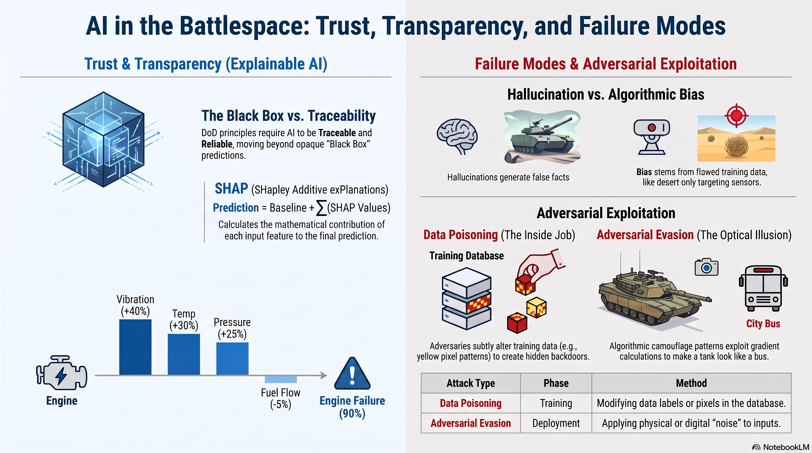

# L36: Failure Modes and Ethics

As Artificial Intelligence transitions from the laboratory to the battlespace, understanding how models fail is just as critical as understanding how they succeed. Deploying AI in tactical environments introduces immense operational and ethical risks. If commanders cannot trust the "why" behind an AI's decision, or if an adversary can manipulate the model's perception, the system becomes a vulnerability rather than an asset.

In this lesson, we will explore the critical vulnerabilities of modern AI, how adversaries exploit them, and the mathematical tools we use to maintain human trust and ethical alignment.

:::{admonition} Lesson Objectives
:class: note

* Identify hallucinations and bias in AI systems.

* Identify how ethical issues stem from bias in training data, algorithms, and human-defined rules.

* Explain the necessity of Explainable AI (XAI) for mission-critical systems.

* Evaluate deployment risks including data poisoning and adversarial evasion.
:::

## Trust and Transparency (Explainable AI)

### The Black Box Problem

Deep Learning models, particularly complex neural networks with millions of parameters, are often described as "black boxes." While we know the math occurring inside the hidden layers, tracing exactly which combination of input pixels or sensor readings caused the final prediction is incredibly difficult.

In the Department of Defense (DoD), this is unacceptable. According to DoD AI Ethical Principles, systems must be Traceable and Reliable. If a system recommends lethal action, human operators must understand the rationale.

### Explainable AI (XAI) and SHAP

{term}`Explainable AI (XAI)` is a field dedicated to making the decision-making processes of AI models understandable to humans.

One of the most powerful mathematical tools in XAI is SHAP (SHapley Additive exPlanations). Based on cooperative game theory, SHAP calculates the exact mathematical contribution (or "payout") that each individual input feature provided to the final prediction. [{cite:t}`lundberg2017unified`]

For example, if the model predicts a 90% chance of an engine failure, SHAP breaks down that 90%. It might reveal that the Vibration Sensor contributed +40%, the Temperature Sensor contributed +30%, the Pressure Sensor contributed +25%, and the Fuel Flow contributed -5% (arguing against failure). Instead of blindly trusting a "High Threat" alert, an operator using SHAP can see exactly which features (e.g., specific radar cross-section anomalies) triggered the alert, allowing for rapid human verification.

### Hallucinations and Ethical Bias

#### The Illusion of Truth

Because LLMs are fundamentally designed to predict statistically likely word sequences, they do not have a concept of absolute truth. When they lack specific knowledge, they do not naturally say "I don't know." Instead, they suffer from {term}`Hallucinations`, generating false, fabricated, or nonsensical information presented with absolute certainty. This is why architectures like {term}`Retrieval-Augmented Generation (RAG)` are important in tactical settings, forcing the model to answer using verified documents.

#### Three Vectors of Algorithmic Bias

{term}`Algorithmic Bias` occurs when a model produces systematically prejudiced results. Ethical issues in AI deployment rarely happen by accident; they typically stem from three distinct sources of bias:

* **Bias in Underlying Training Data:** This is the most common failure mode. If an autonomous targeting system is trained primarily on images of desert warfare, it learns a skewed representation of the world. When deployed in a snowy, urban environment, it may suffer from extreme {term}`Underfitting (High Bias)`, leading to a catastrophic increase in {term}`False Positive (Type I Error)` rates against civilian vehicles.

* **Bias in Training Algorithms:** The mathematical algorithms and loss functions we choose can inherently prioritize certain outcomes. If a training algorithm is optimized purely for overall statistical accuracy without specific fairness constraints, it might achieve that high score by performing perfectly on the majority of standard cases while systematically failing on minority or underrepresented edge cases.

* **Bias in Rules Specified by Human Operators:** AI systems do not operate independently; they are constrained by human-coded heuristics and business rules. If a human commander sets an aggressively low probability threshold for a "Threat" alert due to operational paranoia, the resulting bias (and subsequent ethical failures regarding collateral damage) is encoded directly by the human's ruleset, amplifying the system's inherent risks.

### Adversarial Exploitation

When an adversary intentionally attacks an AI system, they typically use one of two methods: Data Poisoning, and Adversarial Evasion. 

#### Data Poisoning (The Inside Job)

{term}`Data Poisoning` occurs during the training phase. An adversary subtly alters the training data before the model learns from it.

Example Attack: An adversary infiltrates the database and places a tiny, specific pattern of yellow pixels in the corner of hundreds of images labeled "Friendly."

The Result: The neural network learns that "yellow pixel pattern = friendly." Later, in combat, the adversary paints that exact yellow pattern on their tanks. The poisoned AI ignores the tanks, classifying them as friendly.

#### Adversarial Evasion (The Optical Illusion)

{term}`Adversarial Evasion` occurs during the deployment phase against an already trained model. The adversary subtly alters the physical environment or the input data to force the AI to make a mistake.

Example Attack: An adversary applies a specific, algorithmically generated camouflage pattern (often looking like random static to a human) to their vehicles.

The Result: When the drone's CNN processes the camera feed, the specific mathematical noise in the camouflage exploits the network's gradient calculations, forcing the model to classify a Tank as a School Bus with 99% confidence.

## Summary Infographic

 

## Knowledge Check & Practice Questions

1. An LLM generates a highly detailed, completely fabricated historical account of a battle that never happened. A different CNN correctly identifies enemy tanks, but only in desert environments, failing completely in forests. Which system is suffering from a hallucination, and which is suffering from algorithmic bias?

2. An autonomous medical triage AI recommends a specific treatment for a wounded soldier. The baseline average risk score is 40. The SHAP values for the soldier's data are: Heart Rate (+15), Blood Pressure (+5), and Temperature (-10). What is the model's final predicted risk score for this soldier?

3. An adversary hacks into your training database and subtly alters the labels on images of civilian trucks. Later, in the field, they apply a complex static-pattern sticker to a combat vehicle that causes your deployed camera's gradient calculations to fail. Which attack occurred during training, and which occurred during deployment?