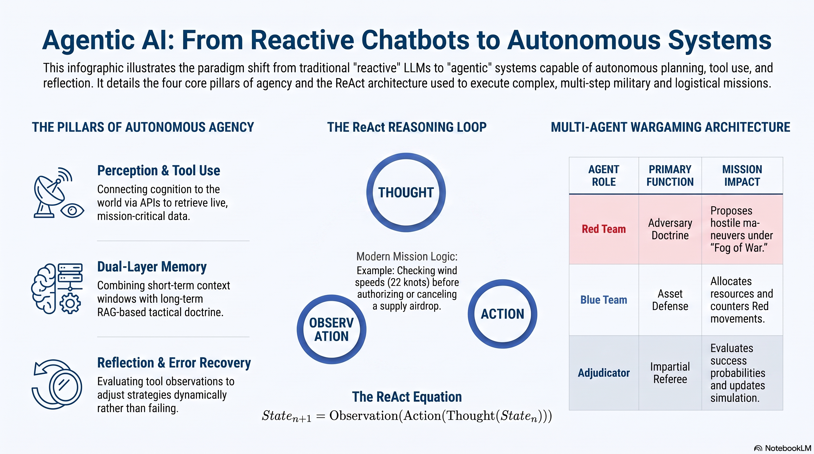

# L37: Agentic AI

While Large Language Models (LLMs) are highly capable of generating text and answering questions, they are traditionally reactive: you provide an input, and they provide an output. Agentic AI represents a paradigm shift where the AI system is endowed with agency—the capacity to autonomously plan, reason, use tools, and take actions over multiple steps to accomplish a complex goal {cite:t}`wang2024survey`.

Instead of just answering a question, an AI Agent acts as a dynamic system that can perceive its environment, formulate a strategy, execute external functions (like searching databases or checking APIs), evaluate the results of those actions, and adapt its plan in real-time.

:::{admonition} Lesson Objectives
:class: note

* Explain agentic reasoning loops (e.g., ReAct).

* Design multi-step workflows incorporating tool use, short-term memory, and error recovery.

* Evaluate the application and limitations of multi-agent architectures in complex scenarios like wargaming.
:::

## The Core Pillars of Agentic AI

To transition a model from a simple chatbot to an autonomous agent, it must possess four interconnected capabilities:

### Perception and Tool Use

Agents cannot act if they are confined to their training data. Tool Use (or function calling) bridges cognition with capability. It allows the agent to interact with the external world by executing predefined scripts or APIs. For instnace, instead of guessing the weather at a target coordinate, the agent explicitly calls a get_weather(lat, lon) function, retrieves the live data, and injects that data into its working memory.

### Planning and Reasoning

Effective agents must strategize rather than react blindly. Planning involves decomposing a high-level goal (e.g., "Plan a supply airdrop") into smaller, sequential subtasks (e.g., 1. Check weather, 2. Check airspace restrictions, 3. Calculate payload weight, 4. Draft route).

### Memory

An agent must remember what it has done to avoid repeating mistakes, a capability often modeled on human cognitive architectures {cite:t}`park2023generative`.

* Short-Term Memory: The agent's immediate context window, tracking the steps it has taken during the current execution loop.

* Long-Term Memory: Often implemented via {term}`Retrieval-Augmented Generation (RAG)` and vector databases, allowing the agent to recall past successful strategies or established tactical doctrine across different sessions.

### Reflection and Error Recovery

This is what distinguishes a robust agent from a fragile script. After executing a tool, the agent must evaluate the Observation. If a tool fails (e.g., the get_weather API times out), a capable agent reflects on the error, adjusts its strategy, and tries an alternative method (e.g., calling a secondary radar API) instead of crashing.

## The ReAct (Reasoning and Acting) Architecture

The most foundational design pattern for Agentic AI is the ReAct (Reasoning and Acting) loop. First introduced in a breakthrough 2023 research paper by {cite:t}`yao2023react`, ReAct forces the LLM into a structured, interleaved cycle of internal cognition and external action.

The ReAct framework relies on a specific prompting structure that cycles through three phases until the goal is achieved:

1. **Thought:** The agent articulates its internal reasoning. It assesses the current state, identifies what information is missing, and decides which tool to use next.

* Thought: "I need to plan an airdrop at Grid 45A. I must first check if the wind speeds at 45A are within the safe threshold of 15 knots."

2. **Action:** The agent executes a specific, structured tool call.

* Action: call_tool: check_weather(grid="45A")

3. **Observation:** The external system returns the result of the tool, which is injected back into the agent's context.

* Observation: "Result: Wind speed at 45A is 22 knots (SEVERE)."

**The Loop Continues:** Based on the new Observation, the agent generates its next Thought.

* Thought: "The wind speed is 22 knots, which exceeds the safe threshold. I cannot authorize the airdrop. I will now draft a cancellation alert to the commander."

* Action: call_tool: send_alert(status="CANCELLED", reason="High Winds")

This explicit "Thought" step is critical. It creates an interpretable reasoning trail for human operators and allows the agent to self-correct if an Action produces an unexpected Observation.

## Multi-Agent Architectures and Wargaming

While a single agent is powerful, complex operational tasks often hit a cognitive ceiling when handled by one model. Multi-Agent Architectures solve this by dividing labor among specialized agents that coordinate and communicate with each other.

### The Agentic Wargame

One of the most promising applications of multi-agent systems in defense is automated wargaming. Instead of a single model trying to simulate an entire conflict, the architecture is divided:

* **The Red Team Agent:** Prompted with adversary doctrine, restricted to seeing only specific "fog of war" intelligence, and tasked with proposing hostile maneuvers.

* **The Blue Team Agent:** Tasked with defending assets, allocating resources, and countering Red Team movements based on friendly doctrine.

* **The Adjudicator Agent:** An impartial referee agent that takes the proposed actions from Red and Blue, calculates the probabilities of success based on a physics/rules engine, and updates the shared simulated environment.

### Challenges in Multi-Agent Systems

**Cascading Hallucinations:** If the Red Team agent hallucinates a capability (e.g., inventing a teleportation device), and the Adjudicator fails to catch it, the Blue Team agent will begin responding to the hallucination, entirely derailing the simulation.

**Infinite Loops:** Without strict orchestration limits, agents can get stuck in endless conversational loops, endlessly debating a single tactical point without taking action.

**Context Degradation:** Over long, multi-step wargame campaigns, agents may lose track of their original, high-level strategic goals as their immediate, short-term memory fills up with minor tactical details.

## Summary Infographic

 

## Knowledge Check & Practice Questions

1. In the ReAct architecture, which step is responsible for injecting the external data (e.g., a database query result) back into the agent's context window: the Thought, the Action, or the Observation?

2. An AI agent successfully plans a complex convoy route avoiding hostile terrain. The developers want the agent to recall this specific successful route layout if asked to plan a similar mission three months later in a completely new chat session. Which capability must be implemented to achieve this: Short-Term Memory (Context Window), Long-Term Memory (RAG/Vector Store), or the Adjudicator Agent?

3. During a simulated multi-agent wargame, the Red Team agent outputs: "I will deploy our stealth hover-tanks." The Adjudicator agent accepts this move, and the Blue Team begins allocating resources to counter hover-tanks. What specific failure mode has occurred in this multi-agent system?