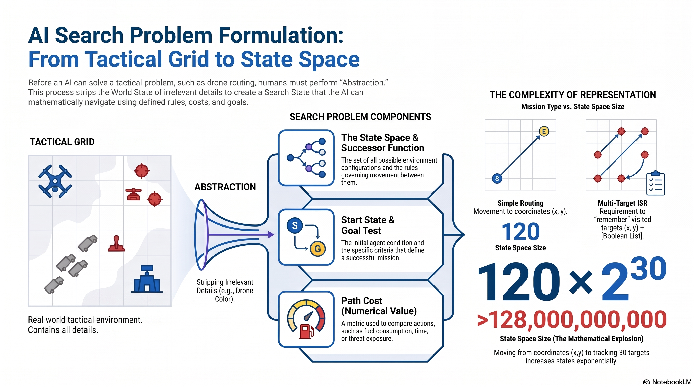

# L4: Problem Formulation

:::{admonition} Lesson Objectives
:class: note

* Define states, actions, goal tests, and path costs.

* Formulate real-world problems as search problems.

* Explain how problem representation affects solution difficulty.
:::

## The Search Problem

Before an AI can "solve" a tactical challenge (like routing a drone or scheduling supply convoys), the human operator must mathematically formulate the problem. "All models are wrong, but some are useful." If we model the problem poorly, the AI will fail to find a solution in a reasonable amount of time.

A formalized {term}`Search` problem consists of four core components:

* {term}`State Space`: The set of all possible states in the environment.

* {term}`Successor Function`: The rules of movement. It takes the current state and a desired {term}Action as input, and returns the resulting state and the associated path cost.

* {term}`Start State` & {term}`Goal State`: Where the agent begins, and the specific condition it is trying to reach (the Goal Test).

* {term}`Path Cost`: A numerical value that compares the effects of different possible actions (e.g., fuel consumed, time elapsed, threat exposure).

A solution is simply a sequence of actions (a plan) that transforms the Start State into the Goal State.

## World State vs. Search State (Abstraction)

The most critical job of an AI Integration Officer is Abstraction—stripping away irrelevant information so the AI doesn't get overwhelmed.

{term}`World State`: Includes every last physical detail of the environment (e.g., exact GPS coordinates of every tree, wind speed, the drone's paint color).

{term}`Search State`: Keeps only the details strictly needed for planning.

## How Representation Affects Difficulty

Let's look at a tactical grid representing a 10x12 urban operational environment. There are exactly 120 possible physical sectors (positions) the drone can occupy.

In Scenario A (Simple Pathing) the drone needs to travel from the Start zone to the Exit zone while avoiding SAM threats.

```{figure} ../../figures/Lsn4_fig1.png
---
width: 95%
align: center
name: simple-search-problem
---
State space example for a simple pathing problem.
```

*State Representation:* (x, y)

**State Space Size:** Exactly 120 states.

**Difficulty:** Trivial. The AI solves this instantly because the search space is incredibly small.

For Scenario B: ISR Sweep (Multi-Target Recon), the commander changes the mission. The drone must now fly over 30 specific target zones scattered across the grid to collect SIGINT before arriving at the exit.

```{figure} ../../figures/Lsn4_fig2.png
---
width: 95%
align: center
name: complex-search-problem
---
State space example for a complex path problem.
```
**State Representation:** (x, y) AND a boolean list of 30 targets [True, False, True...] tracking which targets have been successfully scanned.

**State Space Size:** $120 \times 2^{30}$ (Over 128 Billion states!).

**Difficulty:** Extremely high. Simply adding the requirement to "remember" past actions explodes the mathematical size of the search space.

## State Space Graphs vs. Search Trees

Once the problem is formulated, the AI explores it. It is crucial to understand the difference between the physical layout and the AI's mental exploration:

**State Space Graph:** A mathematical representation of the physical environment. Each {term}`Node` represents an abstracted configuration, and arcs represent actions. In a state space graph, each physical state occurs only once.

**Search Tree:** A "what if" branching tree of plans and their outcomes. The root is the Start State. The branches are possible futures. In a search tree, nodes represent entire paths, meaning the same physical state can appear thousands of times if there are multiple ways to get there.


```{mermaid}
graph TD
    subgraph "State Space Graph (Physical World)"
    S((Start)) --> A((Grid 1))
    S --> B((Grid 2))
    A --> S
    B --> S
    A <--> B
    end

    subgraph "Search Tree (AI's Mental Plan)"
    S_tree((Start)) --> A_tree((Grid 1))
    S_tree --> B_tree((Grid 2))
    
    A_tree --> S_dup1((Start))
    A_tree --> B_dup1((Grid 2))
    
    B_tree --> S_dup2((Start))
    B_tree --> A_dup2((Grid 1))
    
    style S_dup1 fill:transparent,stroke:#e74c3c,stroke-width:2px,stroke-dasharray: 5 5
    style S_dup2 fill:transparent,stroke:#e74c3c,stroke-width:2px,stroke-dasharray: 5 5
    style B_dup1 fill:transparent,stroke:#3498db,stroke-width:2px,stroke-dasharray: 5 5
    style A_dup2 fill:transparent,stroke:#3498db,stroke-width:2px,stroke-dasharray: 5 5
    end
```
**Figure 3:** Notice how "Start", "Grid 1", and "Grid 2" only exist once in the physical graph, but duplicate rapidly in the Search Tree as the AI imagines different paths.

Because search trees contain massive repeated structure, we rarely build the whole tree in memory. We generate it step-by-step using a {term}`Fringe` (the frontier of unexpanded nodes) and a specific exploration strategy.


## Summary Infographic


<br>
<hr width="100%" size="4" color="black">

## Knowledge Check & Practice Questions

1. In problem formulation, what is the difference between the World State and the Search State?

2. You are tasked with mapping the state space of a drone that must visit 5 specific waypoints on a map and return home. Why is the state space size drastically larger than a simple point A to point B mission?
