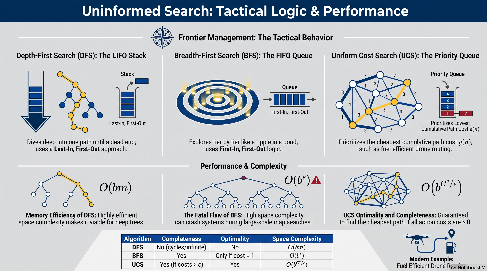

# L5: Uninformed Search (DFS, BFS, UCS)

:::{admonition} Lesson Objectives
:class: note

* Describe how DFS, BFS, and UCS explore state spaces.

* Compare search strategies based on completeness and optimality.

* Explain how frontier management affects algorithm behavior.
:::

## The Frontier

In Lesson 4, we formulated our environment into a Search Tree. But how does the AI actually explore that tree?

If an AI operates with {term}`Uninformed Search`, it has no knowledge of where the goal is located. It only knows its current state, the valid actions, and potentially the path costs. It explores blindly.

The behavior of a search algorithm is entirely dictated by how it manages its {term}`Frontier` (also known as the {term}`Fringe`). The Frontier is the collection of all unexplored nodes that the AI knows about but hasn't visited yet. By changing the data structure of the Frontier, we completely change the AI's tactical behavior.

When evaluating these algorithms, we measure four properties:

* **{term}`Completeness`**: Is it guaranteed to find a solution if one exists?

* **{term}`Optimality`**: Is it guaranteed to find the least-cost path?

* **{term}`Time Complexity`**: How long does it take?

* **{term}`Space Complexity`**: How much memory does it require?

## Depth-First Search (DFS)

Depth-First Search (DFS) pushes as far forward as possible down a single path until it hits a dead end (a leaf node). If it hits a dead end, it retreats to the last intersection and tries the next path.

**Frontier Management:** DFS uses a {term}`LIFO (Last-In, First-Out) Stack`. The most recently discovered node is the first one expanded.

```{mermaid}
graph TD
    S((Start)) --> A((Grid A))
    S --> B((Grid B))
    A --> C((Grid C))
    A --> D((Grid D))
    C --> G((Goal))
    
    style S fill:transparent,stroke:#e74c3c,stroke-width:3px
    style A fill:transparent,stroke:#e74c3c,stroke-width:3px
    style C fill:transparent,stroke:#e74c3c,stroke-width:3px
    style G fill:transparent,stroke:#e74c3c,stroke-width:3px
```
Figure 1: DFS dives straight down the left-most path (S -> A -> C -> G) before ever exploring Grid B or Grid D.

#### DFS Properties

**Completeness:** No. If the state space has infinite depth or cycles (loops), DFS will get stuck forever unless we explicitly maintain a closed set of visited states.

**Optimality:** No. It simply finds the "left-most" solution, regardless of how much fuel or time it costs.

**Space Complexity:** $O(bm)$. This is DFS's only major strength. It is highly memory efficient because it only needs to store the current path to the root.

---

## Breadth-First Search (BFS)

{term}`Breadth-First Search (BFS)` explores the map tier-by-tier. It checks every location 1 step away, then every location 2 steps away, expanding evenly like a ripple in a pond.

**Frontier Management:** BFS uses a {term}`FIFO (First-In, First-Out) Queue`. The oldest discovered node is the first one expanded.

```{mermaid}
graph TD
    S((Start)) --> A((Tier 1: A))
    S --> B((Tier 1: B))
    A --> C((Tier 2: C))
    B --> D((Tier 2: D))
    C --> G((Goal))
    
    style S fill:transparent,stroke:#3498db,stroke-width:3px
    style A fill:transparent,stroke:#f1c40f,stroke-width:3px
    style B fill:transparent,stroke:#f1c40f,stroke-width:3px
```
Figure 2: BFS explores in shallow tiers. It will expand Start, then fully evaluate Tier 1 (A and B) before moving to Tier 2 (C and D).

#### BFS Properties

**Completeness:** Yes. If a solution exists, BFS will find it, provided the branching factor is finite.

**Optimality:** Only if all costs are 1. BFS finds the path with the fewest actions, but ignores path costs (like fuel or threat levels).

**Space Complexity:** $O(b^s)$. This is BFS's fatal flaw. Because it must hold the entire bottom tier of the search tree in memory, it will quickly crash the computer on large maps.

---

## Uniform Cost Search (UCS)

What if the cost to move varies? (e.g., driving through a paved road costs 1 unit of fuel, but driving through mud costs 5 units). {term}`Uniform Cost Search (UCS)` solves this by always expanding the cheapest available node, building cost contours rather than depth tiers.

**Frontier Management:** UCS uses a {term}`Priority Queue`. Nodes are sorted by their cumulative path cost $g(n)$.

**Tactical Analogy:** Routing a supply convoy to prioritize the route that consumes the least amount of fuel, regardless of how many individual turns it takes.

```{mermaid}
graph LR
    S((Start)) -- "Cost: 1" --> A((Grid A))
    S -- "Cost: 5" --> B((Grid B))
    A -- "Cost: 2" --> C((Grid C))
    C -- "Cost: 1" --> G((Goal))
    B -- "Cost: 1" --> G
    
    style S fill:transparent,stroke:#2ecc71,stroke-width:3px
    style A fill:transparent,stroke:#2ecc71,stroke-width:3px
    style C fill:transparent,stroke:#2ecc71,stroke-width:3px
    style G fill:transparent,stroke:#2ecc71,stroke-width:3px
```
Figure 3: Even though S -> B -> G is only 2 steps (BFS would pick this), UCS picks S -> A -> C -> G because the cumulative cost is 4 vs 6.

#### UCS Properties

**Completeness:** Yes. Assuming all action costs are strictly greater than zero ($\epsilon > 0$).

**Optimality:** Yes. UCS is guaranteed to find the absolute cheapest path to the goal.

**Space Complexity:** $O(b^{C^*/\epsilon})$. Like BFS, UCS explores in all directions and is highly memory intensive.


## Summary Infographic


<br>
<hr width="100%" size="4" color="black">

## Knowledge Check & Practice Questions

1. Which search algorithm operates using a FIFO (First-In, First-Out) Queue?

2. You are routing a drone through a canyon. Every grid movement costs exactly 1 unit of battery. You need to find the optimal path. Which algorithm will find it, and why?

3. What is the primary drawback of Uniform Cost Search (UCS)?
