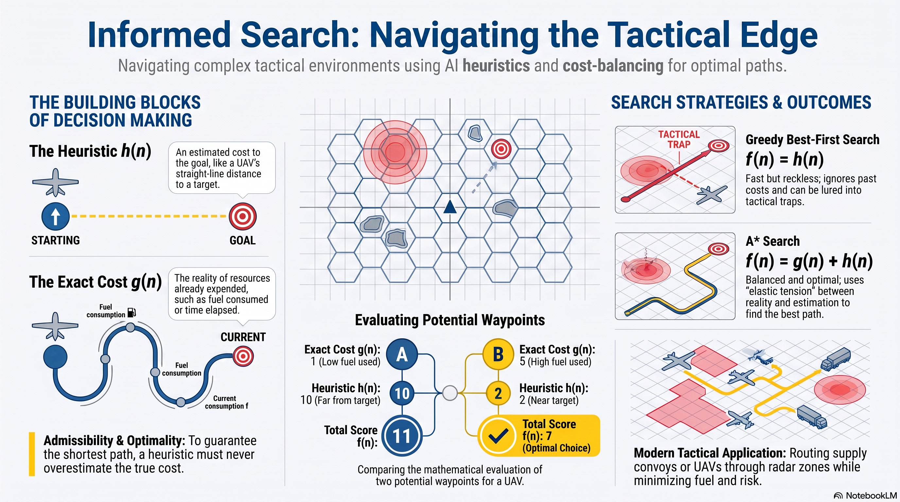

# L6: Informed Search

:::{admonition} Lesson Objectives
:class: note

* Define heuristics and their role in optimizing search spaces.

* Compare Greedy and A* search algorithms.

* Explain how exact cost and heuristics affect an AI system's optimality.
:::

## Introduction to Informed Search

In previous lessons, we explored how an {term}`Agent` searches through a {term}`State Space`. Blind or "uninformed" search algorithms (like Breadth-First Search) expand blindly in all directions. In a tactical environment—such as routing a UAV through hostile airspace—blind search wastes computational resources and time.

To solve this, we use an **Informed Search**. These algorithms use domain-specific intelligence, known as a {term}`Heuristic`, to "guess" which direction is most promising, vastly reducing the time it takes the AI to find a target.

## Heuristics: The Educated Guess

A heuristic, mathematically denoted as $h(n)$, is an estimate of the cost from the current position to the {term}`Goal State`. 

For a routing AI, a common heuristic is the **straight-line (Euclidean) distance** to the target. Even if there are mountains or enemy radar zones in the way, the straight-line distance gives the agent a mathematical "sense of direction."

## Greedy Best-First Search

{term}`Greedy` is an algorithm that makes decisions looking *only* forward. It evaluates nodes entirely based on the heuristic:

**Evaluation Function:** $f(n) = h(n)$

The agent always moves to the adjacent waypoint that appears closest to the goal. While this is computationally extremely fast, it lacks {term}`Optimality`. Because it completely ignores the cost of the path taken so far ($g(n)$), Greedy Search can easily be lured down a path that looks direct but requires navigating massive, costly obstacles later on.

```{mermaid}
graph LR
    S((Start)) -- "Fuel Cost: 1" --> A((Waypoint A<br>h=2))
    S -- "Fuel Cost: 2" --> B((Waypoint B<br>h=5))
    A -- "Fuel Cost: 10" --> G((Goal<br>h=0))
    B -- "Fuel Cost: 2" --> G

    classDef default fill:#f9f9f9,stroke:#888,stroke-width:2px,color:#000;
    classDef start fill:#d4edda,stroke:#28a745,stroke-width:2px,color:#000;
    classDef goal fill:#f8d7da,stroke:#dc3545,stroke-width:2px,color:#000;
    linkStyle default stroke:#a0a0a0,stroke-width:2px;
    class S start;
    class G goal;
```
## A* Search: Balancing Cost and Estimation
{term}`A* Search` (pronounced "A-Star") fixes the vulnerability of Greedy Search by balancing the past and the future. It considers both the exact cost incurred so far ($g(n)$) and the estimated cost to the target ($h(n)$).

**Evaluation Function:**
$$ f(n) = g(n) + h(n) $$

If the heuristic is an {term}`Admissible Heuristic` (meaning it never overestimates the true cost), A* is mathematically guaranteed to find the optimal, lowest-cost path.

### A* Search Execution (Using the graph above)
At Start, A* evaluates both options:
* $f(A) = g(A) + h(A) \rightarrow 1 + 2 = 3$
* $f(B) = g(B) + h(B) \rightarrow 2 + 5 = 7$

1. A* expands Waypoint A (lowest $f$). The path from A to Goal is evaluated: $f(Goal) = (1+10) + 0 = 11$.
2. Before committing to the Goal, A* notices that Waypoint B ($f=7$) is now mathematically cheaper than the Goal ($f=11$).
3. A* switches routes, expanding Waypoint B. The path B to Goal is evaluated: $f(Goal) = (2+2) + 0 = 4$.

**Total Path Cost:** 4 (Optimal).

## The Relationship Between Cost, Heuristics, and Optimality
Achieving {term}`Optimality` in an AI search requires a delicate balance between ground-truth history and future predictions:

* **Exact Cost ($g(n)$):** This represents reality. It anchors the agent to the actual resources expended (e.g., fuel used, time elapsed). If an agent relies only on exact cost, it acts like water filling a bowl—it will absolutely find the shortest path, but it will waste massive amounts of time expanding in every direction to do so.
* **Heuristic ($h(n)$):** This represents directionality. It pulls the agent toward the objective. If an agent relies only on the heuristic, it operates quickly but recklessly, often falling into traps because it ignores reality.
* **The Synthesis ($f(n)$):** By adding these together, A* creates an elastic tension. The heuristic aggressively pulls the search toward the target, but as the actual path cost ($g(n)$) accumulates, it mathematically "drags" on that path's score. If a seemingly direct path becomes too expensive, its total $f(n)$ score inflates, forcing the AI to abandon it and explore alternate, cheaper routes that it previously ignored. This tension is what mathematically guarantees optimality.

## Failure Cases and Optimality
The quality of an informed AI is entirely dependent on its heuristic.
* If $h(n)$ is **too low**, A* behaves like a slow, blind search.
* If $h(n)$ is **too high** (overestimating the cost), the heuristic is no longer admissible. The mathematical guarantee of optimality breaks down, and A* will confidently generate flawed, expensive routes—a major failure case in automated logistics or troop deployments.

---
## Summary Infographic

## Knowledge Check & Practice Questions

1. Explain why Greedy Best-First Search is highly susceptible to generating suboptimal paths in a complex tactical environment.
2. If an AI is routing a supply convoy, and its heuristic function accidentally includes the time it takes to load the trucks (which has already happened), what happens to the A* algorithm?
3. Calculate the A* evaluation function $f(n)$ for a UAV at Waypoint Delta, given it has consumed 15 units of fuel to get there, and its sensors estimate it is 8 units of distance away from the target grid.