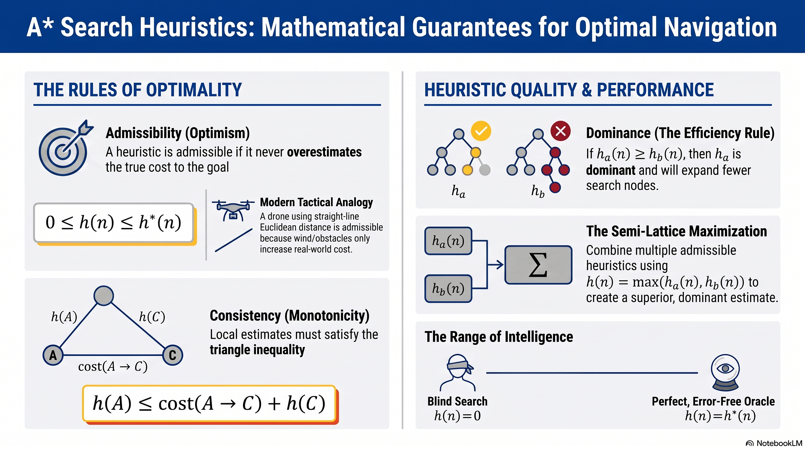

# L7: Heuristics (Admissibility & Consistency)

:::{admonition} Lesson Objectives
:class: note

* Define admissibility and consistency.

* Evaluate heuristic quality and its impact on performance.

* Explain why A* is optimal under certain conditions.

* Understand dominance in heuristics.
:::

## The Role of Heuristics in Search

As we discussed in Lesson 6, {term}`A* Search` combines the exact cost taken so far ($g(n)$) with a {term}`Heuristic`—an estimated cost to the goal ($h(n)$). This allows the agent to navigate a {term}`State Space` efficiently rather than expanding blindly in all directions.

However, the mathematical guarantee of {term}`Optimality` in $A^*$ depends entirely on the mathematical properties of the heuristic provided. According to {cite:t}`russell2020artificial`, a heuristic is essentially domain-specific knowledge injected into the search process. If that intelligence is flawed, the AI will make fatal tactical errors.

We measure the safety and quality of a heuristic using three properties: **Admissibility**, **Consistency**, and **Dominance**.

### Admissibility (Optimism)

A heuristic is {term}`Admissible Heuristic` (often just called Admissibility) if it <u>never overestimates the true cost</u> to reach the goal. It must always be optimistic.

Mathematically, if $h^*(n)$ is the true, exact cost from node $n$ to the goal, then a heuristic $h(n)$ is admissible if:

$$0 \le h(n) \le h^*(n)$$

**Tactical Analogy:** Imagine you are estimating the fuel required for a drone to reach a target. If you estimate using a perfectly straight line (Euclidean distance), you are being optimistic. In reality, wind or no-fly zones will force the drone to maneuver, making the true fuel cost higher. Because the straight-line estimate is lower than the true cost, it is an admissible heuristic.

#### Why Admissibility Guarantees Optimality in Tree Search

If a heuristic overestimates the cost of a path (e.g., falsely claiming a safe valley is highly dangerous), the $A^*$ algorithm will see an artificially inflated $f(n)$ score for that path. It will abandon the true optimal route and instead choose a suboptimal path.

**Rule:** If $h(n)$ is **admissible**, $A^*$ applied to a *Search Tree* is mathematically <u>guaranteed</u> to be **optimal**.

### Consistency (Monotonicity)

While Admissibility applies to the overall distance to the goal, {term}`Consistency` applies to the local distances between individual waypoints. A heuristic is consistent if the estimated cost from node $A$ to the goal is no greater than the step cost to get to a neighboring node $C$, plus the estimated cost from $C$ to the goal.

This is a variation of the triangle inequality:

$$h(A) \le \text{cost}(A \to C) + h(C)$$

If a heuristic is consistent, the total estimated cost of a path ($f(n)$) will never decrease as you move along it. It monotonically increases.

```{mermaid}
graph TD
    A((Waypoint A<br>h = 4)) -- "Actual Cost = 1" --> C((Waypoint C<br>h = 1))
    C -- "Actual Cost = 3" --> G((Goal<br>h = 0))
    A -. "Heuristic Vector" .-> G

    classDef default fill:transparent,stroke:#888,stroke-width:2px,color:inherit;
    classDef highlight fill:transparent,stroke:#e74c3c,stroke-width:3px,color:inherit;
    class A highlight;
```
**Figure 1:** An Inconsistent Heuristic. At Waypoint A, the AI estimates the goal is 4 units away. But if it steps to C (costing 1), C estimates the goal is only 1 unit away. Mathematically, $4 \le 1 + 1$ is FALSE. The heuristic is inconsistent because the "estimated cost" suddenly shrank too fast.

### Why Consistency Matters for Graph Search

In a State Space Graph, we maintain a "closed set" to avoid revisiting nodes (saving memory). If a heuristic is merely admissible but inconsistent, the $A^*$ algorithm might visit a node via a suboptimal path first, place it in the closed set, and ignore a cheaper path discovered later.

**Rule:** If $h(n)$ is **consistent**, $A^*$ applied to a *Graph Search* is mathematically guaranteed to be optimal. (Note: Every consistent heuristic is also admissible, but not all admissible heuristics are consistent).

## Dominance and Heuristic Quality

If you have two different admissible heuristics, $h_a$ and $h_b$, which one should you deploy?

If $h_a(n) \ge h_b(n)$ for every single node in the state space, we say that $h_a$ {term}`Dominance` (dominates) $h_b$.

Because both are admissible, neither one overestimates the true cost. However, because $h_a$ is mathematically larger, it is closer to the true cost ($h^*$).

A *dominant* heuristic is a "higher quality" heuristic.

$A^*$ using $h_a$ will expand fewer nodes than $A^*$ using $h_b$, making the AI run significantly faster while still guaranteeing the perfect route.

**The Semi-Lattice:** Heuristics form a mathematical structure. The absolute bottom is $h(n) = 0$ (which turns $A^*$ into a slow, blind Uniform Cost Search). The absolute top is $h(n) = h^*(n)$ (which is a perfect oracle). If you have two admissible heuristics but neither strictly dominates the other, you can combine them to create a superior heuristic: $h(n) = \max(h_a(n), h_b(n))$.


## Summary Infographic


<br>
<hr width="100%" size="4" color="black">

## Knowledge Check & Practice Questions

1. If an AI agent uses a heuristic that occasionally overestimates the distance to a target, what mathematical guarantee is lost?

2. Which mathematical formula represents the requirement for a heuristic to be Consistent?<br>
A) $h(A) \ge h_b(A)$<br>
B) $h(A) \le \text{cost}(A \to C) + h(C)$ <br>
C) $0 \le h(n) \le h^*(n)$<br>
D) $f(n) = g(n) + h(n)$<br>

3. You have Heuristic 1 (estimates distance via Euclidean straight lines) and Heuristic 2 (estimates distance via Manhattan grid lines). In a city grid where diagonal movement is physically impossible, which heuristic is dominant? <br>
A) Heuristic 1 <br>
B) Heuristic 2<br>
C) Both are equal<br>
D) Neither is dominant<br>
