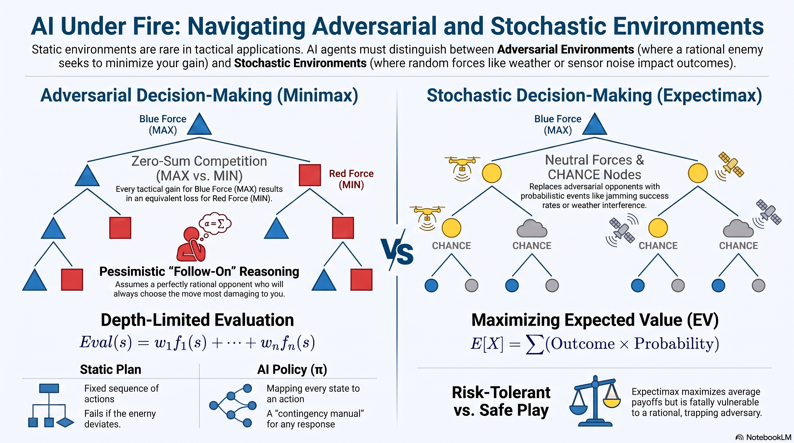

# L8: Adversarial and Stochastic Decision-Making

:::{admonition} Lesson Objectives
:class: note

* Explain minimax decision-making and zero-sum interactions in competitive environments.
* Define an AI policy and contrast it with a static plan.
* Describe expectimax and decision-making within stochastic environments.
* Compare adversarial reasoning against probabilistic reasoning.
:::

## Introduction to Complex Environments

In previous lessons, our {term}`Agent` operated in an environment that was static. The terrain did not change, and there were no opposing forces. In real-world tactical applications, environments are rarely so passive. 

We must account for two complex realities:
1. **Adversarial Environments:** A rational enemy is actively trying to defeat the agent. 
2. **Stochastic Environments:** The environment is subject to random, probabilistic forces (like weather or sensor noise) where outcomes are not guaranteed.

Games and complex tactical scenarios can be categorized across several axes: whether they are deterministic or stochastic, whether they involve one, two, or multiple players, and whether they are zero-sum or general .

## The Dynamics of Adversarial Systems

### Zero-Sum vs General Games
When operating against a rational opponent, we often model the interaction as a {term}`Zero-Sum Game`. In a strictly zero-sum scenario, resources or advantages are finite—meaning any tactical gain for your agent (MAX) results in an exact, mathematically equivalent loss for the adversary (MIN). This creates an environment of pure competition . 

If the utility function of a given state for MAX is $U(s)$, then the utility for MIN is strictly $-U(s)$. Because their goals are diametrically opposed, the agents cannot collaborate. 

We can contrast this with *General Games*, where agents evaluate outcomes based on independent utilities . In general games, a gain for MAX does not automatically equal a loss for MIN, which makes cooperation or indifference possible .

### Turn-Taking and Follow-On Effects
Unlike static pathfinding where an agent executes a sequence of moves uninterrupted, adversarial systems involve **sequential turn-taking**. 

When MAX makes a move, the environment's state changes, and control hands over to MIN. This turn-based structure introduces {term}`Follow-On Effects` (or delayed consequences). A move that looks highly advantageous in the short term might open up a devastating counter-attack three turns later. To survive, the AI cannot just look at the immediate reward; it must simulate the cascading sequence of alternating turns deep into the future, branching out every possible response the enemy might make to calculate the true long-term viability of an action.

## Minimax Decision-Making

When operating against a rational opponent in a zero-sum scenario, we use {term}`Adversarial Search`. The foundational algorithm for this is {term}`Minimax`. 

In a Minimax tree, the primary agent is **MAX** (Blue Force). MAX wants to select actions that yield the highest possible tactical advantage score. The opponent is **MIN** (Red Force). MIN wants to select actions that result in the lowest possible score for MAX.

The algorithm explores the state space down to the terminal nodes (the final outcomes), and then mathematically backs up those values to the root, assuming both agents play perfectly. The value of any given state is defined as the best achievable outcome from that state .

### Minimax Tree Traversal

```{mermaid}
graph TD
    MAX((MAX Root<br>Value: 7)) -- "Chooses Max" --> MIN1((MIN Left<br>Value: 5))
    MAX -- "Chooses Max" --> MIN2((MIN Right<br>Value: 7))
    
    MIN1 -- "Chooses Min" --> T1[Outcome: 10]
    MIN1 -- "Chooses Min" --> T2[Outcome: 5]
    
    MIN2 -- "Chooses Min" --> T3[Outcome: 7]
    MIN2 -- "Chooses Min" --> T4[Outcome: 20]

    classDef default fill:#f9f9f9,stroke:#888,stroke-width:2px,color:#000;
    classDef max fill:#d4edda,stroke:#28a745,stroke-width:2px,color:#000;
    classDef min fill:#f8d7da,stroke:#dc3545,stroke-width:2px,color:#000;
    classDef term fill:#e2e3e5,stroke:#383d41,stroke-width:2px,color:#000;
    linkStyle default stroke:#a0a0a0,stroke-width:2px;
    
    class MAX max;
    class MIN1,MIN2 min;
    class T1,T2,T3,T4 term;
```

**Minimax Execution:**
* The algorithm explores down to the outcomes.
* MIN Left must choose between yielding 10 or 5. As a minimizing agent, it chooses 5.
* MIN Right must choose between yielding 7 or 20. It chooses 7.
* The values 5 and 7 are backed up to the MAX root.
* MAX must choose between the left path (yielding 5) and the right path (yielding 7). MAX chooses Right (7).

Minimax is guaranteed to be optimal against a perfect player . Notice that MAX did not get the highest overall board value (20) because a perfectly rational MIN opponent would never allow MAX to reach it.

## Efficiency and Resource Limits

Just like exhaustive Depth-First Search, Minimax operates with a time complexity of $O(b^m)$ and a space complexity of $O(bm)$ . In realistic, complex tactical environments, finding an exact solution by searching all the way down to terminal states is completely infeasible . For example, in chess, the branching factor ($b$) is approximately 35, and the depth ($m$) is around 100 .

### Depth-Limited Search and Evaluation Functions
Because agents face rigid resource limits, they cannot search to the leaves of the tree . The solution is {term}`Depth-Limited Search` . Instead of exploring until the end of the game, the algorithm stops at a specific depth and replaces terminal utilities with an **Evaluation Function** for the non-terminal positions . 

Evaluation functions attempt to score these non-terminal states, but they are inherently imperfect . Typically, they are calculated as a weighted linear sum of features :

$$ Eval(s) = w_1 f_1(s) + w_2 f_2(s) + \dots + w_n f_n(s) $$

When designing these systems, there is a fundamental tradeoff between the complexity of the features and the complexity of computation . Fortunately, depth matters: the deeper in the tree the evaluation function is applied, the less the absolute quality of the evaluation function matters to the final root decision .

### Game Tree Pruning
To squeeze more depth out of limited resources, AI agents utilize **Minimax Pruning** (such as Alpha-Beta pruning) . Pruning safely discards branches of the game tree that are mathematically proven to have no impact on the final decision . For example, if a MAX node has already discovered a path that guarantees a score of 2, it will stop evaluating any alternative MIN branch as soon as it sees an outcome less than 2, knowing MIN would force a worse outcome .

## From Plans to Policies

In deterministic games, a formal solution for a player is known as a policy ($S \rightarrow A$) . Unlike uninformed and informed search algorithms (like A*) which output a rigid **Plan** (a fixed sequence of actions), adversarial search requires a {term}`Policy` (denoted mathematically as $\pi$). 

A policy is a comprehensive mapping from *every possible state* to a recommended action . It acts as a massive contingency manual: 
* "If the enemy moves Left, I do X."
* "If the enemy moves Right, I do Y."
    
A policy mathematically guarantees the agent knows the best response, no matter how the adversary or environment alters the board state.

## Stochastic Environments and Expectimax

Not all environments have an active adversary. Often, uncertainty comes from natural probability—a {term}`Stochastic Environment`. For example, deploying a jamming drone might have a 50% chance of success based on weather. Nature is not actively trying to defeat you; it simply operates on mathematical odds.

To handle this, we use the {term}`Expectimax` algorithm. We replace the adversarial MIN nodes with CHANCE nodes. Instead of assuming the worst possible outcome, we calculate the {term}`Expected Value (EV)` by multiplying each outcome by its probability.

### Expectimax Tree Traversal

```{mermaid}
graph TD
    MAX((MAX Root<br>EV: 9.6)) -- "Chooses Max" --> C1((CHANCE Left<br>EV: 7.5))
    MAX -- "Chooses Max" --> C2((CHANCE Right<br>EV: 9.6))
    
    C1 -- "P=0.5" --> T1[Outcome: 10]
    C1 -- "P=0.5" --> T2[Outcome: 5]
    
    C2 -- "P=0.8" --> T3[Outcome: 7]
    C2 -- "P=0.2" --> T4[Outcome: 20]

    classDef default fill:#f9f9f9,stroke:#888,stroke-width:2px,color:#000;
    classDef max fill:#d4edda,stroke:#28a745,stroke-width:2px,color:#000;
    classDef chance fill:#cce5ff,stroke:#004085,stroke-width:2px,color:#000;
    classDef term fill:#e2e3e5,stroke:#383d41,stroke-width:2px,color:#000;
    linkStyle default stroke:#a0a0a0,stroke-width:2px;
    
    class MAX max;
    class C1,C2 chance;
    class T1,T2,T3,T4 term;
```

**Expectimax Execution:**
* CHANCE Left evaluates its expected outcome: $E[Left] = (10 \times 0.5) + (5 \times 0.5) = 5 + 2.5 = 7.5$.
* CHANCE Right evaluates its expected outcome: $E[Right] = (7 \times 0.8) + (20 \times 0.2) = 5.6 + 4.0 = 9.6$.
* The expected values 7.5 and 9.6 are backed up to the root.
* MAX chooses the highest expected value. MAX chooses Right (9.6).

## Adversarial vs Probabilistic Reasoning

Understanding when to use Minimax versus Expectimax is critical for AI system design:
* **Minimax (Pessimistic/Safe):** Assumes the worst-case scenario. It is mathematically optimal against a perfect, rational opponent. However, if used against a random or suboptimal opponent, Minimax plays too defensively and misses opportunities to exploit the opponent's mistakes.
* **Expectimax (Optimistic/Risk-Tolerant):** Plays the mathematical odds to maximize the average payoff over time. It is highly effective against neutral environments or predictable, flawed opponents. However, it is fatally vulnerable if used against a rational adversary, who will recognize the AI's risk-taking and easily trap it into the worst-case scenario.

---
## Summary Infographic


<br>
<hr width="100%" size="4" color="black">

```{admonition} Knowledge Check & Practice Questions
:class: note

1. Explain the difference between a Plan (generated by A*) and a Policy (generated by Minimax). Why is a Policy required in a Zero-Sum game?
2. In a Minimax tree, why does the MAX root node sometimes fail to reach the highest numerical value physically present on the board?
3. What is the time and space complexity of Minimax, and why does this necessitate Depth-Limited Search in complex games?
4. Calculate the Expected Value for a CHANCE node representing a drone strike that has three possible outcomes: a 60% chance of a high-value hit (Score: 100), a 30% chance of a low-value hit (Score: 20), and a 10% chance of missing entirely (Score: 0).
5. If an AI commander is deploying troops against a highly trained, rational enemy general, but uses Expectimax instead of Minimax to plan the deployment, what is the likely failure mode?
